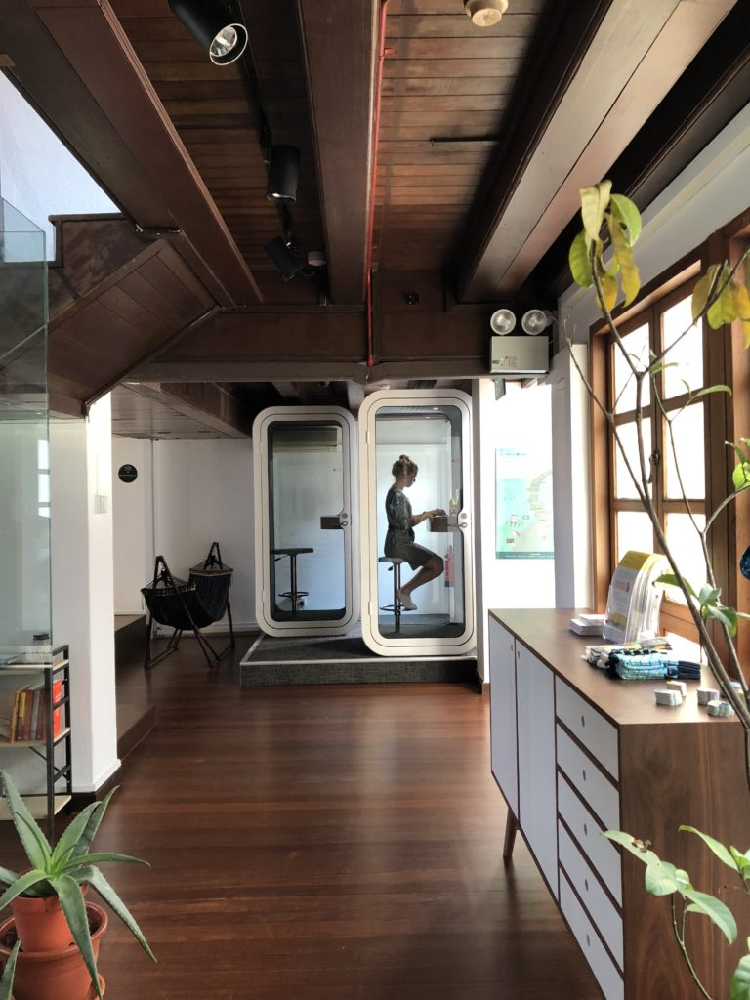

 A glimpse into our Singapore office!

I initially intended to write one post summarising the top three things that I think are done well at [Smartly.io](https://smartly.io) in terms of company culture, but I haven't found the time to. So instead of one big post, here's the first of multiple smaller posts detailing distinct cultural traits that make work life at my new job so remarkable.

As foreshadowed by the title, the biggest cultural trait of all my colleagues is that they know it's important to have balance in life. Work is not everything, nor should it be.

The Finns call it work-life blend, others call it work-life balance. In the end, what we call it matters much less than how we embody it.

Some phrases that are echoed throughout the company whenever it's appropriate are "Take care of yourself!" and "Don't burn out." These are said not just by team leads or the leadership team, we say it among colleagues.

Of course, this would be an extremely contrived example of good work culture if it was just platitudes. I know personally of a few friends' workplaces where those words get bandied around but everybody still works and is implicitly expected to work extra hours.

From what I can tell in my close to two months at Smartly.io so far, it's far from the case. Every time we saw "Don't burn out" to someone in the company, it's usually followed by an explanation of a simple fact: **If you burn out, you lose, your colleagues lose, and the company loses. So take good care of yourself!**

Isn't that amazing?

Actually, isn't that _logical_?

The way I've noticed myself describe this to friends is that this company is incredibly humane.

It's humane to understand that we're all humans and can burn out from working too hard/long without taking time to release that tension in our private time. Like what writing this post does for me. If I had to be working on the weekend, I wouldn't have any time for this.

I find that whenever an example of good workplace culture is dissected and the business reason for it is laid out clearly, it becomes obvious that it should be practised.

But the knowledge-action gap here is real. The truly hard part is creating an environment in the office where everyone self-polices and encourages one another to go home when it's time to leave work, get some rest, and come back tomorrow refreshed.

I've been taking notes. Here are some of the little things I've noticed that contributes to such an environment at my current workplace:

- Folks from the People Team will, without fail, politely interrupt any conversation they hear involving someone working outside of office hours, re-stating the fact that "burning out helps nobody, and that we should take care of ourselves". This strengthens the culture of working while you're working and resting when you're supposed to be resting
- Everyone knows about and occasionally uses the hashtag "#worksmartly" in our internal communications platform to demonstrate new examples of people working smartly by automating manual work, thereby freeing one to do more important work. This is one of the company values, and it's important because if we are honestly going to work 8 hours a day, those hours must yield increasingly good work as the company grows
- We have a party group chat on WhatsApp where people feel safe and compelled to share pictures from their holidays. This serves a nice reminder that we should work hard and play hard, and there's absolutely nothing to feel bad about being on holiday

It's not enough for leadership and everyone in a company to have good intentions. The hard part is in embodying those intentions ourselves and contributing to an environment where others feel safe and compelled to do the same. So in the end it's down to the little actions!

* * *

**Update 14/07/18**: I just watched a great video by someone I find genuine and inspiring on YouTube that talks about burn out. Seems relevant to the topic of work-life balance.

https://www.youtube.com/watch?v=UhssxosrhLE

* * *

_Saturday, 14 July 2018, at home, feeling thankful._
