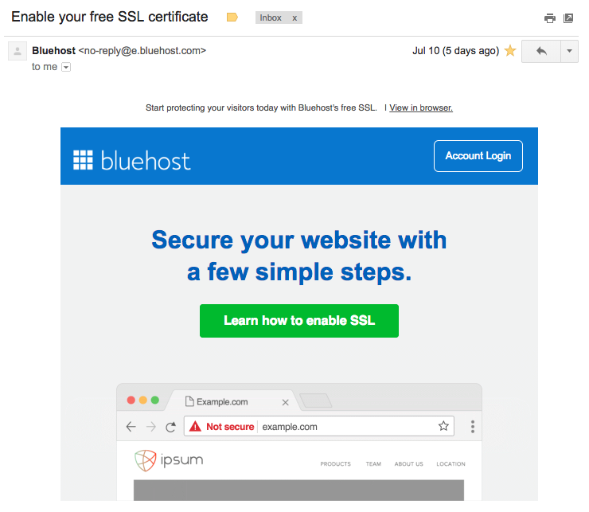
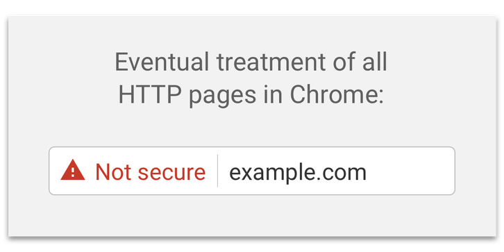

I have a little news to share. For the first time in this blog's history, we have [SSL (secure sockets layer)](https://en.wikipedia.org/wiki/Transport_Layer_Security)!

Why is this interesting? Well, I actually didn't pay for the SSL certificate. I just checked my email a few days back and received an email from my hosting service provider, [Bluehost](https://www.bluehost.com/), about claiming free SSL.

 The cool email from Bluehost

Before I speculate why I am, along with probably tens of thousands of people, getting a free lunch, let's have a quick primer on what SSL is and does for us.

### What is SSL?

Without going into the technical details (since it's not necessary here and I don't know the intricacies of it), SSL is a digital certificate issued by an authority that when setup on your web server, ensures your visitors have a secure connection to your site.

With SSL, it's much safer for people to input their credit card numbers into a website because those digits never go on the wire--as in, through the fibre optic cables of the Internet--without first being encrypted.

Here's a comparison of your credit card details entered into a browser when it's sent to a server with and without SSL:

- Without SSL: 1234-5678-9012-3456 and CVV 987
- With SSL: CVHXsTrEKiTZSYVnLA0YgOnom and CVV KXozKc36lvg=

That's the difference in the data that is sent using an HTTP (_without_ SSL) and HTTPS (_with_ SSL) request. As you can already imagine, this makes bad actors who attempt to snoop around your network requests end up only with a useless string of gibberish.

### Why is Bluehost giving free SSL?

I wanted to understand why Bluehost is giving away free SSL. After all, it must have been good business charging upwards of $10 per month previously for SSL certificates for their users.

Turns out, there's a project called [Let's Encrypt](https://letsencrypt.org/about/).

> Let’s Encrypt is a free, automated, and open certificate authority brought to you by the non-profit Internet Security Research Group (ISRG).

Technically, _they_ are the ones giving free SSL. Bluehost, as it turns out, is just riding on the certificates issued for free by Let's Encrypt.

As someone in tech, I can't say I've heard of a Certificate Authority (CA) that issues SSL certificates for free before Let's Encrypt.

This is probably the first time it's happening, and I'm delighted. I've always felt uncomfortable with services like Bluehost making a profit for making what should already be secure, secure. From what I can tell, it's not _that_ hard technically to encrypt and decrypt data being sent to and from a server/browser.

Anyway, this still doesn't explain why a hosting service provider like Bluehost is now supplying free SSL. My guess is that they have reason to believe that it's a matter of sooner than later than their competitors do the same since it _is_ valuable to end users.

### Why care about SSL besides greater security?

The reasons that SSL is valuable to website owners like me go beyond just added security, although that is the primary reason for many.

As a blogger, there's really no need to encrypt anything. The only data you'll likely be sending me (as in my web server) are the comments you leave on posts. Since no sensitive data is involved, encryption is not exactly valuable to me.

However, Google has been pushing for secure sites to be the norm for a while now and they have been quite aggressive at doing so. They have done so in gradual steps, and now we're entering the [final phase](https://security.googleblog.com/2018/02/a-secure-web-is-here-to-stay.html) of that push by Google:

> Beginning in July 2018 with the release of Chrome 68, Chrome will mark all HTTP sites as “not secure”.

 The Not secure sign in Chrome. It might as well be screaming "Leave now or you'll be hacked!"

In case you've somehow never come across it, Chrome's "Not Secure" sign is a conspicuous red sign on the address bar.

 Much better

Although the realities of a so-called Not Secure site are much less severe than the red sign suggests, it may have a negative impact on the visitor's experience. So, even bloggers are hopping on the bandwagon.

### Check your email

So, in case you haven't already, check your email from your hosting service provider. If it is Bluehost then you should have already received it.

Otherwise, I believe it's only a matter of time and if not, you might want to consider switching to another hosting provider.

* * *

_Sunday, 15th July 2018, at home feeling like the world is a slightly better place._
