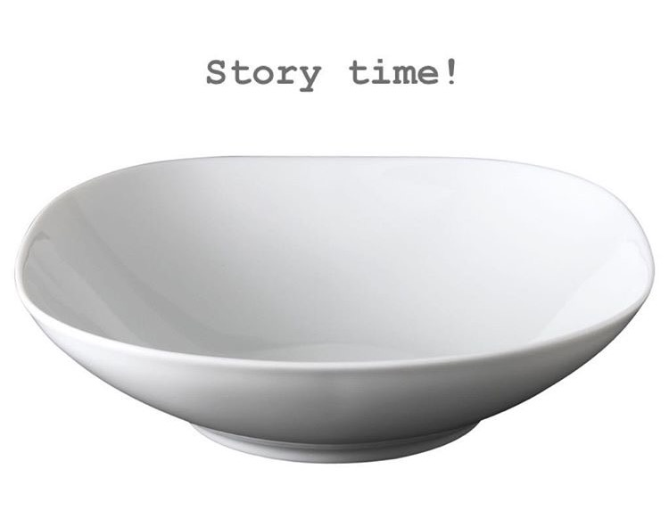
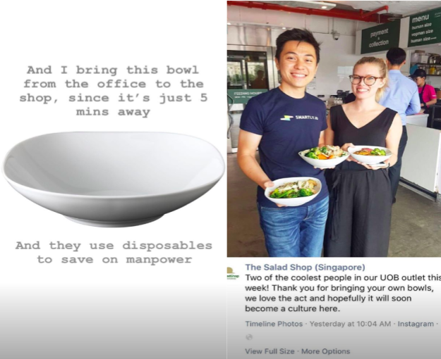
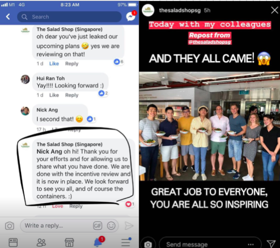

\[caption id="attachment\_2711" align="aligncenter" width="750"\] The bowl that changed my perspective\[/caption\]

I've always been sceptical of the magnitude of change that an individual's action can bring. Four years in university thinking about and grappling with environmental and social issues never managed to change my mind. I'd always kind of been a "conscious business is the only way to solve our environmental problems" kind of guy.

That's why this story is an important one to me personally. I've been in search for reasons to believe that individual actions do matter in the so-called grand scheme of things. I wanted to know if I, as an individual, can move the needle on the sustainability movement.

This is the story of the incident that made me believe that individual efforts matter. It begins with a salad shop.

### The Salad Shop

There's a place near our office called The Salad Shop. It's literally called that. And the salads they serve are delicious and affordable enough that I've eaten 80 percent of my lunches there so far.

In a bid to save on labour costs (I think), they serve their salads in paper bowls with plastic lids and plastic cutlery. So one day, I decided to do something different.

Okay, instead of re-telling the story that I've already told on Instagram, I'll let the Instagram Story tell the story.

### The Instagram Story

For the full story, you can visit this Instagram [highlight reel](https://www.instagram.com/s/aGlnaGxpZ2h0OjE3OTU4NTMwMDgzMDQ0NzAy/). It has better image quality and is an overall better medium than scrolling through a series of photos on this page.

### How my individual effort started to matter

Fascinating story, isn't it? I definitely did not expect my bring-your-own-bowl trip to unfold this way, but I'm really glad that it did.

But it's not about me. This definitely wouldn't have happened if not for these important facts:

- The team at this store was openly sharing with me how pleased they were to see me bring my own bowl. This gave me a clear signal that they welcome me to do so on every visit
- The store manager, by her own volition, rewarded my colleague and me with a 20 percent discount when we went to the shop with our bowls a second time. This created a story to tell, which we used to convince more people in our office to bring their own bowls
- The founder(s) of the company that operates The Salad Shop acknowledges that s/he has a responsibility (and opportunity) to run the business in a way that's environmentally sustainable. In a matter of days, they enacted a 50 cents discount for people who brought their own bowls to their shops

See the pattern yet?

The common thread that runs through these facts is that everybody involved was _primed_ to do their part. This in turn massively multiplied the overall effect of my initial effort to save a set of a disposable bowl, lid, and cutleries.

### Individual efforts matter

I write this post not to self-glorify but to document my own experience and in doing so, give you a concrete example of how an individual's effort matters in the quest towards environmental sustainability. I know I've been looking for an example like that to inspire me into taking action for a long time.

It started with an IKEA bowl and an individual act and ended with an incentive program that encourages every patron to any of the two The Salad Shops and the eight The Sandwich Shops to do the same.

I'll even bet that their business will generate more, not less, profit because of the goodwill that is created among its crowd. Who doesn't want to feel like they're contributing to something bigger than themselves?

* * *

_Saturday, 21 July 2018, at my desk in my super-messy-in-preparation-of-moving home._
