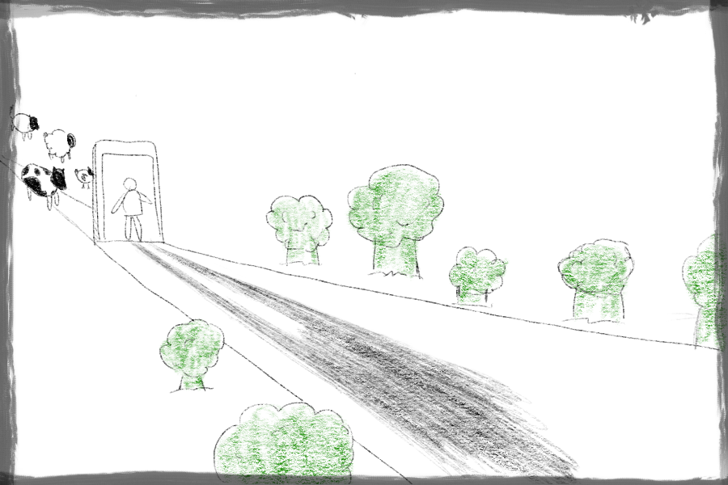

 More or less how I feel right now

It's been an interesting month of being vegetarian for the first time. I was compelled by ethics but ultimately made the leap to experimenting with vegetarianism because of its purported health benefits and the influence of a few newfound friends (colleagues) who are vegetarian (more details in [this post](/2018-06-22-why-im-going-vegetarian/)).

And now, at the end of over a month of experimental vegetarianism, I'm at a crossroad. Make this my new normal, or go back to the old?

### How my experimental month of being vegetarian went

I have to say, things went pretty smoothly throughout the experiment. Not having many expectations certainly helped me feel like things went well.

Aside from the one or two meals where I really struggled to find food that didn't contain any meat, it felt easy being vegetarian.

To my surprise, I had virtually no cravings for meat. I did for fish though, and about two weeks in, I modified my goal of trying to be vegetarian to being pescatarian (essentially vegetarians who also eat fish). In terms of ethics, this is equivalent to me conceding that I care less about the suffering of fishes than mammals, which I feel uncomfortable admitting but is mostly true.

The other difficult thing that I struggled with was articulating my reasons for wanting to cut out meat from my diet.

To most of my friends and family, this move is viewed as borderline radical considering that many of them can't imagine not eating meat. I imagine some of them might even feel like I'm doing this for fashion. I've found it hard to explain exactly the health benefits that I'm trying to reap from removing meat from my diet.

Things I've said so far that sound much more convincing written than when said:

- Meat is cancer-causing and contains a lot of toxins, including the pus that oozes from many of these injured animals' wounds, as well as the animal's own shit that does not get washed off thoroughly before sale
- Eating meat induces an inflammatory response in my bodies whereas eating plants do not
- Meat-based diets correlate very strongly with diabetes, which my dad has and I'm concerned about developing as I grow older

I'm going to work on my delivery, though. I imagine it takes time.

### The benefits I've reaped

The three main benefits I've noticed myself reaping from being vegetarian for a month:

- Lightness in my body after meals
- Joy from knowing no animals had to be killed for me to be full
- Strengthening conviction

I've begun to notice how light I feel after a vegetarian (and even pescatarian) meal compared to one that contains meat. My body feels less burdened by the meal and I very seldom get a post-meal "food coma". That translates to a big gain in my work because I don't feel sleepy most of the time anymore.

Another thing that is probably a little harder to explain (especially around the dining table) is the small joy that comes from finishing a meal knowing that it didn't involve inhumanely slaughtering a factory-farmed animal. I've occasionally smiled to myself because of this.

Having to explain my dietary preference is also refreshing and quite empowering. One of the unexpected benefits of suddenly becoming a vegetarian is a strengthening conviction.

Vegetarianism is unfortunately still a marginal practice, which means practitioners often have to stand up for themselves and explain politely to others at meals why they made the choice. The cool thing is that having conviction in one aspect of life usually means elevating one's overall conviction in taking control of one's life. (A person with a healthy, lean body is also usually someone who wakes up earlier and do things well.)

Now, I'd be a liar if I claimed that there aren't some problems that come with being vegetarian.

### Problems with being vegetarian

The first and probably most obvious problem with being vegetarian is the availability of good vegetarian food. This varies wildly depending on the city you live in. For example, when I was in Helsinki, most restaurants made as much an effort in their vegetarian and vegan menu as their normal menus, which made it much easier for me to be vegetarian. Food must continue to taste at least just as good as before, otherwise, the whole thing becomes a compromise.

Having to compromise on food variety is ironic considering that there are more species of plants and only a few species of animals that we eat. The lack of variety for the vegetarian is the result of supply and demand, not nature. But it is nonetheless something vegetarians, at least those in Singapore, have to grapple with.

Socially, being vegetarian can also be slightly problematic, although not as much as I had originally expected. Usually, I find it's enough to mention my dietary preferences to people I'm having meals with only when they're going to something like a steakhouse. I've found that most places that serve food will have a couple of items that do not contain meat, and they're usually tasty enough to not make me cranky.

### What now?

The way I see it, I only have two options going forward:

1. Continue being pescatarian
2. Go back to eating meat, but much less

My good experience this past month has given me the confidence to believe that I can live without eating meat without losing weight, feeling uneasy or dissatisfied. Couple that with knowing the ethical and health reasons for not eating meat, going back to eating just as much meat as I had before is simply not an option. I'm done with having chicken, pork, or beef at every meal.

Have I decided between the remaining two options, then? No. It's really hard to decide!

If I continue to be pescatarian and avoid meat for the rest of my life:

- I would be missing out on many, many traditional dishes of different cuisines
- I may occasionally have to skip a meal if I fail to find a place that serves vegetarian-ish food

But:

- I would feel great every day knowing I'm no longer participating in the killing of factory-farmed animals
- I would remove willpower from the equation at every meal (should I eat meat this time?)
- I may still sometimes have to eat some meat at important social occasions like business meals or [on a flight](/2018-06-23-vegetarian-obstacles-flight-food/)

If I choose the middle ground and eat meat, just much less of it:

- I get to reap some of the health benefits of eating less meat
- I occasionally get to eat delicious, traditional dishes that contain meat
- I can be more flexible at meals for social reasons

But:

- I would without a doubt occasionally feel like I have compromised on my values
- I would have to do much more thinking at every meal (should I eat meat this time?), which I find can sometimes be exhausting

I'm unsure, but I'm leaning towards the option of being pescatarian. Willpower is a scant resource!

* * *

_Sunday, 29 July 2018, standing at my desk in our new home pondering whether I will make the right decision._
