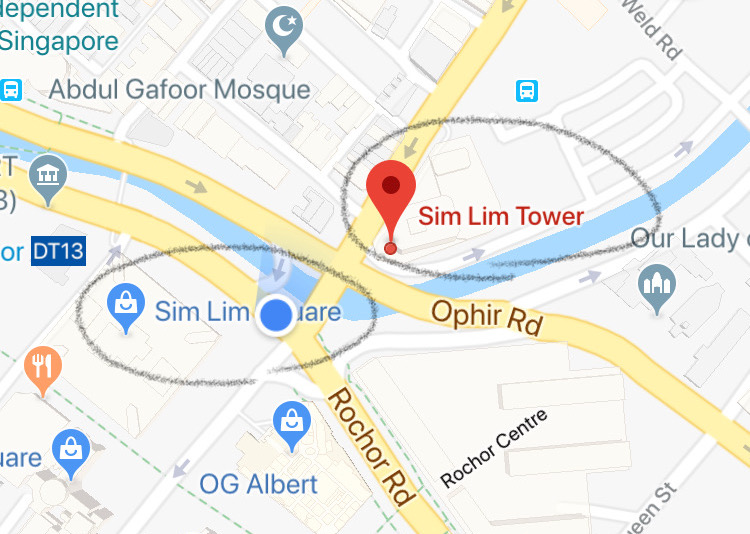

You've probably heard of Sim Lim Square but have you heard of Sim Lim Tower? They are buildings across the street from each other but stock vastly different things.

Here's a very quick post to help you clarify where to go to buy electronics in Singapore.

### Sim Lim Square - for consumer electronics

Go to Sim Lim **Square** if you're looking for consumer electronics:

- laptops
- desktops
- DSLR cameras
- computer and camera peripherals
- TVs
- ... etc.

As a friendly heads-up if you're not local and are heading to Sim Lim Square for the first time, beware of dishonest retailers who jack up prices when they see unsuspecting tourists. My advice is to behave like you know what you're doing and to be prepared with prior research about general prices of the products you're looking to buy.

In general, shopping for electronics at Sim Lim Square is more of a bargain-hunting experience rather than a casual one.

One thing Sim Lim Square clearly is not: it isn't the place for tinkerers who are looking to buy materials to build their own DIY projects.

For that, you should cross the street to Sim Lim Tower.

### Sim Lim Tower - for raw electronics parts

Go to Sim Lim **Tower** if you're not looking for ready-to-use consumer electronics but raw electronic parts:

- power adapters like AC-DC bricks and cables
- electronics hobbyist starter kits like Arduino and Raspberry Pi
- electronics parts like cables, solder and irons, crocodile clips
- parts for [DIY home automation](/2016-03-04-home-automation/)

Sim Lim Tower caters to amateurs and professional makers and tinkerers. That means it's the kind of place where you'd want to go only when you know beforehand exactly what you're looking for.

Generally, shopping here is a pleasant experience.

For electronics shopping, these two Sim Lim's should fulfil most of your needs. But in case you're really in the mood to shop around, two other nearby malls might be worth a visit.

### Peninsula Plaza - for photography equipment

Peninsula Plaza is about a 15-minute walk from Sim Lim Square, and it's the place you'd want to go to buy photography equipment like cameras, lenses, tripods, and lighting equipment.

People in the shops here are quite friendly and knowledgeable about photography.

### Funan "the IT mall" - for everything

Funan, which is under construction at the time of writing and should re-open in 2019, is the place to go for all kinds of consumer electronics.

The key difference between Funan and Sim Lim Square is the shopping experience. In Funan, you can relax and know you're paying a standard price.

Good luck!

* * *

_I wrote this mainly for myself as I have somehow managed to forget the difference between Sim Lim Square and Sim Lim Tower more than once. Hopefully, it saves you a bit of time too._
