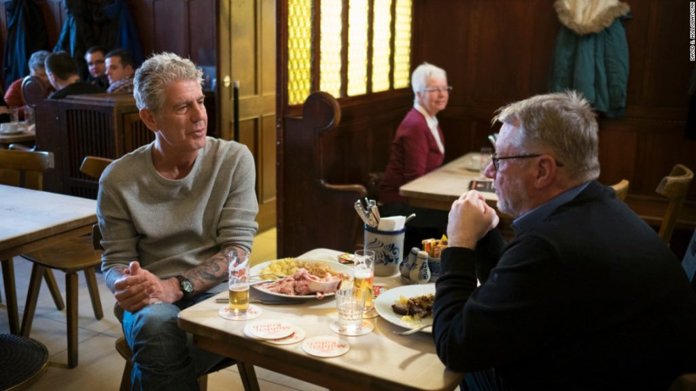

\[caption id="attachment\_2769" align="aligncenter" width="840"\] Parts Unknown: Cologne, Germany\[/caption\]

One of my favourite documentaries is Parts Unknown hosted by Anthony Bourdain. It is gritty, personal, and so very real, owing largely to Anthony Bourdain's no-bullshit and warm personality. My heart still aches thinking about how he [left](https://www.vanityfair.com/hollywood/2018/08/remembering-anthony-bourdain-as-only-his-fixers-could) us.

In [one of the episodes](https://www.eater.com/2016/6/5/11852318/anthony-bourdain-parts-unknown-cologne-germany-recap) that I watched in-flight on my way home from a business trip in Shanghai recently, Bourdain had a fascinating short conversation with an artist in a bar in Cologne, Germany. The artist said something about "cappuccino people" and how, soon, the world would be full of them.

Cappuccino people?

They were talking about the racism and hate that happens regularly among different groups of people, and how the only real solution is if skin colour was no longer something we could talk about - when our babies are so racially mixed up that everyone's skin is cappuccino in colour.

It struck a chord with me. I care much, much less about the colour of people's skin now than I did maybe nine or ten years ago when I didn't know better. Birds of the same feather flock together, they say, and it just felt like I could relate better to other Chinese people.

Nowadays, as I've grown older, I've come to realise how diverse Chinese people can be and how illogical it is to feel like a Chinese person, just because she's Chinese, is likely to be more similar to me in values. I now have Spanish, American, Serbian, Turkish, and Lebanese friends with whom I share very similar values with, and these came by coincidence, not by some plan I made.

In sociology, there is a concept called "other-ing", which explains that most of us see other people largely as either a part of us or as part of the "others". That is a problem, and while I believe that collective consciousness can shift for the better, as it already has for gay people around the world in recent years, there is something quite soothing about knowing that we're already slowly heading there one inter-racial baby at a time.

Cheers, to a world of cappuccino people.

_PS. Netflix, if you're reading this, by the way, know that I always feel sad that I can't watch Parts Unknown in Singapore on Netflix. Please fight for the rights to air the show here!_

* * *

_Saturday, 11 August 2018, in bed after lunch with my Spanish and Chinese friends, L and F._
