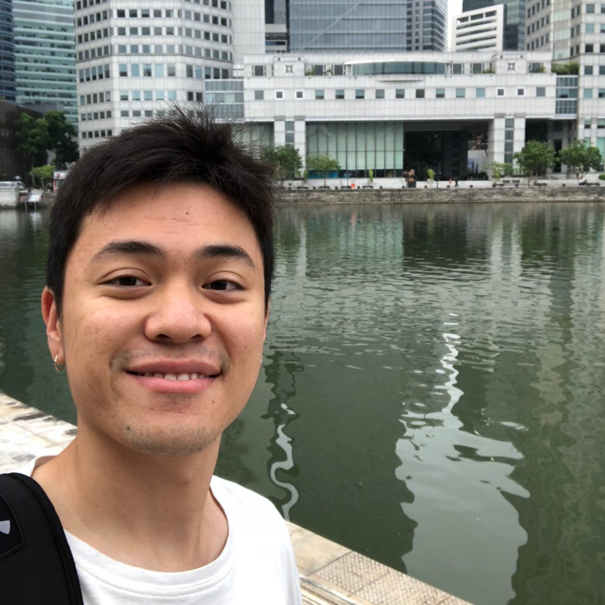

 In the morning making my way along the Singapore River to get to the gym

I've been practising meditation on and off for something like three years now. Some days immediately after sitting through a 10-minute unguided meditation session, I'm able to see a truth very clearly: the truth that everything we need to feel at peace with all that is going on is readily available from within.

Now, I know how this sounds. You're probably already rolling your eyes, as you should. This sounds a little woo-woo and new-age-y and it makes me sound like I've attained some higher level of enlightenment. So let me say this: I struggle each day to find happiness and feel at peace too.

This occasional glimpse into what I've just called a "truth" doesn't make life any easier. It just makes an easier life more accessible (if I remember it in the midst of a brain shit storm).

### Misery

I found out this morning through an Instagram post that an old friend of mine from junior college has been fighting (and losing to) his inner demons. How he mustered the courage to share this openly on Instagram during his depression is something I cannot comprehend, but nonetheless, reading the words in his post struck me with a deep sadness. He had attempted suicide twice. We all struggle with the meaning of life, but some of us harder than others, and not by our own choosing.

Aside from the peace that is already available from within us, accessible through what only a simple act like meditation can access, I've also found other simple things that have inadvertently improved my mental well-being:

- Meditating a few times a week (daily works even better)
- Strengthening my physical body
- Having a lifelong companion in a dog

One of my new year's resolutions this year was to find a workout regime that I actually believe is sustainable with my feeble willpower, and going to the gym before work has been working nicely for over two months now. I can feel the positive effects on my mental well-being throughout the day after a morning workout, on top of the physical growth I was creating.

Having a friend in a few dogs for the past 15 years or so has also been really good for me. Dogs are everyday Buddhas. I would be frowning and stressing over something and when I look at Brownie lying on the couch with his eyes looking at me, his eyelids gently closing, I'd always realise how my unmonitored mind is the source of my misery.

Whoever you are, if you're feeling like there's no meaning in your life, I have no advice for you. I've merely shortlisted the top three things that I know make _me_ feel good in a sustainable way (the opposite of drugs). Perhaps you can try some of them if there's any you haven't tried. It might make you realise that too often we just beat ourselves down.

* * *

_Sunday, 12 August 2018, at home with Brownie on our new blue couch._
