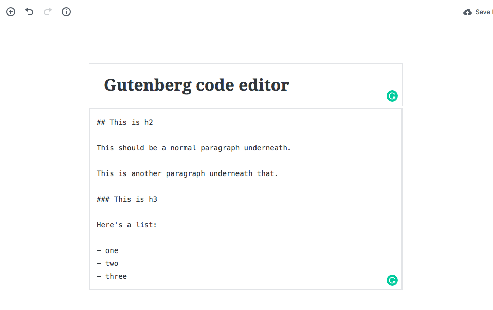

I was wrong. I think I jumped to conclusions a little too quickly about the Gutenberg editor. You can use it while still retaining the charm of a simple code-like editor - they just call it a "code editor", actually.

In this mode of the Gutenberg editor, I can write comfortably in Markdown like I used to, and Jetpack converts that into formatted text on the published page.

There are also no chunky text "blocks" to look at and continually consider to be shifted around or clicked, which is nice.

_Destroys thoughts of migrating out of WordPress in the future._

Everything below this sentence is written in Markdown in the editor I used to write this post. Here's a screenshot of what it looked like behind the scenes:

Pretty and simple, isn't it? :)

UPDATE: While attempting to add the image in this code editor mode by inserting an image block, the editor converted my markdown into pesky HTML, so `## h2 text` became `<h2>h2 text</h2>` without warning. The redemption was short lived it seems. I've now activated the classic editor plugin and will be using this for as long as possible...

* * *

## This is h2

This should be a normal paragraph underneath.

This is another paragraph underneath that.

### This is h3

Here's a list:

- one
- two
- three
