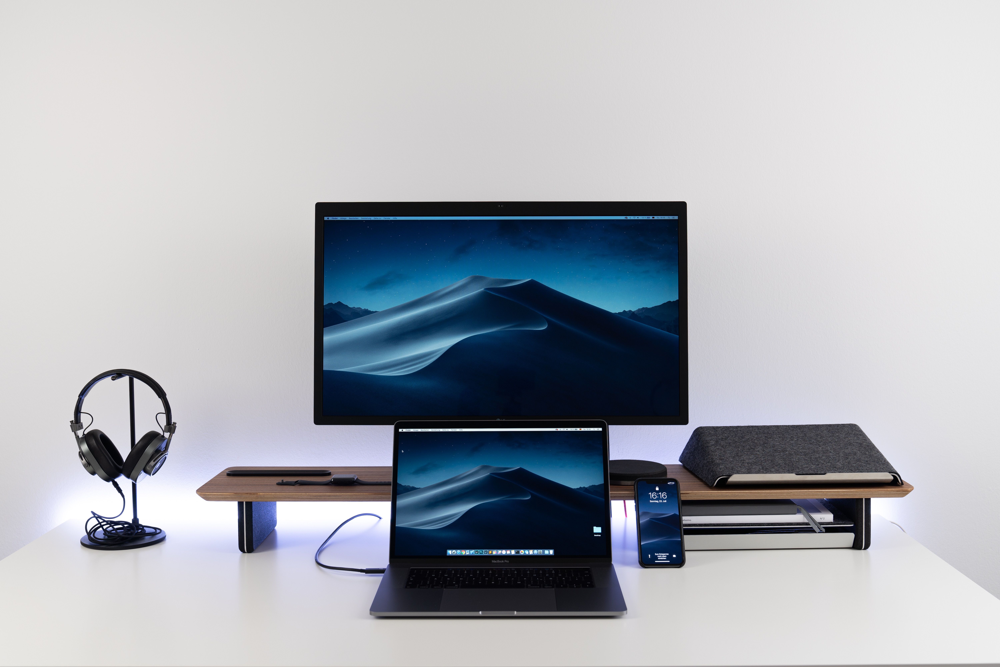

Without thinking about it too much, you wouldn't realise how sinister they are.

I'd just come out of one of the longest meditation sessions I've done - a whopping 25 minutes - and when I opened my eyes, there it was: four different screens sitting on the desk in front of me.

Right after coming out of meditation the first thing I usually notice is the calmness. My brain is relaxed and I sometimes feel inspired.

When I opened my eyes this time and saw four screens: a desktop monitor, MacBook, an iPad, and an iPhone, I immediately felt anxious. I felt like I had to turn those black mirrors into brightly lit screens. It was compulsive.

I'm not sure what to tell you, but it's a pretty strong feeling.

Just before I wrote this, I was watching Netflix. Of course, it was on one of these screens (my MacBook). Now, I'm typing on it.

Will I be happier with fewer screens at home? I'd never really given this a serious thought before, but now I feel like I ought to. Constant anxiety is no way to live!

Screens... devices... gadgets... they're truly at the centre of our lives now. But if we resist for minutes and look around our physical environment, we might just realise how much is actually going on.

For every film scene you watch on screen, there are a million others unfolding in reality around you. Shouldn't that make us want to engage in reality more?

The problem at least for me is the effort needed to engage. Watching has such a low barrier to entry. Move your fingers, sit back and enjoy the show. All the mental stimulation and conversations can be had in my own mind and on "paper" like this post here.

I've also noticed how much more I'm drawn to these screens when I'm alone as compared to when I'm with my wife.

There's no central point that I'm trying to drive at here except to raise the question: will I be happier with fewer screens around me?

One of the highlights of my trips abroad is in Kintamani, Bali, at a small bungalow that we booked for a few days. It was on a big hill and did not come with Wifi. And the calmness that provided is something I can confidently describe as blissful.

Blissful tranquillity. No screens to bother us. Just us and our thoughts.

Of course, I'm not naive enough to think that a life that is continually like that is going to be interesting. I might start pulling my hair out of boredom.

But the way I see it, having so many black mirrors waiting to be activated is the other extreme. A middle ground must be found before I either die of anxiety or boredom.

Neither is particularly enticing.

* * *

Photo by Nikolay Tarashchenko on Unsplash.
