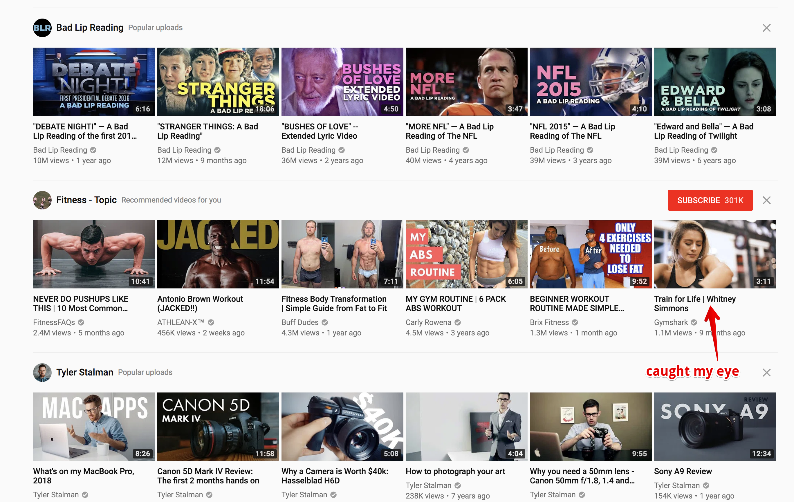

YouTube recommended me this video from Gymshark today and I found myself immediately connecting with what it stood for.

https://www.youtube.com/watch?v=ZmSXVPApUfg

They produce videos of people working out hard to upbeat, motivational music.

There is nothing complicated in this when we see the end result, but the conceptualisation, pitching, and execution must not have been easy. With all things, if it looks simple and congruent, it probably took a lot of strategic and skilful execution. To me, this brand's marketing is an embodiment of that idea.

Also, on a more practical note, this shows that one good way of marketing your brand is to combine two things that go already go well together. In this case, listening to music and working out.

[Gymshark](https://www.gymshark.com/) sells original fitness apparel and they chose to use collaboration with musicians to create a narrative that got me hooked from the get-go. Judging from their view counts and the comments in their videos, it is a marketing strategy that is working beautifully for them.

The best part? Since I stumbled upon the video as a YouTube recommendation and not an ad, they've essentially added one more lead to their sales funnel _for free_. Undoubtedly, this was only been possible because every aspect of their execution was spot-on: compelling title, appealing image, concise and on-brand storytelling, and a relatively short video.

While I'm not going to buy anything from Gymshark (yet), their name is going to be in my head, my Spotify [playlists](https://open.spotify.com/user/21o5jgmtm2yths6dx7sw4zm6a/playlist/5vEASV21KIBG9KJBwh7PFT?si=OpaJQop7TneajOw3dwuPUQ), and my YouTube recommendations. It's only a matter of time before I become a customer.
