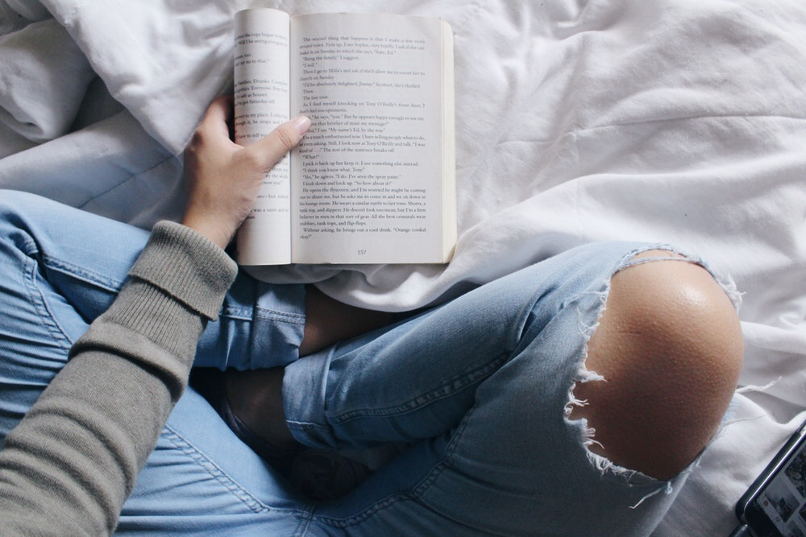

As I read, my wife sat beside me on our blue couch tapping at her phone. A quick glance confirms that she's typing the text for another Instagram post.

This isn't a post about how we should spend less time on our phones. Heck, I'm typing this on my phone right now! No. This is about how different the passage of time is when reading a book as compared to consuming content on a digital device.

I've noticed this phenomenon as being quite consistent: time feels like it moves slower when I'm reading a book than when I'm watching videos, scrolling through Instagram, or even reading articles online.

My hypothesis is a simple one: our mind is much, much more active when imagining worlds than when being presented one.

A book, including nonfiction, relies on the reader's mind to construct a world in her mental space, to toy with the ideas being presented. A lot of that toying around can happen very quickly in our wonderful minds.

Compare this to looking at posts on Instagram or watching a movie. Before you can seriously ponder something, the next picture and the next frame has nudged you forcefully along.

I wouldn't believe it if you told me that you pause for ten seconds at every Instagram photo and consider what it must have meant for the person in it, how it relates to the people around her, why she posted it, and so on.

So I guess the point here is that if you want to slow down time, the most reliably magical way I know is to crack open a book and feed it to your mind. It's a world of difference.

* * *

_I'm currently reading The War of Art by Steven Pressfield._
