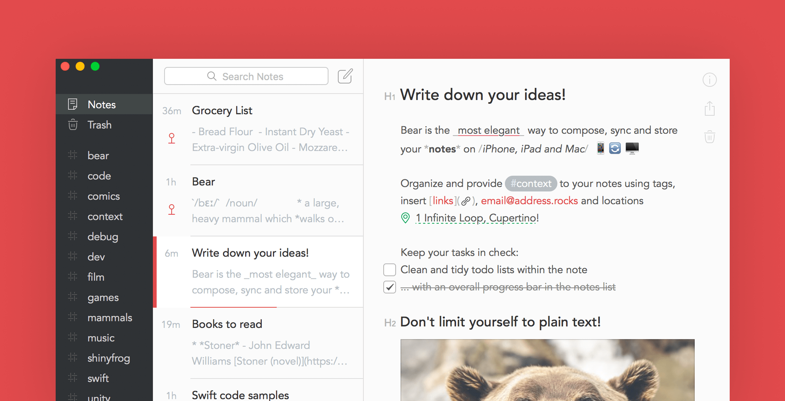
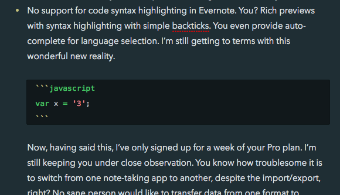

You’re the one I’ve been looking for. After years of trying to beat Evernote into the shape I want, I have failed. And look, now I’m falling for you.

### Bear app vs Evernote

Here are a few problems that Evernote has that you, [Bear](https://bear.app/), don’t:

- It takes ages to launch. You’ve launched in under a second so far each time, on all devices.
- Searching has now become extremely slow, possibly due to the amazing but not-so-often-used in-document search feature, or maybe because I have thousands of notes in it by now. You, on the other hand, are lightning fast. I hope you can keep this up when you’re bogged down by thousands of notes.
- Changing notebooks is slow and clunky. You don’t need me to create notebooks and instead, you create them on the fly for me with simple `#hashtags`.
- No support for writing in Markdown in Evernote. But you? You handle Markdown beautifully with rich previews that get out of the way.
- No support for code syntax highlighting in Evernote. You? Rich previews with syntax highlighting with simple backticks. You even provide auto-complete for language selection. I’m still getting to terms with this wonderful new reality.

Now, having said this, I’ve only signed up for a week of your Pro plan. I’m still keeping you under close observation. You know how troublesome it is to switch from one note-taking app to another, despite the import/export, right? No sane person would like to transfer data from one format to another if it can be avoided.

### Real world test drive

I figured I’ll bring you for a test drive in the real world for two weeks and then either ditch you or marry you, and it all boils down to whether you do these things well:

- Sync data among my devices reliably, including images and videos. That’s 2 MacBooks, 1 iPhone, and1 iPad.
- Search, among other means, body text quickly and easily.
- Convince me that your hashtag folder sorting system is actually a smart thing and not a gimmick.
- Pasting things from the web or elsewhere leads to a consistent and considered behaviour.
- Continue to work as quickly as you do now when I add more notes.
- Allow me to copy your contents into Wordpress in raw Markdown without formatting issues for quick writing here and publishing there.
- (Bonus) If I have the ability to download all my data off your server so that I’m assured that I don’t get locked into you like a co-dependent lover, I will pledge my allegiance to you, no further questions asked.

I’ve said what I needed to say. Please know that I’m ready to love you, Bear. Now show me what you’re made of!
