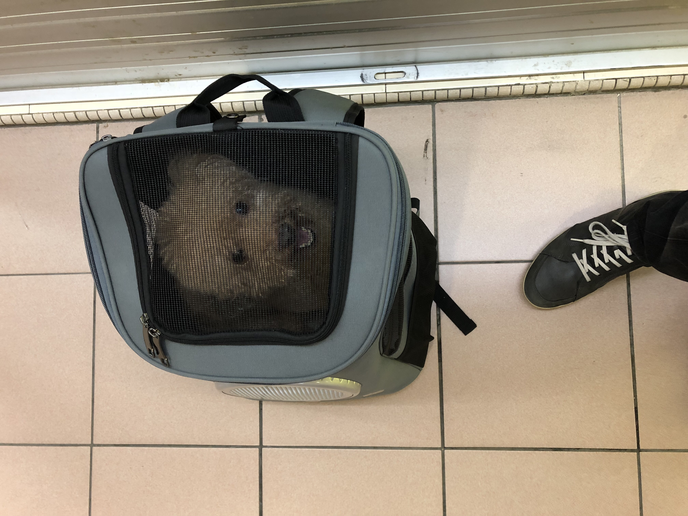

If you've lived in Singapore before, you'd know that most places have restrictions on pets. Shopping malls and most restaurants don't allow pets.

Many of the shopkeepers and restaurateurs I've met cite the same reason: some customers don't like it.

As a dog owner and all-around animal lover, I find this upsetting but understandable. Business owners believe (falsely) that they should pander to the needs of as many of their customers as possible, so they can make as much money as possible. I reluctantly agree.

So what can we, as enthusiastic and responsible pet owners, do about it?

### The Solution

This dog bag is the solution that I was gifted. I mean, literally, the bag was a birthday gift from our friends WY and K. It's the best thing we never knew we wanted!

Charlane and I have already carried Brownie into several malls with this bag, including Orchard Forum, People's Park Complex, and a few others. We even had desserts indoors with him in the bag next to our legs.

The funny thing is, this bag works as though it's invisible not because its design is inconspicuous. I think it works because nobody is paying attention to others. Everyone is too busy being stuck in their own heads to look up and notice your Deliveroo-esque bag!
