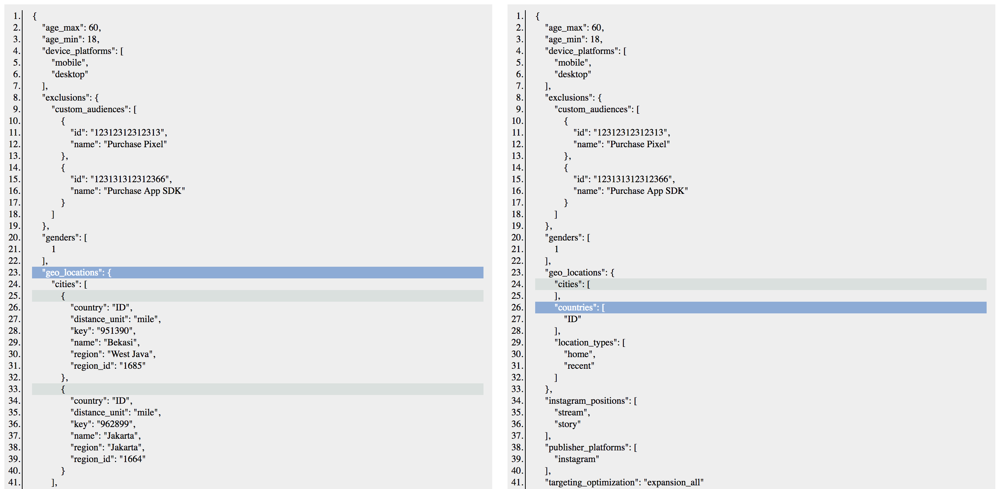

A very cool tool that I discovered today from google searching is [JSON Diff](http://www.jsondiff.com/). It does exactly what you expect it to. Paste two JSON files into the tool and it shows you the differences between them.

### My use case

At Smartly.io where I work, we sometimes have to help our customers debug a problem with our tool. Because the Smartly.io tool is a platform for automating advertising across Facebook and Pinterest (with more channels to come), we do _a lot_ of API requests to other servers from our backend.

With [API](/2018-02-03-what-is-an-api/) requests naturally comes a lot of JSON objects, since basically every data transfer protocol now happens with JSON over the internet.

Before today, I admit, I haven’t thought to diff two JSON files using an external tool. I mostly just eyeballed the two files in Visual Studios Code and looked for differences. Thinking in retrospect now, I feel so silly. As a developer, looking for such a tool should have come more naturally!

In today’s debugging, I wanted to find out what was the change that one of our users tried to make to her Ad Set through our tool that resulted in the dreaded “Unknown Error” returned from Facebook’s server.

Technically speaking, that involved looking at the current configuration (in JSON format) of the Ad Set in question via the [Facebook Marketing API](https://developers.facebook.com/docs/marketing-apis) and then contrasting it against the request that our backend tried to make for updating its value.

In other words, what was the existing configuration and what was the new desired configuration? I knew that once I could see the difference, I would be able to systematically test each of the changes in value and uncover the one that caused the error.

### What it looks like

This is what the JSON diff tool produced:

Personally, this was the highlight of my workday. On my first try, I found a tool that works exactly as I wanted! These are not my typical days on the internet. What a beautiful day.

This tool has eliminated all possibility for human error in trying to find the differences manually. It also saved me time and cognitive power, which I put to good use in the rest of the debugging.

Thanks [Zack Grossbart](http://www.zackgrossbart.com/blog/more-about-zack/) for creating and hosting this free tool. It’s a real time and brain saver. (You sir seem to have an amazing list of open source projects under your name - very inspiring!)
