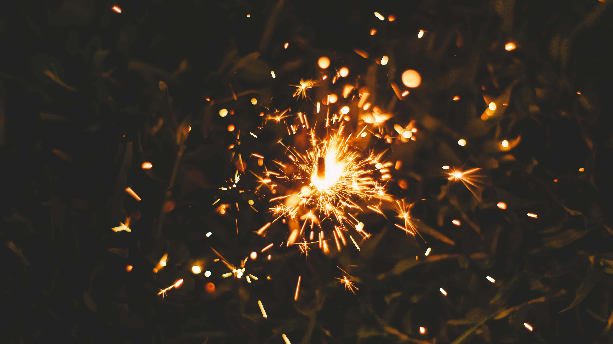

Tomorrow is going to be a big day for [my wife](https://www.instagram.com/charlane_yu/) and I as we launch our first business together as co-founders.

Just one and a half months ago, I said something that she said something else to that eventually created some sparks. The inspiration to combine our skills and interests to start an online shop came out of a casual conversation. It seemed to come out of nowhere but felt very real. Our hearts were racing and our voices became brighter.

We are starting Singapore's first bridal veil boutique tomorrow (I will share more details tomorrow). This is something we're both excited to share with the world after one and a half months of preparation hand-making veils, setting up shop, and writing a bunch of content.

One and a half months, in my opinion, is not a very long time to go from idea to launch! I'm impressed by how much we've achieved in such a short period and I think we did something right this time.

### Inspiration needs action

The thing that I've realised from my current vantage point, after having acted on the inspiration immediately, is that inspiration is like a spark. It is a tiny explosion with the _potential_ to spread into a great fire.

And while market opportunity is the fuel that enables a flame, action is the catalyst. A spark could, if it's lucky, cause a small forest fire. But it is _wind_ that makes the wildfire. Action is the wind.

I'm happy that my wife and I acted on our inspiration right from the day after. Our first actions led to more actions, transforming a spark into a wildfire.

Now, the last speck of ember has fizzled, and it is time to sow the seeds for growth.

* * *

_Photo by J A N U P R A S A D on Unsplash._
