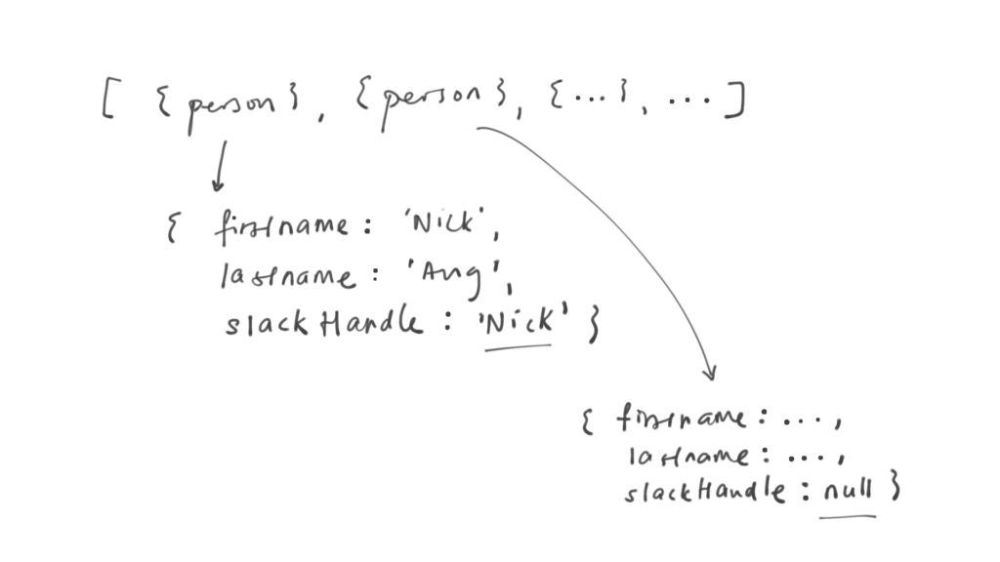
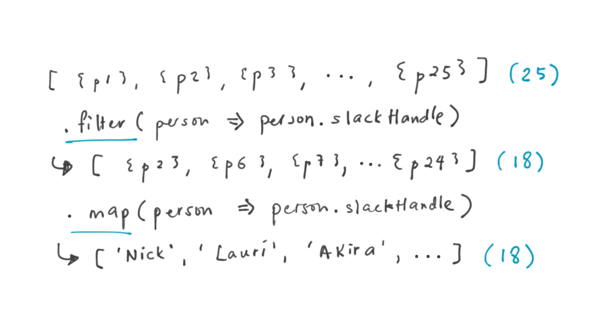
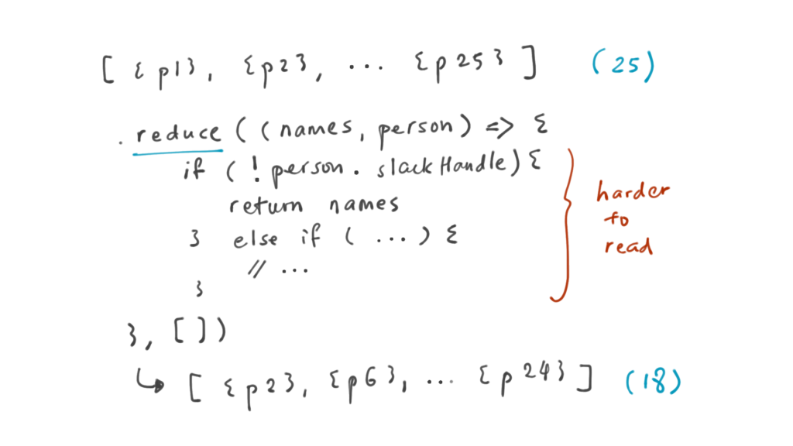

At some point in your programming career, you will come to a fork in the road to choose between code readability or efficiency. Which do you choose?

Take the example of an array of `Person` objects. Let’s say this was the data you expect to be returned from an internal [API](/2018-02-03-what-is-an-api/).

Because it’s an internal API, you know that there is a chance that some of the `Person` objects may have a `null` value in certain keys. For example:

In your front-end that is supposed to consume this data and visualise it for the user, you know you’ll have to do a bit of cleaning up. You don’t want to present a list of slackHandles that includes the weirdo “null”.

At this point, you may think of using the built-in `.map()` method in JavaScript. But then you remember that map doesn’t allow you to skip items in the array - the mapped array will always have the same number of items as the original array.

One good solution you think of implementing next is to first put the array through another built-in method, `filter()`, before employing `.map()`. Sounds good!

But as you write the implementation halfway, it dawns on you that you could also use the more powerful `.reduce()`, which is kind of like `map()` except you can choose to skip certain items.

As a good programmer who cares about efficiency, you notice that the second approach, using reduce, would result in the outcome you want with just a single iteration of the array. The first approach would, by contrast, need 2x the number of iterations, reading every item in the array twice - once during filter, and once during map.

Which path do you walk down? Readability or efficiency?

### Prefer readability

For me, in this situation, I would assess the most important factor: how big will this array ever be?

With any modern computer, iterating through an array with less than 100,000 entries would easily complete in under a second (unless there is another loop happening within each iteration, leading to an n^2 (or n-squared) [time complexity](/2017-11-15-algorithm-time-complexity-big-o-notation/)).

So in this example, I would choose the method of doing `array.filter().map()` over `array.reduce()`, because it is _much_ easier to read and understand.

To be honest, even if the array was 100,000 items in length, I might still choose the filter-and-map approach.

In the bigger scheme of things, walking through an array once versus twice is not a big difference, even though it is technically double the number of operations. Often times, the real culprit of inefficient code is a loop within another loop, not a loop that is run twice. It’s the difference between:

- 100,000 + 100,000 = 200,000 operations
- and 100,000 x 100,000 = 10,000,000,000 operations

Moral of the story? Learn to prefer writing code that is easier to read, even if it means slightly poorer performance. Most of the time, that “poorer” performance by the computer is negligible and not visible. The time penalty you would be putting on your fellow programmer, on the other hand, probably isn’t!

* * *

_Photo by Faye Cornish on Unsplash._
