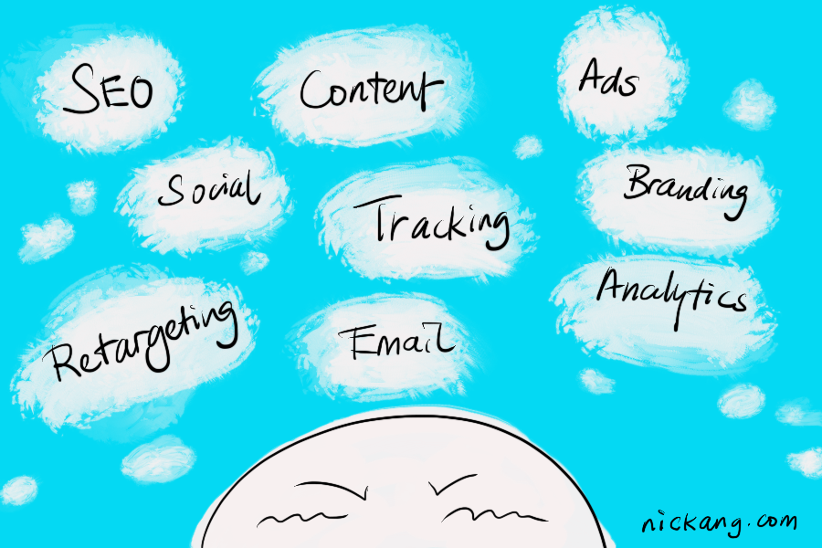

Marketing is a really big domain of expertise. Just ask [Seth Godin](https://seths.blog/) - he’s been studying and practising it his entire career, and he’s still learning every day! (He blogs about them daily on his [blog](https://seths.blog/).)

Before starting [ang veil yú](https://angveilyu) with my wife, I’d never really given marketing any special attention or serious thought. Now that I’m running the marketing for our online wedding veil store, well, I have to.

So today I wrote my first marketing plan. It lays out three key areas that we should work on until the end of 2018:

1. Get initial traffic to the store
2. Improve organic search traffic
3. Create brand awareness in Singapore

I’ll spare you the details, but set to say, it was a good exercise. Having no prior knowledge of marketing, I’m basically starting from ground zero. Everything I do in relation to marketing for ang veil yú is going to be new to me. It’s an intoxicating mix of intimidating and exciting!

## Questions, questions, questions

What should we post on Instagram? Should we be spending time publishing posts on Facebook? What about Pinterest and Twitter?

Is the tone of our communications acceptable or the best it can be for our audience?

What keywords should we pay for and which negative keywords should we throw into the mix? Should we even advertise at all or rely on organic search traffic to grow? What is an acceptable cost per acquisition (CPA) for our product?

