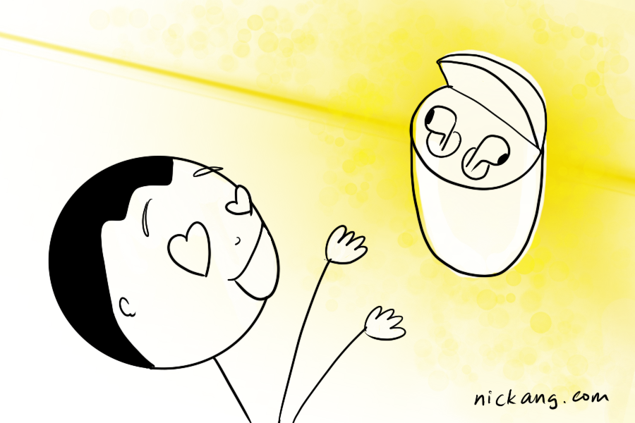

My friends are buying a pair for me (with my money) and I can’t wait for my AirPods to arrive.

It’s not because I’m addicted to gadgets. Okay, I _might_ be a little, but that’s not why I’m looking forward to my own pair of AirPods.

I’m eagerly anticipating my AirPods because of what I imagine and tell myself I could do with them.

### My imaginations

Here are my imaginations:

- I'm finally going to be able to make myself run more often. I can’t run with my wireless over-ear headphone because of sweat. And I dislike running with cables hitting my chest with every step. AirPods would get out of the way and just get music into my brain so I feel at least half-decent moving my limbs
- Now I can have podcasts and music with me anywhere I go without ever having to fumble over cables again.
- My overall happiness will increase by a bit every time I open the case and the AirPods connect automatically. I always notice the friction when using products, and whenever there is none, I feel a little bit happy inside, with no end to how many times I can re-experience that happiness.

Here’s the thing: in no small way, I believe my imagination of Life With AirPods is shaped by marketing - some deliberate by Apple, and some derivative from fans. They worked well though, otherwise, I probably wouldn’t bother writing about it.

### The forces that shape my imaginations

As I’m [trying](/2018-11-17-first-marketing-plan/) to crack marketing for [ang veil yú](/2018-11-09-singapores-first-bridal-veil-boutique/), I sat down to list a few specific things that might have influenced the way I thought about these wireless earbuds that cost SGD $200. I came up with this:

- Apple products, in general, have been top-notch in terms of usability design, and I care about user design, so their products are always intriguing to me.
- Apple’ ecosystem of products has proven to be industry-leading in terms of working seamlessly together. Makes me excited to add another one to my existing (growing) repertoire of products made by them.
- Very large number of YouTube video reviews of the AirPods made by tech reviewers and Apple fanboys. Watching people talk energetically about a product made me want one so that I can be energetic like them.
- Seeing people in the gym who are fit and wearing them. Makes me think that if I had one, I might just find a way to be as fit as them. I recognise this as illogical but I believe it’s still had bearings on my decision to purchase one.

Looking at that list of things that influenced my purchasing decision (after months of toying with the idea), I see some kind of strategy emerging:

- Maintain brand image as high-end
- Make actually good products
- Find a way to compel customers to review the product
- Give potential customers the opportunity to see the product in use

### Applying the strategy to my online store

Although applying the strategy for a tech product to a wedding accessory may not lead to an exact fit, I believe some of these are applicable to a great extent.

For example, for [ang veil yú veils](https://angveilyu.com), we _can_ find ways to compel customers to review the product. In the case of the AirPods, the compelling part was how weird the product was, being the first of its kind (truly wireless, separate earbuds). For veils, like apparel, it could be designing something similar to what someone popular wore publicly before.

The easiest way to give potential customers the opportunity to see our product in use is to have more brides wear our veils on their big day. But because wedding veils aren’t exactly worn outside of weddings, we’d have to think a little more creatively to come up with other ways of achieving this. Perhaps we could make a small, special collection of veils for parties and events?

### Paying greater attention

I wanted to write this post because I know that the feelings I’m having now, eagerly awaiting the arrival of a product, are powerful but fleeting. I’ve had these feelings about the AirPods for about 6 months before finally deciding to pull out my wallet to purchase it.

During those 6 months, some things must have been happening, either done to me or done by myself, that finally made me part with my cash. This was my attempt to deconstruct them.

I think it’s going to be interesting to do more of these analyses in the future as I get these yearnings again (they really don’t come that often for me). Step one is to pay greater attention to _what_ is happening between the first impression to purchase.
