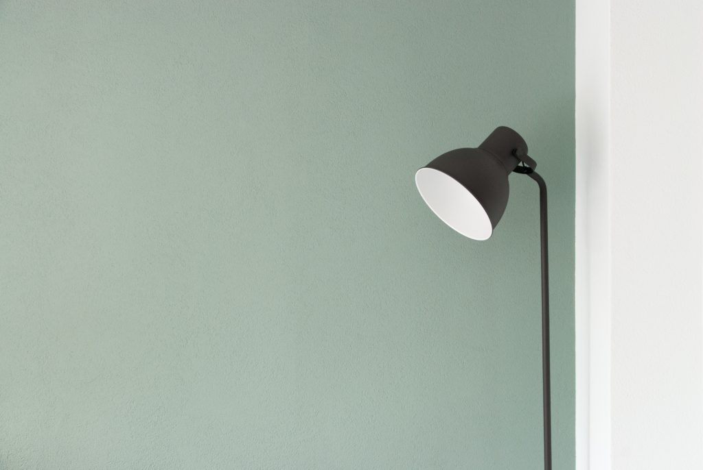

Simple is easier to understand.

Simple is easier to remember.

Dogs are simple.

Simple things are always more beautiful.

Simple is harder to break.

Simple things load faster.

In a complex world, simple is rare and appreciated.

Simple is the culmination of clear thinking and action.

Simple is closer to the truth.

Simple things are accessible to everyone.

## Real-life examples where simple is better

**Digital user experience**

Users of a digital tool, like Smartly.io for example, occasionally face bugs. If the code base that makes the tool work is simpler, it would be easier to locate bugs and have them fixed more quickly. The outcome? A simpler, better customer support experience.

In fact, if the code base was simpler, there would be more time to simplify the user interface, which ultimately makes it so accessible that users are able to debug their own problems.

**Habits**

We are better able to turn simple routines into habits. Like going to the gym every morning before work on days 1, 3, 5, 7 of the week. Instead of planning the upcoming week’s workout days every Sunday based on the following week’s calendar and find 4 slots. Simple is easier to remember.

**Dogs**

Dogs are simple. And how many times have you caught yourself saying, “I just want to be like you, Brownie”?

**Apple**

Apple products are a living repository of how simple is better.

The Unibody cut out of a single aluminium block is the simple end result of good engineering that gives MacBooks their sturdiness, lightness, and clean aesthetic.

AirPods connect automatically to your iPhone and not anyone else’s. When you put on one of the earbuds, it makes a simple sound to signal that it is paired. And when you’re listening to music halfway and someone wants to talk to you, taking out one of the earbuds automatically pauses whatever you’re listening to on your iPhone. Put it back, and it resumes. In other words, it simply works the way you would have wanted it to.

In macOS, when viewing an image or PDF in the in-built Preview app, you rotate the image or page with a thumb and finger on the trackpad. How? By rotating it as if it were a piece of paper in physical reality. Simple is accessible. Simple is usually easier to remember, but in this case, it’s so simple, you don’t even have to remember it.

**Communication**

Reading 3 short sentences is easier than 3 long ones.

Reading 5 sentences is easier than reading 10 sentences.

Reading 3 succinct sentences with the essence of the message encapsulated is easier to read than 10 sentences with everything spelt out. “TL;DR” is a mainstay in the Urban Dictionary for good reason.

Ultimately, when something is easy to read, it has a greater chance of actually being read and understood. When someone understands the essence of a plan, she is more likely to remember and act on it correctly.

* * *

_Photo by David van Dijk._
