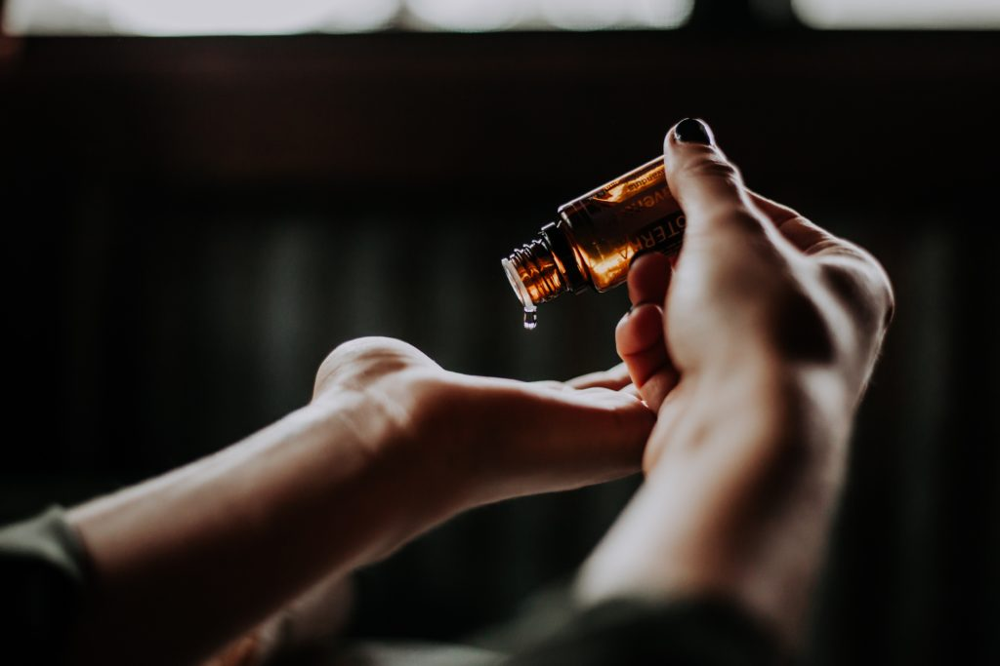

Here’s a thought without much bearings on life but is interesting nonetheless - is a massage considered wasted on you if you fall asleep during one?

Let’s break that question down into its constituent parts:

- Waste of what? An experience, muscle relaxation, or something else?
- How does sleep affect that _what_? Reduces or virtually eliminates it?

If you typically go for a massage as an experience, the answer is a clear-cut _yes_, you’ve wasted your massage if you sleep while it happened.

But if you go for a massage to relief muscular tension, would all that kneading of the muscles have gone to waste?

My completely unscientific but logical answer is no - it’s not wasted. A piece of wet clay isn’t alive, but yet the more you knead it, the tougher it gets as moisture escapes. Okay, probably not the best analogy since massages don’t actually wick any sort of fluids out of our bodies (eww).

Think of chicken then. If you were the dead chicken and someone attempted to tenderise your muscle fibres so that you would have better texture when eaten by a chicken-lover, kneading you would do the trick. No? How about hammering you with one of those jagged-edged metal hammers? There we go.

So, it’s not a question of whether a massage is wasted (in terms of muscle relaxation), but _how much_ is wasted if you were asleep during the tenderisation process.

Now that’s a trickier question. Does thinking about your muscles getting tenderised catalyse the process?

According to a few studies on [mind-muscle connection](https://medium.com/@SandCResearch/can-using-the-mind-muscle-connection-enhance-hypertrophy-398de4687bd7), focusing intently on the muscle group that you’re exercising does catalyse its growth when training for hypertrophy. It really makes you wonder, if not for science, how could we have intuited _that_?

So by some stretch of reasoning and the imagination, I’d guess (again, unscientifically) that it applies to massages as well. In other words, if you’re not awake during a massage, you lose that mind-muscle connection because your mind is is lalaland, and you end up with _maybe_ some less muscle relaxation. Maybe.

Ok, so that’s it for today’s episode of Nick’s intuitive and unscientific conjectures. I know at least _I_ will believe in this so I never ask this question again.

PS. I'm in Bali and just received an hour-long full-body massage for $8 Singapore dollars. I was fully awake the entire time, and it was glorious.

* * *

_Photo by Christin Hume._
