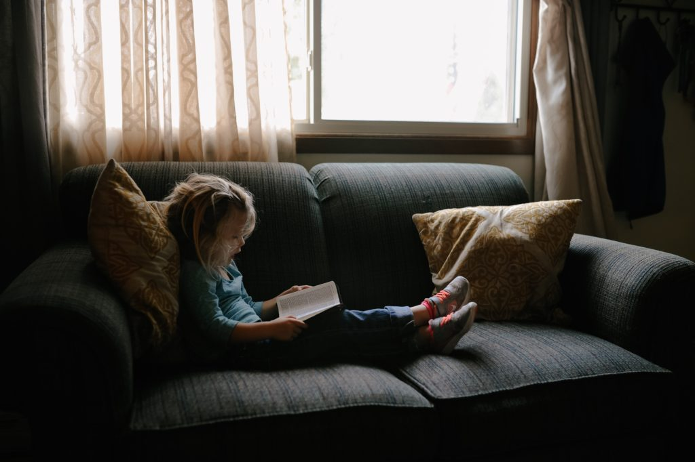

In a bid to understand what I've been thinking about and have done for the year, I'm taking stock of the posts I've published this year.

Here are some stats (bracketed is number from 2017):

- **Posts published**: 130 (96)
- **Views**: 77,800 (5,500)
- **Visitors**: 64,300 (3,500)

Overall, I'm quite happy knowing that people are finding this blog more useful this year than last (proxied by view count). Views increased by 14 times and visitors by 18 times! These are partially vanity metrics and, in all honesty, I don't really keep track of it until the end of the year. But it does indicate that at least some of the things I've been writing resonates with some of you, which makes me feel warm inside. :)

## My favourite posts from 2018

Here is the list, in chronological order:

- 03.01 - [Temptation to just build stuff](/2018-01-03-temptation-to-just-build-stuff/) 
- 09.01 - [The fallacy of greener bananas](/2018-01-09-fallacy-greener-bananas/) 
- 28.01 - [The uncommon (and invaluable) ability to recognise a noisy mind](/2018-01-28-uncommon-invaluable-ability-recognise-noisy-mind/) 
- 08.02 - [How to setup ESLint for your next project](/2018-02-08-setup-eslint-next-project/) 
- 28.03 - [On learning](/2018-03-28-on-learning/) 
- 16.04 - [A display of creativity and collaboration like no other](/2018-04-15-a-display-of-creativity-and-collaboration-like-no-other/) 
- 22.04 - [The Art of Living Deliberately](/2018-04-21-art-of-living-deliberately/) - work to be done 
- 14.05 - [There’s so much we can do with our life](/2018-05-14-so-much-we-can-do-with-our-life/) 
- 15.05 - [The key to forming new habits](/2018-05-15-key-to-forming-new-habits/) 
- 02.06 - [Reflecting on 15 days in the Philippines fields](/2018-06-02-philippines-field-trip/) 
- 23.06 - [Why I’m going vegetarian](/2018-06-22-why-im-going-vegetarian/) 
- 14.07 - [How I think about Work-Life Balance](/2018-07-14-work-life-balance/) 
- 21.07 - [Do individual efforts matter in the grand scheme of things?](/2018-07-21-do-individual-efforts-matter/) 
- 28.07 - [Reflecting on 1 month of being vegetarian](/2018-07-28-reflecting-on-1-month-of-being-vegetarian/) 
- 12.08 - [All the peace from within](/2018-08-12-all-the-peace-from-within/) 
- 13.10 - [The one thing that reliably slows down the passage of time](/2018-10-13-the-one-thing-that-reliably-slows-down-the-passage-of-time/) 
- 06.11 - [I’m not sorry for being confused](/2018-11-06-im-not-sorry-for-being-confused/) 
- 21.11 - [Climbing](/2018-11-21-climbing/) 
- 25.11 - [The importance of habits](/2018-11-25-the-importance-of-habits/) 
- 06.12 - [10 reasons why simple is better](/2018-12-06-10-reasons-why-simple-is-better/) 
- 09.12 - [How to keep things interesting in a relationship](/2018-12-08-how-to-keep-things-interesting-in-a-relationship/)

And if you secretly want to see everything I've published ever, visit the [blog page](/blog/).

* * *

_Photo by Josh Applegate._
