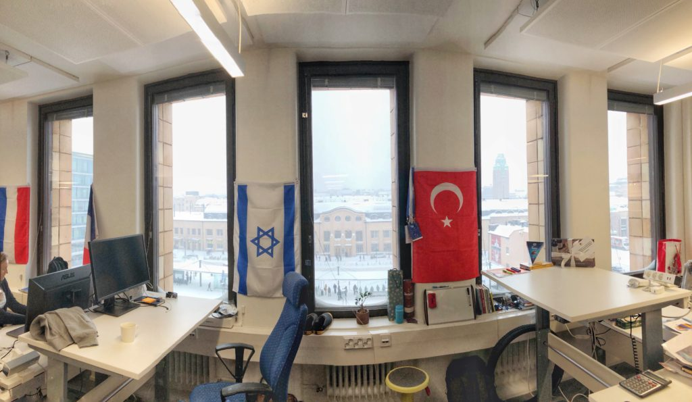

I have Finnish colleagues, and they never run in the office. I don’t think I’ve ever seen any of them go any faster than a leisurely walking pace. And although I don’t really know where that steadiness comes from, I want in, because I’ve found that it’s an incredibly effective way to gain perspective and calm down.

Case in point: I have two more important things that I need to finish before the work day ends in an hour. What do I do?

Currently my modus operandi is to suspend all toilet activities, do a quick jog to the pantry for a drink and back to my desk, and hurry up in trying to finish the remaining tasks.

Pretending I’m a Finn, I’d walk slowly to the toilet to take of business, pace slowly to the pantry and grab a mug, fill it with tea or coffee, and then stroll back to my table.

Why is this better, in my opinion?

## The effects of walking slowly

Because by the time I’m back at my seat, the second approach would have helped me realise that I can always do the work tomorrow. As long as I set the expectations correctly to my colleagues, doing the work tomorrow in an unhurried state is not just good for my mental wellbeing, it is also very likely going to yield better results because of the power of a fresh mind. If it’s an important task, I owe it to everyone to do it well, right?

This idea of being deliberately slow in transitioning from one task to another ties back to a broader point about anxiety.

While I wouldn’t say I suffer from anxiety at work, I do notice that I sometimes get anxious a few times in a day, especially when there is critical work that I need to do.

Where are these occasional waves of anxiety, including jogging around a small office in a bid to save 10 seconds, arising from?

## The source of our anxiety

I believe a big culprit is our own tendency to associate our sense of self-worth too closely with what we do at work. When I achieve something at work, I feel a high that lasts the next few days. And when I’m criticised for a job not-so-well-done, for example, I feel a low that lingers for days.

So, the point is this: I don’t think Finns deliberately slow themselves down physically to make themselves feel calm. That’s just a result of them _actually_ being calm about work, even in the face of criticism and failure. That robust core in their attitude towards work comes from knowing that they are not their work.

Work is just one part of their life. There’s alpine skiing, ice hockey, rock climbing, snowmobiling, swimming, sauna-ing with friends, and all the other nice things that they can get good at and have fun while doing.

I like that a lot.

I also believe this will make me enjoy work better. And you know what they say - you tend to be good at what you enjoy.
