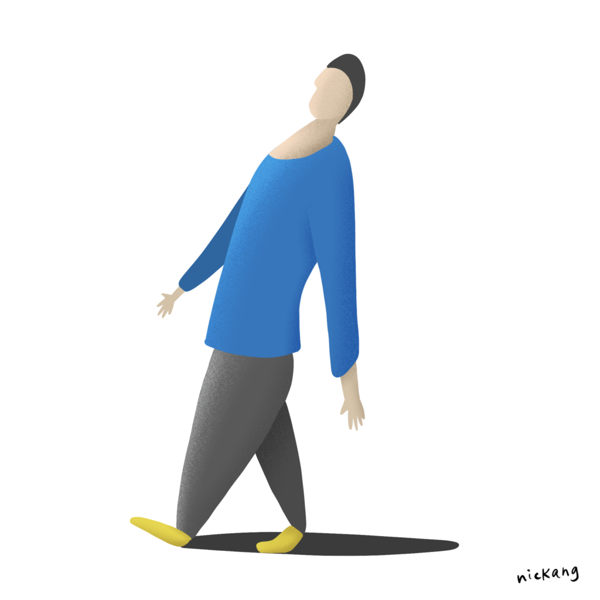
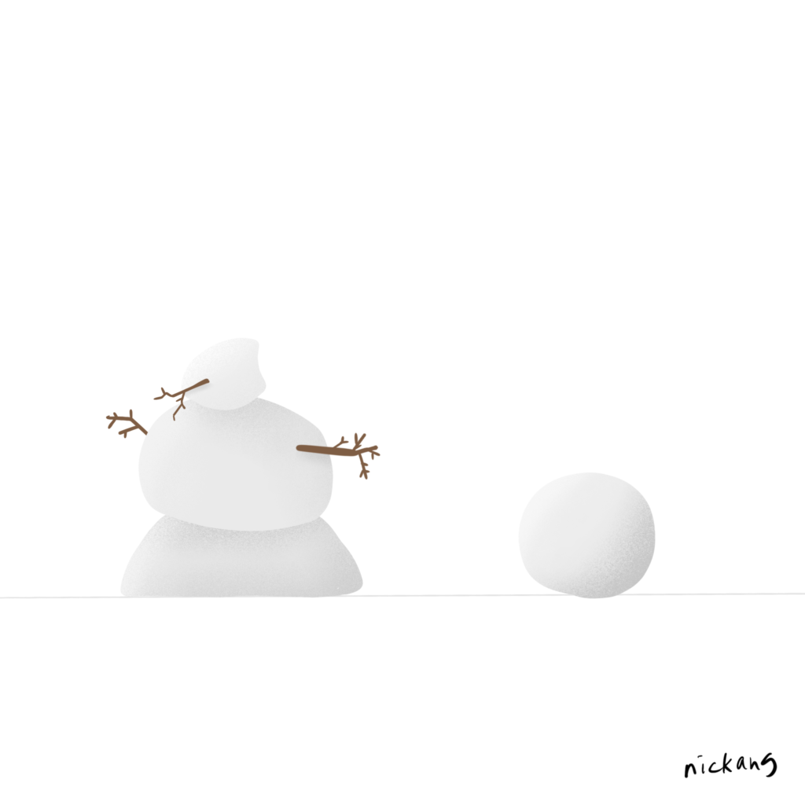
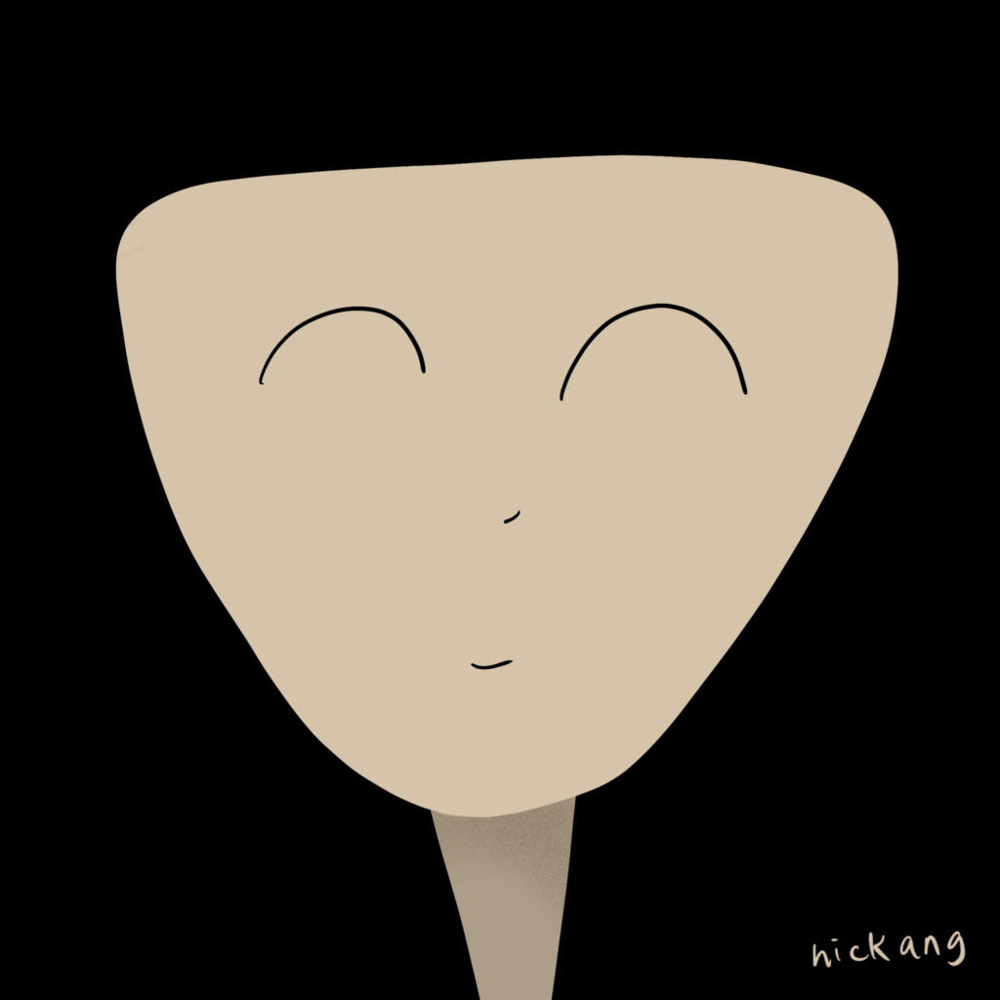

I recently spent three weeks in Helsinki as a sort of mini-rotation within [Smartly.io](https://smartly.io). While I was there, I worked a lot more closely with the team I belong to but have been working remotely with from Singapore, and I’ve learned a lot.

Below are some of my main learnings, which appear in no particular order. I was bored on my flight home to Singapore and made a couple of sketches to accompany some of the points. Happy reading!

## There's no need to run

No need to rush, one thing at a time mentality of Finnish colleagues. I want to emulate. First, by stopping my habit of running in a small office.

## Work hard, then go home on time and live

Working on laptop picture

When I'm overseas I tend to work more. There were a few evenings where I left the office at 9pm instead of the usual 6pm. The main reason is the fact that I'm alone in the city. There's only so many activities to do before you've done them all. The funny thing is, I realised that no matter how much work I do, there's always more work that can be done. Experiencing this voluntary "overworking" really drove home this point for me. Work on what you can to deliver the most impact, and then go home and have a nice evening to relax and live.

## Done is better than perfect

In a startup, before attaining stability and dominating a space, the idea of “done is better than perfect" or "speed as a habit" is useful to internalise and embody.

Get it done, then go back and do it well. But produce the benefits as soon as possible. I witnessed this at work in the way one colleague hacked a bookmarklet that enhances people’s experience when they are doing customer support, and the way another coworker scoped a new internal tool project, stripping it of "nice to haves" down to the bare essentials so that people can start using it as soon as possible.

## Trust is built 100x faster in person than on video calls

I had known for a long time that trust is built socially, and that it is built much more effectively in person. But this trip made me realise just _how much_ more effective. By my estimation, it’s something like 100 times.

Now that I’ve been back for a couple of days and have joined video calls with my colleagues on the other side of the world once again, I’ve noticed a change in the fluidity of our conversations. We crack more jokes and show more concern for one another’s wellbeing. All of this adds up to a better working experience.

I’m also much more comfortable asking for help and openly discussing ideas with them via Flowdock (what we use as our internal messaging platform). This is fantastic, because it helps me make better decisions and carry out my work faster!

## Smart people aren’t afraid to look like they don’t know

There is truly nothing to be embarrassed about when you don’t know something. You should only feel embarrassed if you allow yourself to continue not knowing even when you know that it is something important to learn. A coworker who is in a similar role as I am asked me a question that only someone who is earnest to learn would ask, because it was a technical question that some would expect him to already know. I thought he did himself a favour by not feeling too embarrassed to ask.

## It’s healthy to seek achievements outside of work

Having an intense hobby outside of work is good for your physical health but also your mental health, because it reduces the chance of you connecting too much of your self worth to your work. I've noticed a few of my colleagues here are into skiing, rock climbing and bouldering, soccer, swimming, triathlons. I wrote a whole [post](tk) on this.

## Induction technology is a life hack

Induction stoves are amazingly effective at heating up stuff in a pot. If there are not many drawbacks, I'd fit my future kitchen with induction stoves and cookware!

## Husky sledding occupy an uncomfortable space in my mind

Husky sledding is a grey area for me and I'm not sure yet how to think about it. From what I observe in Lapland, Finland, people who care for and lead packs of huskies are very kind people, but I still feel apprehensive about making them do the work of pulling the sled's and my weight because it seems to be a burden on these fantastic animals. It also feels a little exploitative, somehow more intensely than when a farmer ploughs the field with an ox or a person rides a horse.

## Goodbyes are hard and I prefer not doing it

I'm bad at goodbyes and prefer to avoid them altogether if I could. On my last day in our Helsinki office, I didn't walk around the office to say bye to everyone that I actually felt like saying bye to. I find goodbyes awkward. It always feels like I'm fishing for some last minute love, until next time.

So whenever I can help it, I don’t do it. I prefer a silent exit.

## Daily-ish reflections on Instagram

Throughout my trip, I also wrote my reflections and published them periodically on my Instagram account. It was meant to be an experiment and at the end, I'd say I had a pleasant experience writing reflections there.

The only problem is that I don't really have control over whether Instagram servers are going to be kept alive in the next 50 years, whereas I can be confident that I can spin up another server myself that hosts WordPress (which is open-sourced) if the server for this blog dies tomorrow.

But this post isn't meant to be a reflection about data ownership, so let's move right along to the (select set of) Instagram posts...

https://www.instagram.com/p/BsZUc5XBpa9

https://www.instagram.com/p/BskjhqABnvG

https://www.instagram.com/p/BsyphbiBQG2

https://www.instagram.com/p/BtJxgujBr5S

https://www.instagram.com/p/BtSYzsBBwjz
