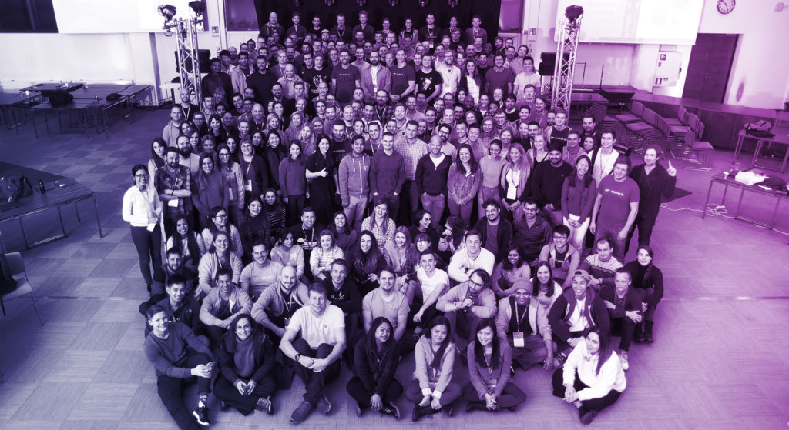

 Photo by Smartly.io

Today an article that I wrote was published on the [Smartly.io](https://smartly.io) blog. It’s a piece titled “Trust, Alignment and Action — Nick’s Learnings from Futurio 2019” and it’s about what I’ve learned from our company-wide offsite, Futurio.

You can view it [here](https://www.smartly.io/blog/trust-alignment-and-action-nicks-learnings-from-futurio-2019).

I’d actually secretly been wanting to publish on the company blog, but this article was born not just of my desire. It was happenstance.

In one of my earlier posts in February, I [reflected](https://www.nickang.com/reflecting-3-week-work-rotation-helsinki/) on how I’d been experimenting with publishing reflections on Instagram instead of here on my own blog. It was one of those posts that got the attention of Siiri, my colleague at Smartly.io who is part of the team that looks after the creation of meaningful content on our industry-leading blog.

From this, I’ve once again seen how experimentation and consistency pays off. I’ve been blogging my reflections of work for a while, which made it easy for me to experiment with doing the same on a different platform (Instagram).

The backpacker hiking behind you on a trail can get to know a lot about you from the crumbs you leave in your steps!
