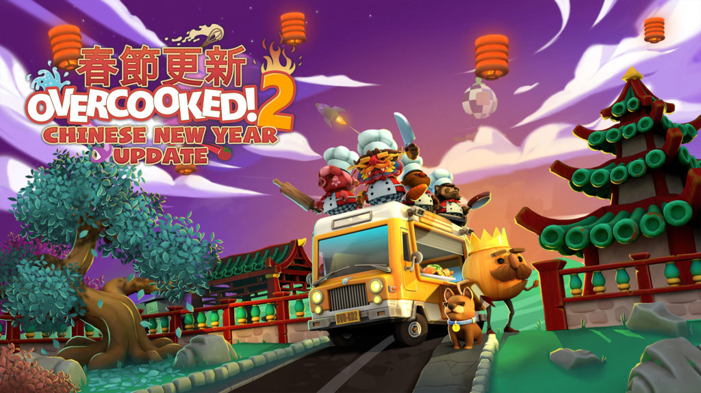
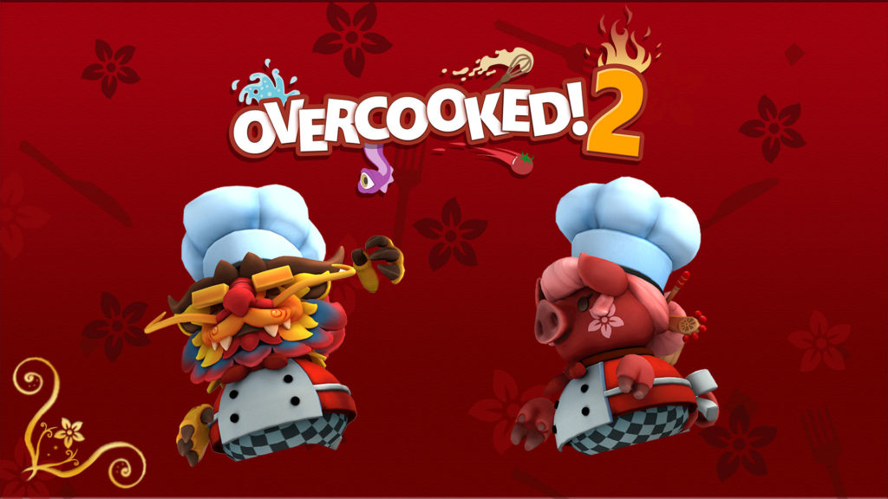

 Graphic by Team17

[Overcooked](https://www.team17.com/games/overcooked/) is a game designed for the PS4 that was love at first sight (yes, pre-play) for me and my wife. On first sight, it’s just one of those games whose goal is to prepare meals and serve them.

But when you’re engaged in gameplay, mayhem breaks loose and it becomes just one of those games that help you learn about your temperament, coordination, and teamwork, as well as that of the people you play with!

To be honest, Overcooked did occupy that “typical” cooking game space in my mind until very recently. It shared similar components of such games:

- Raw materials need to be processed (eg. chopped, cooked)
- Processed materials must be assembled into meals (eg. pizzas, tacos, sushi)
- There’s a timer on a few of these elements to keep players on the edge of their seats (eg. food can get overcooked, customers can run out of patience waiting for a meal)

## The power of seasonal content

But I said _recently_. I now think that Overcooked is in a league of its own because of one thing: seasonal content!

Specifically, as far as I can tell, seasonal content is something that is unique to [Overcooked 2](http://www.ghosttowngames.com/overcooked-2/) (PS4 version) that the original Overcooked didn’t have.

My first taste of seasonal content came towards the end of last year during Christmas, when I saw a prompt on my TV asking me to download seasonal content for Overcooked 2 when I fired up my PS4. It was delightful to play new levels that have been designed for the wintery landscape of Christmas time.

Then, yesterday I had my second experience with seasonal content, which was even better than the Christmas one. This was the moment I realised the power of seasonal content.

## Lunar New Year gameplay and avatars

For Lunar New Year, the developers of Overcooked 2 [released an update](https://www.team17.com/overcooked-2-chinese-new-year-free-update-available-now/overcooked-2/) that brought something like 6 to 8 new levels. These levels were set in the special “seasonal content” realm, separate from the usual Story realm that Overcooked 2 originally shipped with.

The really cool part for me was to discover that the Christmas levels belonged in the same realm as the new Lunar New Year levels. It’s a whole, infinitely expandable realm that is in-sync with our real-life calendar. How cool is that?

All of this is possible because of the infrastructure that the PS4 provides to game developers. Now, when you ship a game, it is only version 1.0 of the game. You can now ship seasonal updates over the internet to all players anytime and provide even more entertainment and fun to people.

 Graphic by Team17

As if this wasn’t already fantastic, the developers went ahead and created seasonal-content-specific avatars that can only be unlocked if you played the seasonal content. When my wife and I first unlocked the Chinese Dragon avatar, we were both wow-ed and we laughed at how much the developers and designers have outdone themselves to produce it. It takes a _wow_ moment to lead to a post like this, I suppose.

## The point

There isn’t exactly a point I’m trying to make in this post. It’s more of a post to share my excitement about one of the new-ish possibilities in video games that I’d recently discovered.

Some things I’ve learned from this discovery:

- Video game developers are no longer bound to the “ship it and that will be the final version” paradigm. They can release patches that fix bugs and deliver seasonal content.
- Seasonal content gets people (like me) excited because they expand the universe I’ve already grown to love. These also introduce an evergreen quality to all games that I may think of purchasing in the future, even if they don’t ever release seasonal updates. A sort of subliminal positive network effect.

All this fun to be had in producing a video game… perhaps I might try my hand at developing one in the near future!
