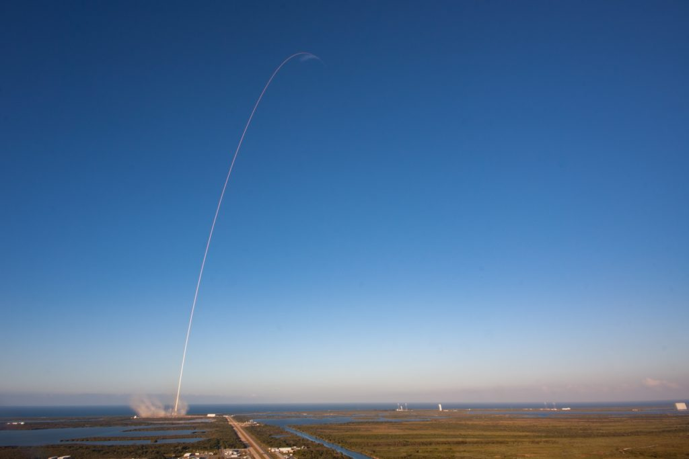

 Photo by SpaceX

I recently heard an analogy of a pilot who, before takeoff, turned the nose of his plane one degree to the left. At the destination airport, confused passengers alighted in an airport in Washington state instead of New York.

This analogy brilliantly illustrates how one small change can lead to a very different outcome.

It applies to every change we seek to make in our lives, big or small. For example, if you wanted to finally get fit in 2019, waking up to go to the gym once a week before work would suffice.

That one trip to the gym represents a one-degree change in your trajectory, which wouldn’t be visible to anyone, including yourself. But over a period of a few short months, you’d notice how different everything looks.

The point here is this: for many of the goals that we know will take time to be accomplished, where each day’s progress isn’t going to be self-evident, we should **focus on our trajectory and not our progress**.

As long as we’re on the right trajectory, we can trust that we’ll get the outcome we want.

(The analogy was from the book [Atomic Habits: Tiny Changes, Remarkable Results](https://jamesclear.com/atomic-habits) by James Clear.)
