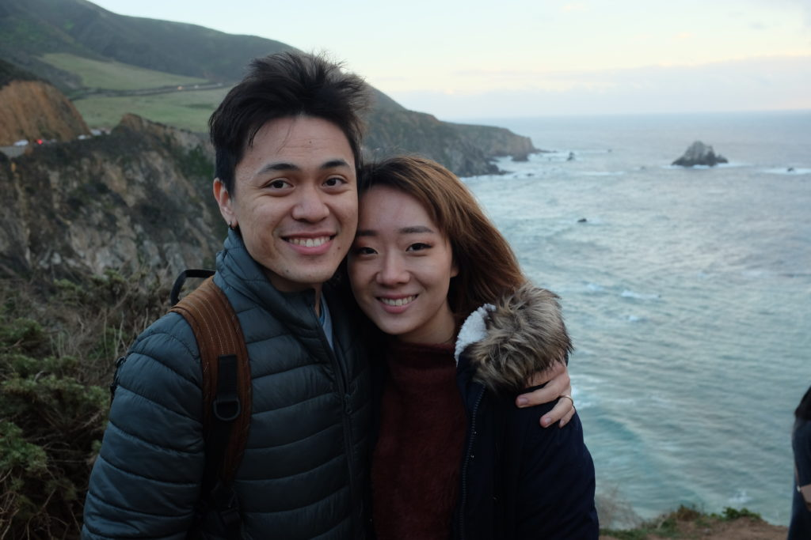

 Just by the Bixby Creek Bridge along the Pacific Ocean, two hours drive south of San Francisco

Living on the 25th floor of a tall mixed-purpose building in the middle of the city is supposed to be amazing. And in many ways, it is. What I find lacking has little to do with where our building is, but what this city is.

Singapore is hot and humid. I've never loved that about the city. This kind of weather, which, by the way, is around all-year, means that it's near impossible to have a pleasant walk in the park. You would sweat _on the way_ to the park.

Having just spent the entire January in the winter of Helsinki, I know what the opposite of hot and humid feels like. But the opposite isn't true - you wouldn't shiver on the way to the park, as long as you wore the appropriate clothes. The only problem is the fact that literally _everything_ is white because of snow.

## The perfect middle ground

Had I been born in a century earlier, I wouldn't have known from personal experience that there is a nice middle ground between Singapore and Helsinki, where the weather is kind almost all year round. Where you would be able to _actually_ have a pleasant walk in the park and feel like nature loves you.

To me, that place is San Francisco.

Situated by the Pacific coast and a 2 to 3 hours drive from the wonders of nature like Yosemite National Park, San Francisco is the dream city to be in. The weather varies seasonally but is never close to as cold in Helsinki or as hot in Singapore. It's as close to perfect as I have experienced.

Based on what I've learned in school about geography, I imagine there are at least a couple of cities that are just like San Francisco, culture notwithstanding.

How much I would give just to be able to live in one of these cities!

## My relationship with nature so far

I was born and grew up in Singapore. I was not raised spending much time in nature, which is probably the side-effect of being born in an extremely capitalistic city. My parents have always been focused on earning money, upgrading our homes, and trying to provide my siblings and me with a leg-up in competitive Singapore life.

But for some reason, I chose to major in Environmental Studies in university, and I learned about nature and the relationships that different societies have with "their" nature. Those four years I spent contemplating what my own relationship with nature was, which continued to draw a blank.

I had no relationship with nature besides resistance. Before stepping out of the house, I prepare mentally to be drenched in sweat. I try to be hygienic and wash my hands and my dogs' paws after a short walk. I resist the heat with iced teas and sunglasses all the time.

## Why weather and access to nature matters to me

About six years ago, I had been to San Francisco as part of a university program where we visited tech companies in the Bay Area. I stayed for around ten days after the trip and travelled around California with my girlfriend and witnessed the grandeur of nature for the first time.

Driving our Chevrolet convertible (a free upgrade) with its top down into Yosemite National Park for the first time, I was awestruck. I knew just how small we were. The spectacular granite mountain faces explained to me my place in life.

So why does weather and access to nature matter to me? Because good weather makes it easy for me to travel out into and be in nature so that I am reminded of my place on earth. People are not the answer. I have never met anyone in any city that would reduce my ego instead of inadvertently growing it.

I'm sick of (from?) the lack of nature in my life. And I hope I can change that soon.
