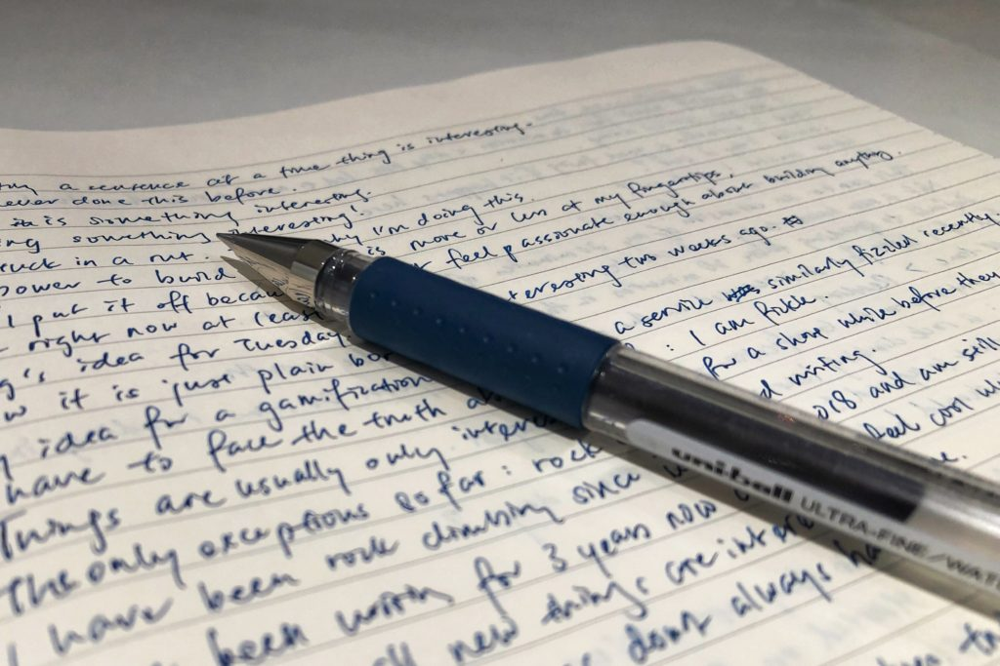

So, I just wanted to write about what just happened on my notebook. I had discovered a new way of writing that helped clarify my mind even better than my long-form morning pages journal.

It's by writing line by line. Like this. I did this just now with pen and paper before I flipped open my laptop. I had a red-wine glass of Tsing Tao beer beforehand. And I began with "I am stuck in a rut". The spontaneous exercise ended with "I am out of the rut".

In between those two lines were two and a half pages of single sentences talking about why I felt like I was in a rut and what I could and should probably do about it.

Ok, I will be a little more specific. I am just going to paraphrase what I have on my Moleskine notebook here.

\*

I asked myself about my ability to code and why I haven't felt compelled to make use of that power to build interesting things.

One of the reasons I came up with was that maybe I am bad at coding and therefore subconsciously I don't want to work on something new. I knew that was only partially and most likely not importantly true. So I came up with another reason.

Am I just not that interested in coding? was my reason in the guise of a question.

"I can rock climb, but that doesn't make money", was the next line I wrote.

"Coding and being 'technical' makes money."

"Funny thing is, I don't work on anything fun or interesting even when I don't have to make money, like on a weekend."

So then I continued to talk to myself. At this point, I was starting to get into the zone. Yes, of talking to myself with the help of my pen and paper.

"This writing a sentence at a time thing is interesting. I have never done this before."

"So this _is_ something interesting."

"I _am_ doing something interesting!"

I was starting to get intrigued now. This whole scribbling exercise began with no outcome and no structure in mind, but it was beginning to take shape and heading towards an outcome.

"The power to build software is more or less at my fingertips."

"But I put it off because I don't feel passionate enough about building anything."

Here, I wrote down two examples of projects that I had recently gotten quite excited about, only to experience a sharp dip in enthusiasm for them in less than two weeks since I had first heard and thought about them.

"I have to face the truth about myself: I am fickle."

"Things are usually only interesting to me for a short while before they become boring for me."

Then came a sentence I'm a little embarrassed to share online, but I will for completeness of this post.

"New is my oxygen. Without new things, I feel like I'm in a rut."

Right after this sentence, as if out of nowhere, I came up with an idea, which I somehow decided to write down as a matter-of-fact statement.

"I need something new and interesting to work on every month."

And so I have arrived at the point of this post. **I am going to work on a new and interesting (to me) project every month.**

## One project every month

A month is all I got, even if the project is interesting and I want to continue working on it. A month is also all I have to endure if a project ceases to be interesting to me.

These are the parameters I have set for myself to set myself up for succeeding in this new undertaking:

- I will work on the month's project every single day
- I will only have to spend 20 minutes working on it each day
- If I become uninterested in the project midway, I can quit
- Once I quit, I cannot go back to continue on the project again
- Also, once I quit, I will spend those 20 minutes on reading instead of doing

I haven't been actively publishing on this blog for the last two months because I have been working on developing two new habits. One of those habits is to read for 20 minutes each day. I can spend more time reading, but not less.

Along with trying to develop this habit, I have also been trying to write 750 words each day. I have so far kept a 54-day streak for both of these purportedly life-changing habits.

The point of bringing this up is to lend context to why I setup those parameters for myself on this new endeavour. Those parameters have worked really well for me so far.

The key elements are to work on the thing every single day, and to be careful to only try developing one new habit at a time.

The latter is the reason why I am combining this new endeavour of one new project each month with my now somewhat established habit of reading for 20 minutes a day. Being realistic, I don't think I can introduce a third habit for development when the other two haven't become habitual yet.

## Project #1: A 'Gamification' backend

<blockquote class="twitter-tweet">
<a href="https://twitter.com/hashtag/amcoding?src=hash&amp;ref_src=twsrc%5Etfw">#amcoding</a> and doing research for what framework to use for my new project which is going to be backend heavy. Will need a good ORM library in terms of ease of use. Any recommendations?
— Nick Ang (@nickang) <a href="https://twitter.com/nickang/status/1154974884956479489?ref_src=twsrc%5Etfw">July 27, 2019</a></blockquote>

I will begin by continuing to work on one of the side projects that I had started a week ago. (I've actually been tweeting about each new learning as I gain them - click on the embedded tweet above for the full thread.) It is to build a ready-to-consume Gamification API that allows any developer to quickly use to store data related to their internal gamification projects.

Gamification, by the way, is the concept of adding a layer of competition and fun on top of what would normally be a mundane, routine job.

I'm thinking of building an API that will enable developers to quickly iterate on gamification projects instead of building and maintaining their own infrastructure for a proof of concept.

To set myself up for success, my goal with this project is just to make a demo website that will consume this imaginary gamification API. With that API, it will work beautifully. And without that API, it will just look like a dumb website that does nothing.

My project for August is to build that dumb website.

* * *

_So, that's what has been on my mind lately. Sorry for disappearing for two months recently. I have actually been quite active on Twitter in the past two months, so feel free to follow me or just tweet 'Hi' at me [@nickang](https://twitter.com/nickang) on Twitter!_
