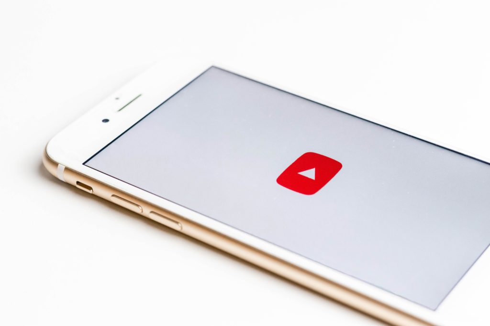
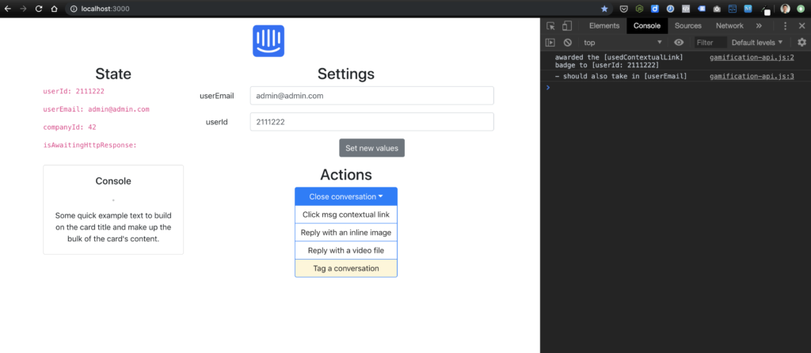

 Photo by Sara Kurfeß on Unsplash

I had two habits going. This was supposed to be a third habit. I would work on a [new side project every month](https://www.nickang.com/one-project-every-month/), which should involve doing something every day for that month. For August, the goal was to code, for 20 minutes a day, a simple frontend that makes dummy API calls to a would-be API. This first side project was a failure.

I failed because I only managed to sit down to code for 20 minutes for a total of 6 days in August.

## Lesson: Each month has a different rhythm

The failure wasn't due to lack of motivation. I had a few projects in mind and I genuinely wanted to keep coding on the side to improve my skills.

The reason for failing to keep a daily routine for this project was the fact that I hadn't considered what my month of August would really look like ahead of time.

We traveled for 10 days in Australia with some friends. That made it difficult for me to carve out time to do code. I would have had to wake up very early. I was already waking early to write daily. Compounding it would make me both an asshole to my traveling companions and make me a little too tired to enjoy the trip.

Ok, there's probably also a part of me just wasn't willing to prioritise this for a project that I didn't care deeply about seeing through. I was coding a simple frontend that would make dummy API calls to a server that would then, in the backend, make server-side API calls to a microservice that I would eventually develop after this frontend is done. It was supposed to help me visualise the technical and business requirements of a generic gamification API service. The gamification API part was the more interesting of this 2-part project, and I haven't gotten to that yet.

What I had produced by this time, nearing the end of August, is a frontend that has buttons and options that basically functions as a simulator of a consumer application (eg. Intercom app for customer support). It can send requests to a not-yet-existent gamification API service on the fly, triggered by actions taken by support agents as they chat, tag, and close conversations with customers.

Here's the final product of August's project:

## Next: Side project for the month of September

For the month of September, my new project will be unrelated to coding. I want to **produce and upload a video a day for the 30 days** in September.

My goal with this project is to go through the motion of shooting, editing, and uploading videos on a regular basis, and the purpose is to compress my learning of video production so that I can make videos in October when something really interesting is going to happen... (more will be revealed on the vlog soon. If you're interested you can subscribe to my [YouTube channel](https://www.youtube.com/channel/UCfGK7NLYK22y1ahCh6w9baw).)

This will obviously take much, much more time than 20 minutes. So it makes sense to question whether I'm setting myself up for failure. I don't think I am, because **the rhythm of this project matches the rhythm of what I think my life in September will be like**. More than the rhythm of my August matched my coding project.

In September, we will be traveling to Ukraine for a 10-day holiday. For the rest of the 20 days, my life will be slightly more interesting than a usual month because we are in the midst of preparing for something big and probably quite relatable. Hint: we are moving.

These are the parameters I will be setting for myself for the September one-vid-a-day project:

- One video uploaded per day on my not-yet-existent YouTube channel
- Spend at most 1 hour editing and rendering the video, so that it doesn't intrude into my normal life too drastically

Even though I don't think I'm setting myself up for failure despite the bigger commitment, I still worry about not being able to follow through with this completely. One video a day is probably the most time-intensive side project I would have embarked on so far in my life, voluntarily. It won't be as easy as reading a book for 20 minutes daily.

But I'm excited about getting good at shooting video, working in iMovie, selecting and incorporating music, and weaving everything together with good storytelling.

I consider this a project that is about getting through the phase of learning the tools of the trade. The video quality is not important. Even the story isn't too important, although a poorly told story is always better than a story not told at all. It's about maximising learning, as these projects are supposed to be about.

Interested to follow along? You can do that by subscribing to my ghost town of a YouTube channel by clicking [here](https://www.youtube.com/channel/UCfGK7NLYK22y1ahCh6w9baw). And if you have comments or thoughts you'd like to share with me, tweet me [here](https://twitter.com/nickang).
