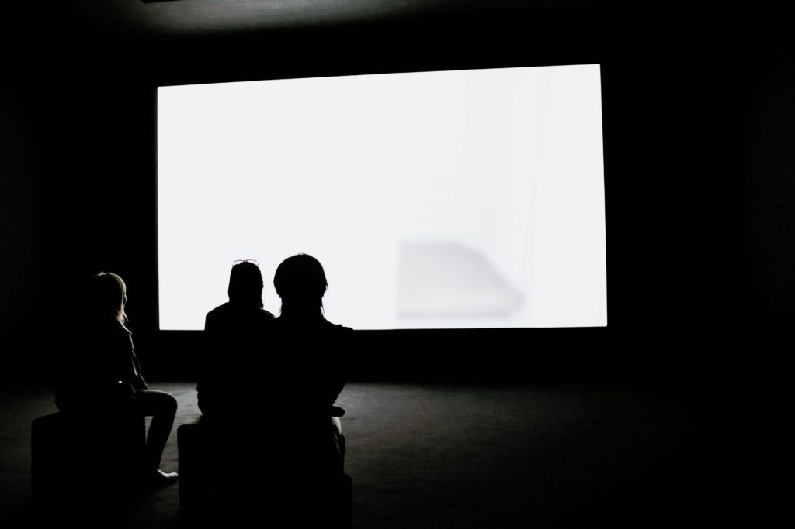

 Photo by Adrien Olichon on Unsplash

I'm looking for a word that describes this exact feeling because it was how I felt yesterday from around 4 pm. That was when I left the office and headed home after a long 4-hour meeting with the team. I was participating remotely from Berlin, while the rest of the team were in Helsinki.

When I came home, I realised I didn't have a lot of things I could do that didn't involve looking at a screen.

I wanted to sketch, but sketching is most fun nowadays on my iPad.

I wanted to write, but then realised I would have to type on a laptop. There's no other device that I could use other than pen and paper, which was out of the question.

The only thing left to do that doesn't involve looking at a screen is to read. I own a Kindle for this reason.

In the end, Mei and I went for dinner together at a vegan-friendly Vietnamese restaurant nearby called Co Chu and spent the evening talking about our experience away from home in Berlin so far. I enjoyed that meal very much because it also meant being away from screens.

For me, wanting to get away from a screen is not a response to eye fatigue. It would be more accurate to describe it as a response to _digital fatigue_. I craved some real-world, tactile interaction. Keyboards and touch screens are an extra layer between an action and the outcome it produces.

With pen on paper, the distance between lead and pulp is all there is.

For an Apple Pencil and iPad, the glass and the milliseconds-quick computation stand in between. While they don't impede the act of drawing, knowing that what you're creating is a simulation can sometimes get tiring.

So it would be nice to have a word to describe how I felt yesterday. Because I know the feeling will come visiting again soon.
