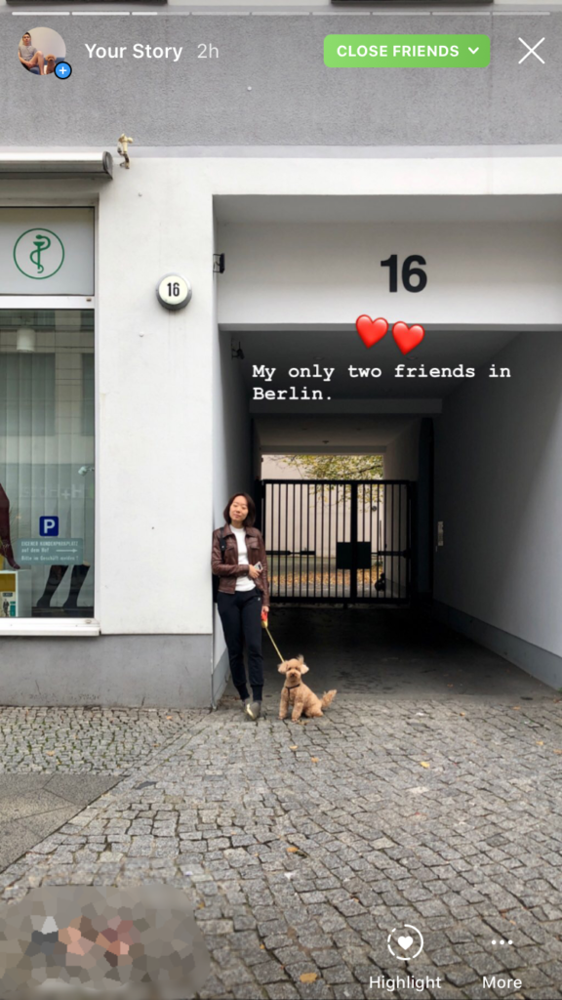

Earlier this year in February, I published my last post on Instagram and left the platform. I left because I was feeling what every magazine has discussed as the detrimental effects of using something like Instagram. I was constantly and, worse, subconsciously, comparing my life to other people's.

The straw that broke the camel's back was the moment that I realised I was, just like basically everyone else on Instagram, participating in a posturing culture. I mean, this post says it all. I was alone in a hotel in Copenhagen, so who took the bloody photo?

https://www.instagram.com/p/Bh0ieM_nTpU

It's 2019, so I will spare you the sermon on how using social media could cause imbalance in your life.

Instead, I hope to share the story of how I stumbled on the solution to this problem.

Nowadays, I'm back on Instagram and reaping the benefits of being on the platform. The main benefit of Instagram, I find, is the fact that I can share my experiences with my close friends and family with very little effort. Everyone including my mum is on it. Being a lazy person, that was a big plus for me.

The story began with the sabbatical.

## A 6 months sabbatical from Instagram

I didn't plan to take a sabbatical. No. In February 2019, I just stopped using Instagram indefinitely because I saw that it was doing a lot of harm and provided meagre returns. To be honest, even now, I'm not sure I was getting _anything_ out of being on Instagram in my first few years of periodically posting and constantly consuming.

But it had the effect of making me constantly think about what other people are doing and experiencing. Had the posts and stories been more representative of what a normal day is like for these people instead of being their daily enhanced (and sometimes outright artificial) highlight reel, I would have found it OK.

Alas, that's not that case. Everyone knows that Instagram, in its current state, is basically the world's biggest highlight reel.

Once I realised the effects, I just stopped one day. At the time I actually had some sketches that I really wanted to share with my friends but I held back and uninstalled the app anyway.

Then, I forgot about the sketches I wanted to upload and I forgot about Instagram. And life was great. My mind was unleashed from the incessant chatter and it was once again free to observe and day dream.

In the ensuing months, I started to build new habits, mainly because I had about an extra hour each day now without consuming and posting on Instagram. I'm particularly proud of the two habits that I've managed to establish: writing 750 words and reading for 20 minutes daily.

I have kept up a streak of over 100 days of writing and reading now and it not only feels amazing, but it also looks amazing. I mean, I get to read my morning journal entries and see how I've progressed! And my digital 'read' shelf on Goodreads is growing.

Writing daily takes about 20 to 30 minutes of my time each day, and reading for 20 minutes takes, well, 20 minutes. So that's how I've productively spent my extra hour each day since I stopped using Instagram. This is something I'm very proud of.

But it is October 2019 now, and I'm back on Instagram.

## Moving to Berlin

In a [blog post](https://www.nickang.com/new-years-resolution-2018/) I published about my new year's resolutions for 2018, I talked about how I wanted to leave my country to live abroad for a few years. That didn't happen last year, but with some hard work, we've managed to move to Berlin this year, in October.

Relocating to a new city is probably the most exciting thing I've ever done in my life so far, and I really wanted to document my experience in packing up, moving, and settling into a new continent, country, and city. I was sure that I would experience many new things that if left undocumented, would be forgotten memories.

It wouldn't be an exaggeration to say that ever since I got the OK to move from my employer, my biggest fear was losing memories of these early Berlin experiences.

My hypothesis was that I would be experiencing so many new things that I could have something interesting to talk about every single day in a vlog format.

So I started preparations early.

As we confirmed our relocation day to be in the first week of October, I started a [side project in September](https://www.nickang.com/my-first-monthly-side-project-was-a-failure/) to film and publish a vlog everyday. I managed to publish 18 videos that month, and it gave me a real taste of the work involved with filming and editing videos. It was tedious and took me roughly two to three hours each day to film, edit, and upload these vlogs.

Now, two weeks into our stay in Berlin, I haven't made a single vlog. It's just not possible! German bureaucracy keeps you on your toes all the time. Plus, it would take time away from us absorbing our new surroundings.

Within the first two days of our arrival here, I knew that if I ever wanted to document my experiences and share them with my friends and family, I would need a new plan. Vlogging on YouTube is not viable, at least not now while we're busy learning how to live in this wonderful city.

## Instagram fit the bill

So, I became a hammer in search of a nail to smash. I started asking myself, among all the social media platforms that are at my disposal as a modern human being, which one best fit the bill?

The bill:

- It cannot take too much effort to share, because then I would just not do it.
- It cannot take too much effort to create the content, because then I would just not do it.
- It is hopefully creative enough for me to experiment with different ways of expressing myself.

And the platforms to choose from were:

- Instagram
- Twitter
- Blog
- YouTube
- Facebook

So I worked down the list and struck out those that didn't fit the bill:

- Instagram
- Twitter Not sure I could get friends to use this thing, even if I tried.
- Blog Too much effort to share content.
- YouTube Too much effort to create content.
- Facebook

So I was left with Instagram and Facebook.

This was when I recalled a feature that was released by Instagram just days before I left the platform - the **Close Friends list**.

It is such a simple feature that it needed little explanation. I knew that it basically allowed me to select a list of people to be grouped as my "close friends" and that I would be able to share Instagram Stories exclusively with them instead of my list of followers.

Armed with this realisation, I reinstalled Instagram on my phone and created my Close Friends list.

## How I use Instagram now

\[caption id="attachment\_3443" align="aligncenter" width="576"\] Sharing only to Close Friends\[/caption\]

Two weeks have quickly passed and we've experienced a lot in Berlin, even though by any measure, we are taking things slowly.

I now have, under my belt, two weeks of posting daily Instagram Stories updates to my close friends list. It has been delightful, so far.

Whenever I share something there, I would get a few messages in my Instagram inbox from friends and family. All of those I would take the time to reply carefully and half of those usually end up becoming short discussions.

Every time I launch Instagram on my phone now, I don't think about scrolling the feed or watching other people's stories. Instead, I just think of what's in my inbox and what conversations I might be having today with my close friends.

I have a fundamentally new relationship with Instagram now. One that, to me, seems healthier and a lot more purposeful.

When I started to use Instagram again after 6 months of being off the platform, I was afraid I would start subconsciously comparing my life again to the lives of the people I follow. But that hasn't happened.

I think what has happened is that my new mentality towards what to use Instagram for has removed my desire to scroll through the feed or watch other people's Instagram Stories. The only exceptions are the Stories that my close friends share with me.

I'm quite happy with my new relationship with Instagram.
