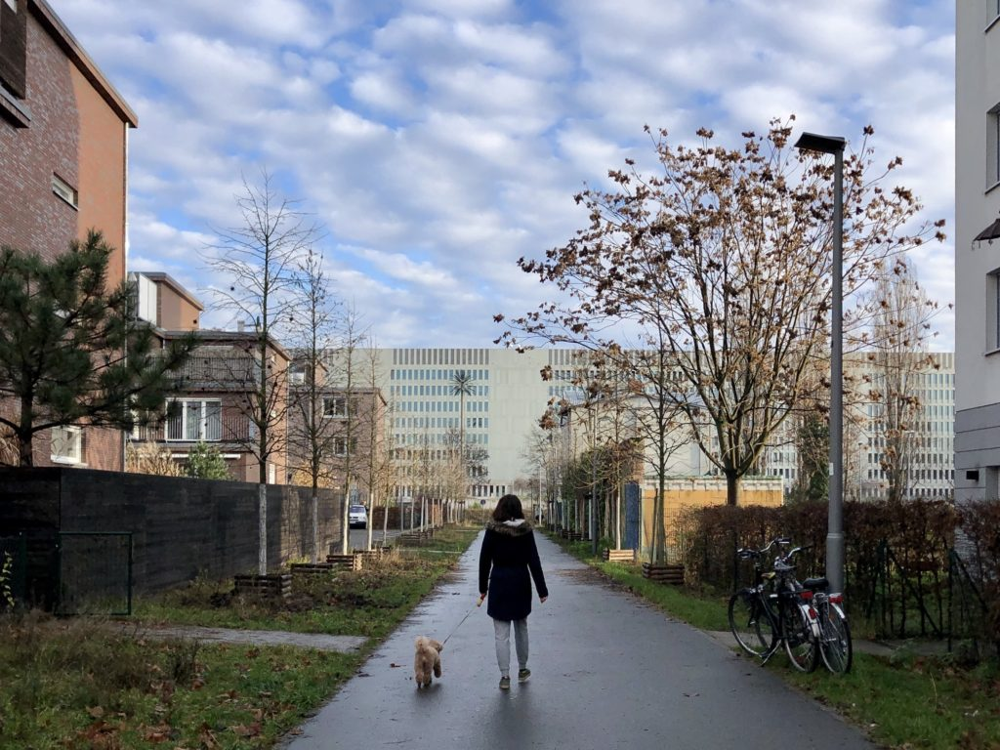
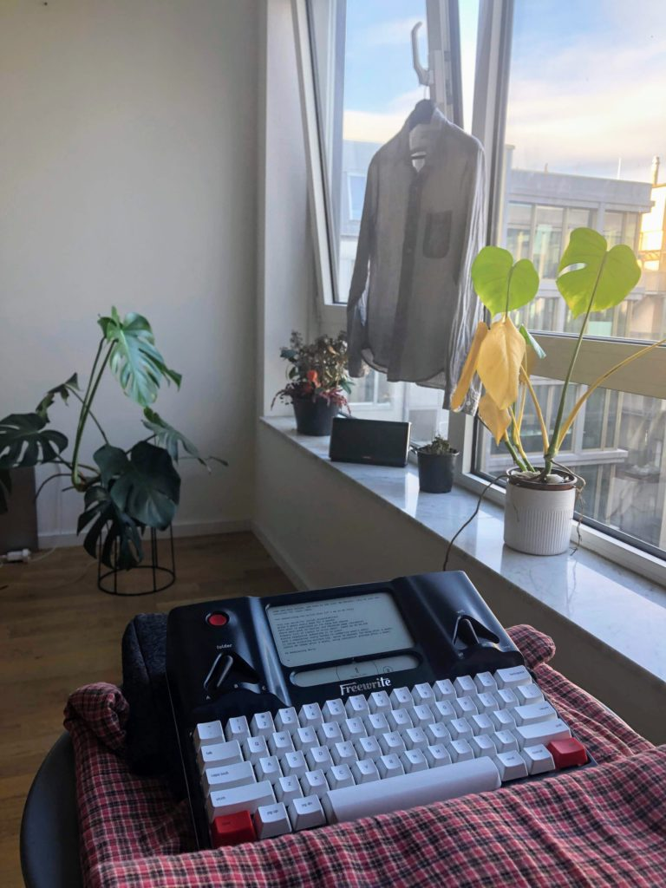
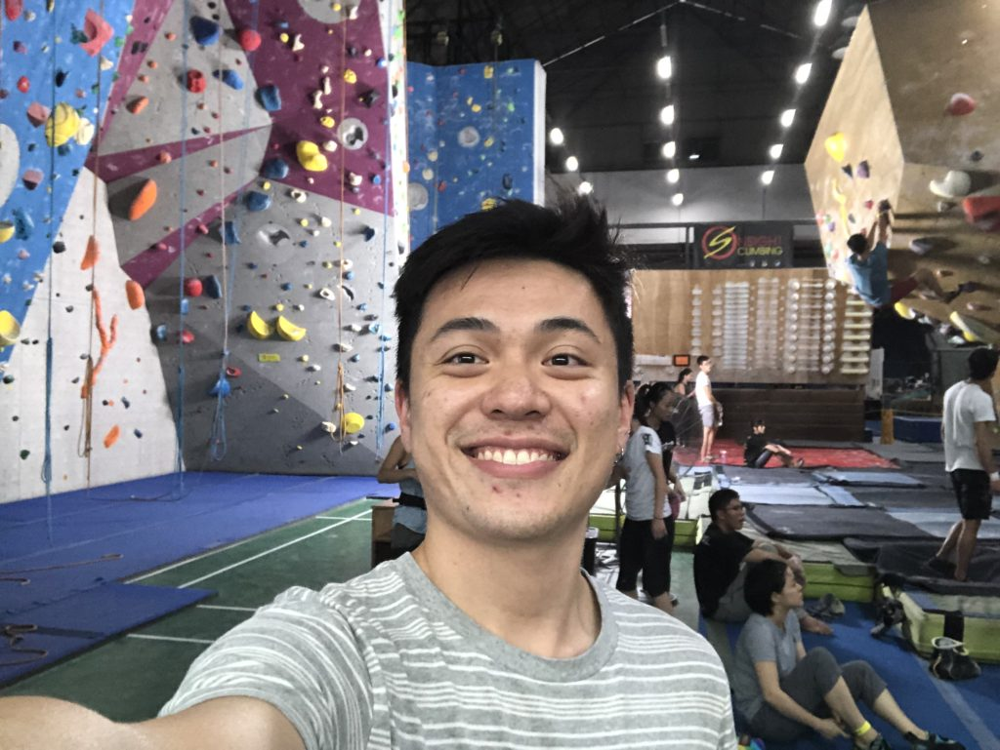
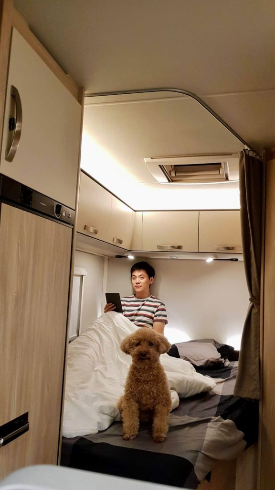
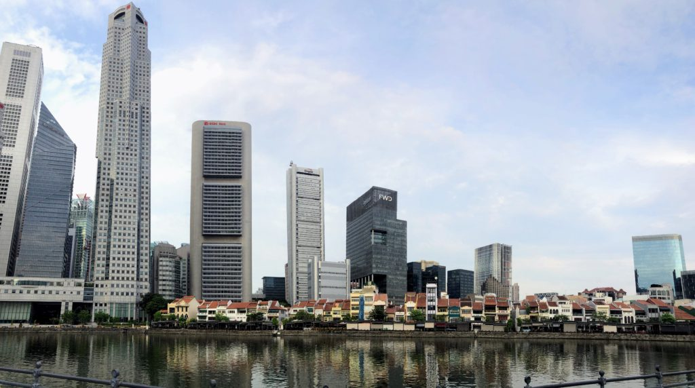

 Walking in our new neighbourhood in Mitte, Berlin

## The value of writing daily

This is the first year in my life where I've consistently kept a journal almost every single day. I have written an entry in my journal on 250 days amounting to around 150,000 words year-to-date.

While I'm certainly proud of creating this new habit, I'm more interested in the results of writing daily.

I wrote every day on my laptop (and nowadays [on my Freewrite](https://www.nickang.com/first-impressions-of-the-astrohaus-freewrite/)) in the morning before heading to work because I needed some mental purging. [Tim Ferriss](https://tim.blog/2015/01/15/morning-pages/) in one of his podcasts articulated the negative effects of letting your thoughts run freely in your mind the best: every thought un-purged is like a bullet ricocheting in your brain. By the end of the day, your brain is absolute mush.

People conduct mind-purging differently. Some meditate, others play sports. I mostly write, although sports has become quite a big part of my routine this year and it certainly has an effect in purging my mind as well.

Writing my thoughts in words has helped me to continually clear unnecessarily negative or superfluous thoughts and create space for fresh thinking. I find that it has had a strong positive effect on my productivity at work because I can focus on the projects I'm working on without getting distracted by the noise up there. It has also helped me maintain a greater presence when I'm with my wife. I tune out a lot less.

So my biggest lesson this year is learning how useful and feasible it is to write every day. I highly recommend you to try it yourself and see what it does for you!

## Sports is exercise while having fun

This is really obvious when put into a sentence, but it took me close to 30 years to figure this out. Sports is basically fun exercise!

One of my [2018 New Year's Resolutions](https://www.nickang.com/new-years-resolution-2018/) was to find a way to sustain an exercise regime. I recognise the benefits of a healthy body, of feeling strong, and how it correlates to a strong mind, but I've never experienced success in setting up a long-term exercise regime like some of my friends have since their teens.

Going to the gym works for some people but not me. I dislike "hitting the gym". Though if the gym was an object I think I might actually enjoy _hitting_ it. For me, running on a treadmill and doing repeated body movements is as interesting as watching paint dry. I never enjoyed it, and I attributed my countless failed attempts to start an exercise regime in the gym to this lack of joy.

In December 2018, I went rock climbing with some of my colleagues. It was a company event. I didn't fall in love with the sport immediately but I decided to go again because something about climbing walls of great heights intrigued me.

Two months later, I found myself paying for an all-access pass to a group of rock climbing gyms in Singapore, climbing 3 to 4 times a week with my wife (whom I had dragged into the activity and who now loves the sport as much as I do).

I found joy in rock climbing and since we go to the rock climbing gym at least 3 times a week nowadays, I'd say I've finally found an exercise regime that works for me. Extra points that I get to work out, have fun, and do it together with my wife.

The milestone is a significant one for me - knowing I have a sport that I can't wait to go _play_ after work, even at the age of 30, is incredibly liberating. I know my physical health is taken care of as long as I continue to climb.

In terms of the lesson here, it is this: if you know you want something, the first path to try should be the one that sounds like it has a good chance of being fun for you.

I could have saved some money and time, not to mention grow stronger, if I had explored sports like rock climbing earlier. Maybe I wouldn't have liked it if I tried earlier, true, but I believe if I tried other things instead of sticking to just things in a regular gym, I might have found my thing earlier too.

## Provide value, gain bargaining power

 A picture from our first campervan road trip, somewhere in the north of Germany

This year my wife and I and our dog Brownie moved from Singapore to Berlin while I remained employed by the same company. What a great deal! I'm honestly still pinching myself sometimes wondering if we're really here, fulfiling our promise to ourselves that we will live abroad for some time before deciding on a place in this world to call home.

What I've learned from my relocation is that if you focus on providing value, you will inadvertently gain some bargaining power.

I [joined Smartly.io](https://www.nickang.com/one-month-at-smartly/) in June 2018, about 1.5 years ago. At the time of my final interview, I mentioned to my recruiter, who is now one of my closest colleagues in the company, that realistically speaking, I was only likely to accept the offer (if I got one) if there was an opportunity for relocation to another office outside of Singapore. I wasn't trying to be a hard-ass. I mentioned it up front because I wanted to be fair to her and the company as well - if they weren't willing to or able to consider my needs, then the interview need not go on any further.

Also, and this is important, I was absolutely willing to prove the value I will bring to the company with time before the relocation happens. A transaction usually involves an exchange. From June 2018 to July 2019, I focused on providing value to the company. I did that by providing technical support to our teams in the Asia-Pacific region. Eventually, my bargaining power grew, and they made the relocation happen.

The lesson for me here is two folds:

1. Don't be afraid to tell what you're worth
2. Be humble and focus on giving value, and you shall be valued

I'm aware that there are probably millions of people in this world who have done amazing things for their employers but received no reciprocal gains in bargaining power or even appreciation. This is not discounting the fact that capital exploits labour.

But in my honest opinion, you ought to be able to recognise this and create a plan to transition to a new employer who does reciprocate. Trust me, companies like [Smartly.io](http://smartly.io/) exist around the world - you just have to put in the effort and find them.

## Commuting is a pain in the ass that can be eliminated

 The Smartly.io office is somewhere in this photo

My wife is a makeup artist and her work involves frequent visits to hotels where wedding banquets are held. In Singapore, most hotels are near the city centre.

Anyway, in 2018, we lived in our apartment in Bukit Panjang, which was a 30 minutes journey by motorcycle on the expressway to Orchard Road, the city centre.

On most weekends I would drive her from our apartment to the hotel lobby on my 20-year old Honda Shadow 400 motorcycle, sometimes up to two round trips in a day. That's 30 \* 4 = 2 hours of time just being on the road, possibly waiting to be caught in a jam, engaged in road rage because someone was having a bad day, or getting hit by a reckless driver.

One day, we were at the iconic Ion Orchard junction on my motorcycle and my wife casually suggested, "Why don't we rent an apartment here?" It sounded like a joke because of course, we wouldn't be able to afford an apartment in the city centre! How ludicrous a question, right?

But for some reason, perhaps it was the tropical heat under my helmet, I said, "That's a great idea. Let's do some research." And the rest, as they say, is history.

We rented out our own apartment that was 30 minutes away from the city centre for around the same amount that was our new rent in a smaller apartment in the city centre.

I believe that in life, there's a time for everything. Being in our late 20s, sacrificing some floor area for a much better location for the same price was the right thing at the right time. We went from living in an oversized 110-sqm apartment to a just-right sized 60-sqm apartment for the three of us.

From June 2018 until October 2019, just before we moved to Berlin, we lived in this apartment in the city centre. It was so near to the large hotels that my wife could sometimes walk to them to meet her bridal clients. And for me, my office was a jaw-dropping 5 minutes walk away. It used to be a 40-minutes motorcycle ride. It was like living in two different worlds.

Those 15 months were probably the most enjoyable months that we have ever had since we moved out and began living together.

On most days, I would leave the office with the sun shining on my face, and I got home within 5 minutes to be greeted by my wife. We'd finish dinner at a nearby food court and by the time we left, the sky would still be bright. And on most evenings, we either went rock climbing for 3 hours or spent the time doing our own things at home, together.

For the first time in my life, I felt like I was living like a millionaire. It was not just because we lived in an expensive postal code. I felt rich like a millionaire because I could spend so much more time with the people I loved.

This is the year that I learned an extremely valuable lesson: eliminating one's commuting is extremely beneficial and it is achievable. I attribute my stronger body, less stressed mind, and healthier relationship this year to the fact that I've virtually eliminated my commute.

I don't intend to turn back anymore until, perhaps, after I've retired.

In Berlin, we've similarly chosen to pay higher rent for our centrally located apartment, which is a 10-minute cycling commute to my office. The sun has been setting at 430pm lately in winter though, so it isn't always bright by the time I leave the office and get home. But the benefits still apply!

## Everything is bought with time

This is a quick but profound lesson that I took from a book that was recommended to me by one of my colleagues. The book is _[The Millionaire Fastlane](https://www.goodreads.com/book/show/18872437-the-millionaire-fastlane)_ by MJ DeMarco. Although I'm not a fan of the book title, I do like its content. It is a good book and I recommend it highly to anyone who has ever thought of employment as a kind of bondage.

Reading this book has helped me see what _stuff_ really is bought with. I guess you could say that I experienced a curtain lifting moment where I glimpsed what's behind the stage for the first time. Everything - the stuff that we buy on an almost daily basis - is bought with time, not money.

Most of us, including me and my wife and everyone in my family, work a job primarily so that we have money. And to get that money, we trade our time. Skills are merely multipliers of the amount of money you get, but the limiting variable is time.

So if we work for money, and to work means to use up time, then we're trading time for money. It's not a new idea. The conceptual leap is, though. And it's that we buy things with time, not money.

This has changed my way of thinking about the purchases that I make. It hasn't made me necessarily more frugal. Instead, it has made me think about every purchase in terms of the time multiplier it potentially has on my life. Some things free up time, others take them up.

For example, I recently bought a distraction-free, drafting tool called the [Freewrite](https://getfreewrite.com/discount/XTR6424BZFVZ?rfsn=3471572.a797a1&utm_source=refersion&utm_medium=affiliate&utm_campaign=3471572.a797a1) (affiliate link). It's basically like a Kindle for writers. It cost 500 EUR, which is a significant amount of money, but I bought it anyway because I knew that it would increase my output of words by at least 2 times. That translates to halving the time it takes me to produce a blog post draft, which is freeing up a lot of time for me. It has a time multiplying effect of at least 2, which is huge.

An example of something that takes up my time is buying expensive groceries.

Before coming to Berlin, living comfortably in Singapore, I would occasionally choose to buy a more expensive version of the same product, like organic milk instead of milk, or better-branded milk over the supermarket's own label of milk.

Pricing plays with your mind, signalling that a product is of a higher quality if it is priced higher than its shelf mates. _There must be a reason why it's more expensive than this other brand's milk, right?_ Some times it's true, but I've found recently through a blind taste test that it can easily be false as well. I think 80 percent of the more expensive products taste the same and has the same nutritional value as their more affordable counterparts.

https://www.instagram.com/p/B4F_wfvn72s

Buying a slightly more expensive carton of milk might make me feel like I'm progressing in life (_oh look at me, I drink 'superior' milk, I must be successful_), but it is merely an illusion and the cost is extra time because time is traded for money. As Russell Peters puts it, _no thaaank you!_

## Goodbye 2019

2019 has been a fantastic year for me and my family because of the things I've learned and the opportunities I've managed to catch. I can honestly say that this is probably one of the best years of my adult life so far. Life has been kind to me this year. _People_ have been kind to me this year.

I'm extremely grateful for all the things that had to happen for me to be typing this post in an apartment in Berlin, Germany.

Okay, I'll stop myself here before I get too sentimental. Wherever you are and whoever you are reading this, I hope your year has gone as you plannedworked. Yes or no, let us work to make 2020 an amazing year for the people we care about by continuing on our never-ending quest of growing ourselves.

Happy holidays and new year!
