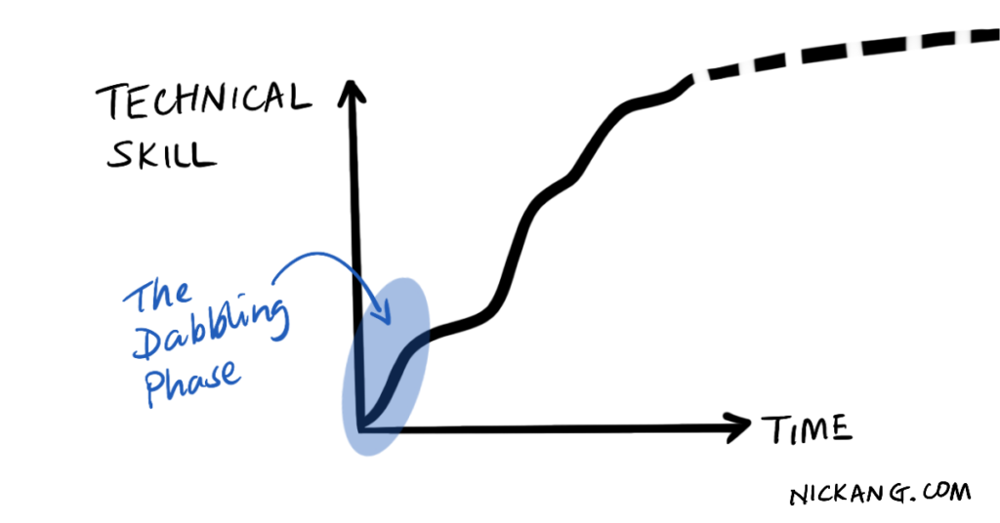

**If there is a skill in this world that is perfect for learning by iterating, it is programming.**

Iterating means to make an initial attempt, then improve on it if you choose to do so. I strongly recommend you to take this approach to learning to code.

Coding lends itself terrifically to this approach because you can write 100 lines of code and when you press _Run,_ your code is evaluated instantly by a computer. The magical result is instant feedback. This means that in a short amount of time, you can get a real sense of what coding _feels_ like. And from there, you can make your judgement of whether it is for you.

In other words, the best approach to start learning to code is to **dabble first, then take the leap**.

## Which programming language?

At this very early stage, I don't think it matters which programming language you choose to dabble with. When you've made up your mind that learning to code is interesting enough, _that's_ when you should pick a programming language.

It's like trying tea for the first time - if you've never had tea, any cup of tea will give you a rough idea of what tea generally tastes like. First, finish that box of tea that uncle Sammy gifted you from his recent trip to Japan. When you're done, you'll know if you still want to have tea or not. That's the definition of dabbling.

Is it possible that uncle Sammy's tea from Japan happens to be the kind of tea, perhaps it was a fruit tea, and it turned you off? Yes. But there is a much stronger set of commonalities across modern programming languages (JavaScript, C++, Python, Ruby) than there is among teas (fruit, black, green, herbal). So the chances of you getting off on the wrong footage are very slim.

However, if you are already past the dabbling phase and are wondering which programming language is the best for you to leap with, I recommend JavaScript. I share my reasoning in [this other post](/2017-10-17-how-to-get-started-with-programming-part-2/).

## How much should I dabble before leaping?

When I was learning to code for the first time in 2016, roughly a year after I graduated from university with a non-technical Bachelor's degree in Environmental Studies, I dabbled for 3 months before leaping.

I wanted to get a taste of what coding was like, so I decided to dabble in it. I googled for free coding courses online. To help me narrow down the long list of courses available online, I made a short checklist that functioned like a criteria list:

- Must be hands-on. There should be a way for me to write and run code so I learn by application
- Leave me to try it for myself. I don't want to be spoon-fed. Instead, I want to be challenged and if I'm stuck, I expect there to be not-too-obvious hints
- Community of people to ask for help (optional). It'd be great to ask a human to explain something to me if I'm stuck. But then again, I believe in my googling skills, so this is optional

[FreeCodeCamp](https://freecodecamp.org) was what I ended up using because, well, they ranked high on Google and met the above criteria. I won't lie, it took me a whole day of sampling various course providers to decide on FreeCodeCamp. But by the end of the day, I knew it was good enough for dipping my toes in technical waters.

(The runner-up was [Codecademy](https://www.codecademy.com/). But I didn't like it as much because I felt like they were hand-holding me too much. Often I felt like I was being talked to like a 12 year old, which I didn't appreciate.)

So I ended up learning HTML, CSS, and for the bulk of my time, JavaScript on FreeCodeCamp.

In total, I spent 3 months coding for about 1 to 2 hours each day. The devil is in the details, so I will write _how_ I structured my time during those 3 months in another post. I did benefit from being a fresh university graduate with no education debt, fresh out of failure from trying to build my own tech startup without technical skills.

After those 3 months, I realised that I found coding interesting enough that I should enrol myself in a [full-time programming bootcamp](/2017-03-12-general-assembly-singapore-review/). This was me _leaping_. A few more months later, I started work as a junior software engineer at an unheard-of startup based in Hong Kong.

So how much should _you_ dabble in coding before leaping? I recommend giving it at least 1 to 2 weeks.

Try coding on one of the free online courses that have an in-built web-based code editor where you can write and run code. And do it for something trivial like 30 minutes a day. If you're already liking it, you can up that time to an hour or two. This was exactly the rhythm I used until I realised, _Hey, this is actually kinda fun..._ The rest is history.

## Use interestingness as your guide

One final practical note about this approach. When you're dabbling, use interestingness as your guide.

If you find writing and running your code to achieve some kind of outcome a little interesting, code more. Keep going.

But if you find it as boring as watching your laundry dry, then you should acknowledge that perhaps coding is not for you. People like to over-explain things, but it is really as simple as that. Use interestingness as your guide.

And by the way, if you are afraid that you will get stuck on a difficult problem and that that will turn you away from learning to code in this dabbling phase, rest assured. The basic concepts in programming like variables, different data types, and even conditional if/else statements should be accessible to you.

I say it's accessible to you because you, as a logical, functioning member of society, already think like that. You just haven't been writing your thinking _explicitly_ as step-by-step instructions. So don't worry about walking into an incredibly difficult problem when you're doing an introduction to programming course online. You're merely writing down explicitly the way you think, so that a computer can emulate your thinking.

I'll leave you with this curve that I made up, which I think does the job of explaining the growth of your technical skill across time. The beginning is the most fun because you can make progress rapidly, building concept on top of concept and applying as you write and run your code.

The dabbling phase is where you'll likely experience the most interestingness in the shortest time

If this initial phase is still uninteresting to you, then there is a chance that coding may not be your cup of tea.

* * *

If you have dabbled and realised that coding is uninteresting to you, please [tweet me](https://twitter.com/nickang) about it. I'd like to have a conversation with you to find out if I might have missed something in this post, and potentially help you confirm or reject your decision to stop learning to code.
