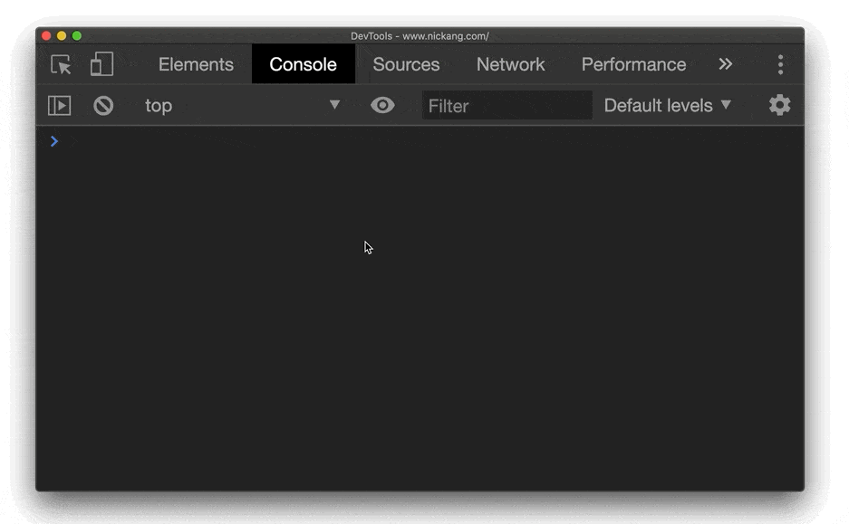

REPL stands for read-evaluate-print-loop and it is basically a program that is an active session running a programming language and awaiting additional inputs.

I know from experience trying to explain this concept that it can be confusing at first, so in this post I'll try to explain what is an REPL in practical terms.

## What is REPL for?

REPL is used regularly by people who are understand a programming language to quickly run a snippet of code and see its outcome. This is usually done before incorporating a code snippet into a project, or as a quick way to do some hacky computations on the fly.

There are more advanced use cases for REPL, like to access a database through application code. But that's beyond the basics, so I will deliberately leave that out for now. If you're curious to know more, [tweet me](https://twitter.com/nickang).

All this is to say that it pays to know what what is REPL for. Once understood, you can use it to do some very useful things very quickly.

## Read, evaluate, print loop

A REPL is essentially just another program that repeats the steps of read-evaluate-print.

"Read" means that this program, the REPL, allows for user input that will be read by the program.

"Evaluate" means that this program will receive the user input and evaluate it. For example, in a JavaScript REPL, you could write `if (true) console.log('the statement is true')` and hit enter, and it will print out the sentence `the statement is true` because the conditional statement, the "if" block, was _evaluated_ by the program and the code inside the block was executed.

"Print" means that this program has a way of displaying its output. In the case of REPL programs, the output is always directly printed in the same console in which you write inputs.

Put together, Read-Evaluate-Print forms the basis for a very useful but simple program that lets a developer write some code and have it executed, and its output are shown immediately after the loop finishes.

So, as you can probably guess, the "loop" part just means that the first 3 steps of R-E-P are ran in a loop. After an input has been evaluated and its computed outcome has been printed, the program returns the command line back to you again, awaiting further input to run the next loop.



Running simple commands is extremely quick using an REPL like the Chrome DevTools console

As you can see from the GIF above, which shows me writing a series of statements in JavaScript in the Chrome browser console (a REPL program), I have the ability to quickly compute things on the fly. One of my most frequent use cases for an REPL is to do this kind of quick computation.

### Random name picker example

Let's say I'm teaching a class and I want to impartially pick someone at random to come up to the front and present his or her project. I could say that I'm going to "randomly" pick someone and then point to her, but since this is a programming class, I realise I can't fool them with my imprecise parlance.

So I decide to launch a REPL and write a quick algorithm.

Since I'm familiar with JavaScript, I know that the quickest way to access an REPL that interprets JavaScript is to use the Chrome browser's console tab. So with the contents of my screen projected on the wall, I launch Chrome on my computer and open the Chrome developer tools > console tab. I do that with the shortcut `Cmd + Option + J` on my MacBook.

Within the console, I write a simple program that will help me pick a student who is present at random.

```js
let students = `Chee Kean
Jerry
Justin
Edmund`;

students = students.split('\\n')

function randomNumber(min, max) {
  min = Math.ceil(min);
  max = Math.floor(max);
  return Math.floor(Math.random() * (max - min)) + min;
}

function getRandomName(array) {
  return array[randomNumber(0, array.length)];
}

// run
getRandomName(students) //=> 'Justin'
```

I write this in the REPL and when I hit enter, the program prints a random name as an output of the code I wrote.

Here's what it looks like in action:


A random name picker written quick and dirty in the Chrome DevTools console! (Okay, I pre-wrote the functions to make this GIF short...)

Boom!

Super simple, super fast. As long as you know how to write some JavaScript, you can do incredible computations with a very short setup-time by using the Chrome console.

### Other examples of frequent use cases of REPL

Here are some situations, described in JavaScript code, where I've used an REPL at work or on my side projects.

Counting digits (useful for verifying, e.g. a credit card number has the correct number of digits):

```js
'491751971537'.length //=> 12
```

Sorting a list of names alphabetically:

```js
const months = ['Mary', 'Jane', 'Febrian', 'Deckster']
months.sort() //=> ['Deckster', 'Febrian', 'Jane', 'Mary']
```

Sanity-checking code that I've written in a project:

```js
// Checking whether a HTTP request using
// fetch will work as expected
fetch('https://www.nickang.com')
	.then(a => a.json())
	.then(response => console.log(response))
	.catch(error => console.log(error))
```

## REPL for every major programming language

In my examples above, I chose to use JavaScript because it is probably the most accessible programming language for modern day use. But you can find an REPL program for most major programming languages:

- Python
- Ruby
- Java
- C++
- JavaScript
- ... and more

This is great, because each programming language has its strengths and weaknesses, and there are different situations that call for each of them.

## 3 bullet summary

- REPL stands for read, evaluate, print loop and it is a program that accepts inputs, evaluates those inputs, and prints the output for instant feedback to the programmer
- The top use cases for REPL are: 1) writing and testing new code before incorporating into a project, and 2) running quick and dirty computations on the fly
- REPL programs exists for most major programming languages like Python, Ruby, Java, C++, JavaScript, and more. The concept of REPL is the same across all languages
