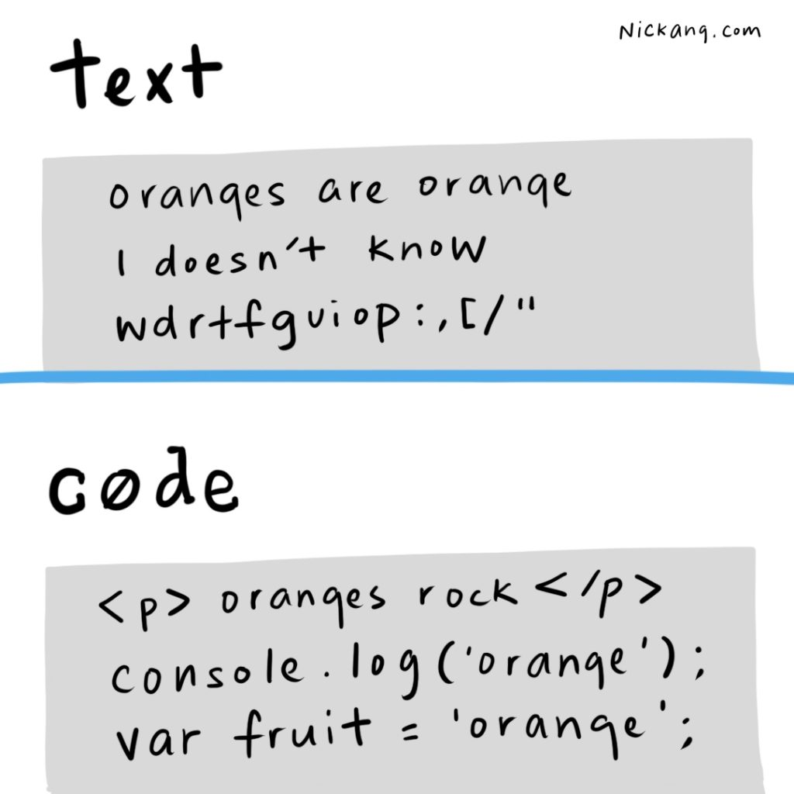
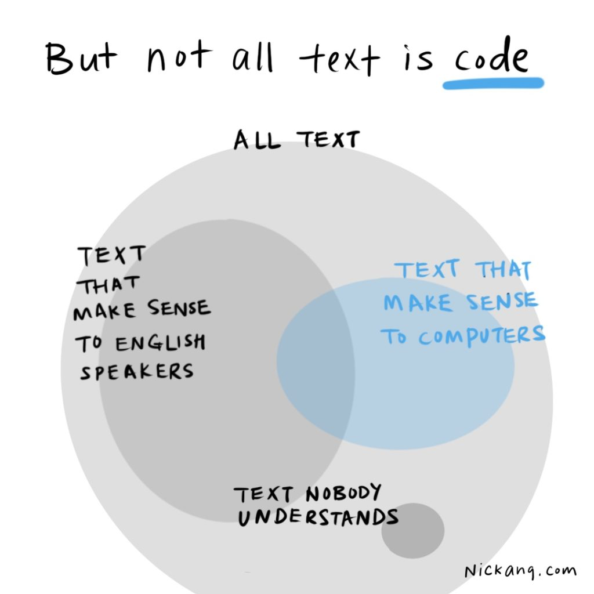

What is the difference between text and code? Clarifying this concept should help you demystify what code is once and for all.

Is code special compared to text?

Turns outs, code is not that special! In fact, code is just text that is written in a specific format, following some rules.

Text is any combination of characters, but you wouldn't say "jfoebhtoajxnrirn" is text _in English_, because not a single English-speaking person in the world could tell you what it meant. Nonetheless, it's still technically accurate to call it text.



The same applies to code. Code is just text that a _computer_ understands.

So while `console.log('oranges')` doesn't make a lot of sense to someone who doesn't understand the JavaScript programming _language_, it does make sense to a computer that can read JavaScript.

And any text that a computer can interpret and run? That's called code. (It's called computer code to be precise, but nobody bothers saying computer code nowadays since most code written and read daily are computer code. So just "code" will do.)

## Details about text vs code

A computer will only interpret the contents of a file as code if you modify its file extension. For example, you could have a file that contains this text (it's HTML code, actually, but code is just text, remember?):

```html
<h1>Meow, world!</h1>
<p>Purrr.</p>
```

And let's say you created 2 files that contained this exact text:

- File 1: welcome**.txt**
- File 2: welcome**.html**

When you try and open these on your computer, it will try and find the most suitable program on your computer to open it. The result?

File 1 gets opened in a text editor, like NotePad on Windows or TextEdit on Mac. File 2, on the other hand, will be opened either in a code editor or, most likely, your browser.

The outcome is significantly different! Even though the contents are identical, the file extension (.txt vs .html) determines what will be done with that file.

In the case of file 2, the browser will display a webpage that has a big bold heading saying "Meow, world!" and a paragraph underneath that in normal font, saying "Purrr.".

* * *
