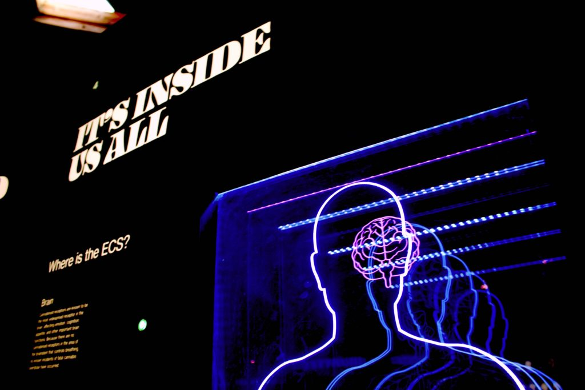

Photo by Bret Kavanaugh

This post is my basic attempt to write down the way I’ve been thinking about human memory and how I’ve approached using computers to augment my own limited memory.

Note that this isn’t meant to be very scientific as it’s just me putting into words my current state of thinking on this. I may write a post in the future that is richer in citations for the scientists in us.

Anyway, the reason I want to write about this is because I had a conversation with my wife recently about the way _I_ have been handling information in our lives together. She's not too happy, so I'm writing this to help me think how to think about the topic of memory and augmentation.

## Comparing human to computer memory

A good place to start is by comparing human to computer memory. That will give us a basis for discussing how to leverage these two devices later.

I believe that computers are modelled after the human brain, not just because humans made computers but because I actually see strong similarities between them.

A computer has two kinds of memory: random access memory (RAM) and hard disk space (storage). RAM is used for _quick_ read-and-write access. Storage on the other hand is used for long-term, _slower_ read-and-write access. So the main difference between the two types of memory in a computer is the speed of access. That is an important difference because it ultimately determines processing speed, or the speed at which computations are made and connections are drawn.

The human memory seems to share the same model as computer memory. There is short-term memory, like when you're at a social event and meeting a lot of people and you have to remember people's names lest you make someone feel insignificant. This is just like the RAM of a computer: after the social event, your brain will most likely purge the names out of your memory to free it up for newer tasks.

Then there's long-term memory, which your partner is probably constantly putting to the test by asking you “do you remember” types of questions. (Reminiscing is a big part of relationships!) This long-term memory of the human brain is just like the hard disk space in a computer because it's tucked away for future who-knows-when access.

## How I think human memory should be managed

With that in mind (as in, hold that thought in your short-term RAM so you can draw connections to what I'm about to say next), here's how I think human memory should be managed for maximum overall effectiveness.

My wife likes to try and remember things using her own brain and I don't. That's the fundamental difference between how we think human memory should be managed, so let's start there.

We live in a time where we each have a computer in our pocket that connects to billions of computers around the world. Even without that connectivity, the processing power and memory available in our mobile phones nowadays is enough to store most of what you'd ever need to remember. With mobile data that connects your phone to the internet, you can store and access literally _everything_ you'd ever _want_ to remember. So, why not put that into use?

In my engineer’s mind, it's clear that this kind of technology has matured and is here to stay. Every app we use on our phone or laptop is but a series of files with text in them that can be stored reliably in a hard disk somewhere. Which is to say that any argument about how it is unsafe to store information on computers for future access should, by now, be debunked and stop holding sway in any discussion about memory.

(To indulge in the software engineering side here with some details, I’d just like to mention that every type of media, be it an essay, a video clip, or a spreadsheet, is basically stored as a ‘file’ in a computer’s filesystem. These files just contain characters. So for as long as we have computers in the world, we will be able to access our digital files.)

So, unreliability of technology shouldn't be a valid argument to not use it for extending one's memory.

We can, and I think should, use technology like our mobile phones to augment our memory.

I believe that a lot of things should be written down (in an app on a phone or laptop) and swiftly forgotten. As long as we know how to do a search on the app later on, future retrieval is guaranteed. The kinds of things that I believe should fall into this group of things are:

- facts about a place or person or the missing items in one's fridge
- passport numbers, credit card numbers, friend's addresses and birthdates, the PIN to one's bicycle lock
- results of analysis, thinking, and synthesis in writing

Perhaps the last point is contentious because it depends on whether you employ a robust system for note-taking that enables re-discovery like a [personal knowledge management (PKM) system](/2020-07-05-personal-knowledge-management-system/), but the rest should be understandably suited for outsourcing to computer memory.

So the workflow is to always _write it down_. Need to buy mushrooms because we’ve run out? Write that down in your go-to To Do list app, and forget about it completely. The goal is to clear your brain's cache because the fact that you need to buy mushrooms during your next grocery run has already been recorded and doesn’t need to be remembered by you. Let the computer remember it for you.

## What I learned from my wife's disagreement

Here's the part that my wife disagrees with me: I believe that there is no longer any utility to remember about the mushrooms.

I would wipe mushrooms from my mind completely knowing that it's been taken care of. This purge, I believe, helps free up a small bit of the equivalent of RAM in my brain so that I would have one less thing sapping "brain juice" up there. Ultimately, I believe that **having as few irrelevant things as possible in my mind at any point in time enables me to do the best work that I actually am trying to do**. That could be writing a computer program or climbing a difficult rock climbing route or planning the itinerary of a not too distant holiday.

My wife disagrees because of 2 things:

1. She believes that human memory will, unlike computers, expand when it is trained regularly to retain more information
2. She believes that holding short-term information in one's brain is vital to ensuring a healthy memory, especially when you're walking down the proverbial memory lane, otherwise it would make people sad

I need to do some research to find out if point 1 is true, but I agree with her on point 2. If I’m honest with myself, I know I can be incredibly unromantic at times because I cannot remember the details of how our trip to Bali unfolded with enough detail.

Using apps to convert items from my short-term memory into the long-term memory of a computer has likely caused my memory to deteriorate. As a result, I’m less able to remember details with my own brain. That’s the insight I got from talking to my wife about this.

Perhaps now is a good time to bring up that although I believe that mobile digital technology is mature and reliable, I also acknowledge that it is not as readily _accessible_ as, say, one's own brain. Our connection to the brain is always-on and instant, whereas a computer still needs to be at-hand for its memory to be accessible.

## How I think about memory with computers now

Whether or not science tells us that human memory expands with use, I now think that **it's more useful to use computer memory to augment human memory in a supplementary way**. So instead of a dependency, a computer becomes a trusty sidekick.

Action point to myself: I will start by trying to remember that we need to get mushrooms during our next grocery run. And if I forget, it shall be right there in Wunderlist.
