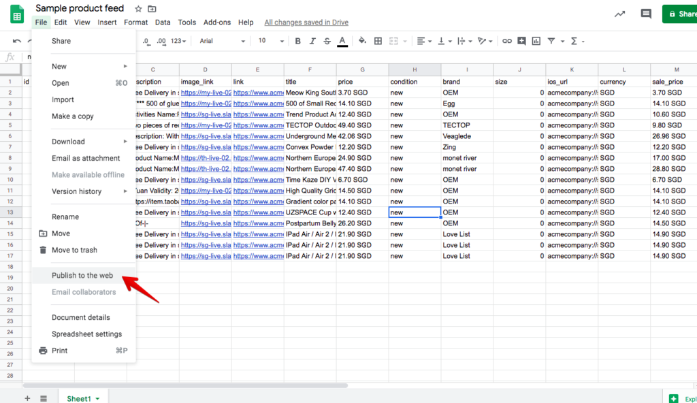

One way to make the data in Google Sheets downloadable is to publish to the web - but is it reliable for sensitive business use cases?

I work at an advertising technology company that has some of the biggest advertisers on Facebook in the world as clients. For these big clients, the main bottleneck we solve is automating manual work, and we do that with a product called Automated Ads.

Automated Ads basically allows our users to connect a hosted feed file (e.g. a Google Sheets CSV export file) to our system and ads will be created, updated, and deleted based on differences between the now and the previous refresh. It’s an impressive state machine with a robust diffing algorithm and I continue to learn things about how it is engineered in terms of application code till this day, almost 2 years into working at [Smartly.io](https://www.smartly.io/).

Anyway, on to the reliability of Google Sheets as a source of data.

The reason I brought up the Automated Ads product is that it was designed to be agnostic of where users host their feeds. Most of our users gravitated naturally to the dominant online spreadsheet provider [Google Sheets](https://www.google.com/sheets/about/). I don’t know the numbers but I’d guess that Google Sheets must have had an important role in enabling our company to grow in the early stages since it was basically free to use for hosting relatively large spreadsheets.

Today, however, we had several users complain that some ads had been archived unexpectedly in their campaigns that was managed by Automated Ads. It’s puzzling, because no changes were made to the campaign settings, and our users shared screenshots of their recent Google Sheets version history and they more or less proved that no data were modified before their ads got archived by our system.

Remember, the way Automated Ads works is that it looks at the previous feed’s data, compares it with the current feed’s data, and if there are differences, it makes HTTP requests to Facebook to create, update, or delete ads. In all these cases, there had been no differences between the previous and current feed data.

So, what was the reason?

We noticed from our logs for one of our users that the last feed downloaded from Google Sheets was 200kb in size, while the latest one - the one that triggered several ads to be deleted - was only 6kb in size. That’s close to 40 times smaller, and it led us to what we now think is the root cause: the feed file that our server downloaded using the user’s Google Sheets public URL was somehow incomplete. Instead of the full 500 rows feed, for example, one with only 20 rows was returned. Since previously existing rows were missing from the point of view of our diff-ing algorithm, our system deleted some ads!

## Downloading via API might be more robust

Let’s talk about possible solutions from an engineering and product perspective. Users don’t want to hear excuses. If you ask them to specify a URL to a hosted feed and that will connect their data to your system, they expect your app to work with it, no questions asked. Things should just work.

With that in mind, one thing that I think our engineering team might explore is to download the feed file using [Google Sheets API](https://developers.google.com/sheets/api) instead of the public download URL.

This API approach will only work if Google’s server side code is different for the API export versus the public URL export. Otherwise, we will still get the same result of a partial feed.

## Other engineered solutions

My hunch is that the Google Sheets API is going to be more robust than the export URL, because APIs are usually just one layer of abstraction (SQL) away from the database where the data actually resides.

But just for fun, I started asking myself (and having discussions with our software developers) what other potential solutions there could be. Here are some other possible solutions:

1. For every feed file that is connected, whenever our system pulls data, we can query it 5 times instead of 1, and only start processing the data if all 5 requests responded with the same number of rows of data
2. Build in a fail-safe to check the number of rows and compare it to the previous download's number, and prevent further processing if the number falls too drastically

There are probably more, but these were the two that we came up with. I think the first is a better idea than the second because it's just more tedious, not more complex.

If Google Sheets' server would just work as we expect it to, that would be the ideal scenario.

Personally, I think it's annoying to have to patch another product's instability, but that is something that product and development teams have to get used to working with. Rather than complain, it's probably better to do something and move on.
