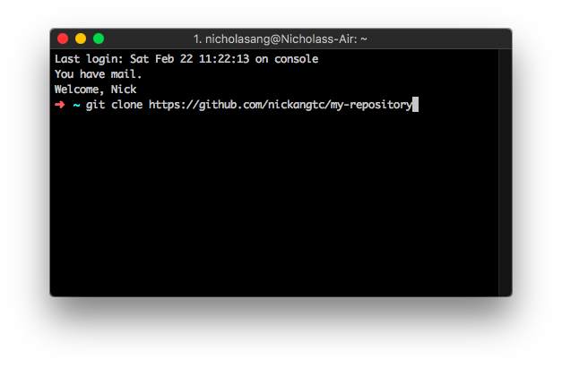

Setting up Terminal to access GitHub when there is 2FA setup on is more convoluted than I expected, so here's a reference.

The first time you try to clone a repository from GitHub to your laptop (after being granted access by your team mates), Terminal will prompt you for your username and password.

You should use these inputs:

- username: your GitHub email address (not your username)
- password: a **special token** generated from GitHub developer settings

## **Generating the special token**

Because of enforced 2-factor-authentication (2FA) by your organisation, you will need to use a special token to access GitHub from Terminal instead of your normal password. This setup should only need to happen once.

1. Login to [github.com](http://github.com)
2. Go to [https://github.com/settings/tokens](https://github.com/settings/tokens)
3. Click on Generate new token
4. You will be asked for the scope of access this token will grant -> select all, since it's for you and you want full control
5. Click Generate token -> Copy this. There is no need to store this anywhere, you can always regenerate a new token and invalidate the current one if needed

This token is what you need to enter as your **password** in Terminal, instead of the normal password you use to login on [github.com](http://github.com).

## Troubleshooting

### 1\. GitHub account does not have access to the repository

If you see this error, it most likely means your GitHub account has not been granted access to the repo you're trying to clone.

```shell
fatal: repository https://github.com/my-repository not found
```

There's a quick way to figure out if you have access or not:

- Ensure you are logged in to your GitHub account before proceeding
- If you have access, then you should be able to view the repository on GitHub.
- If you don't, then loading the GitHub repository URL will only lead to a 404 resource not found page.

If you can see the repository on GitHub but you cannot, for example, run `git clone <https://github.com/my-repository`\>, then it means that it's most likely a matter of using the wrong password. Refer to number 2 below.

And if you see a 404 when loading the repository

### 2\. GitHub account has access but not through Terminal

If you see this error, it means that you have entered the wrong credentials.

```shell
fatal: Authentication failed for https://github.com/my-repository
```

This second scenario is if you have checked scenario 1.

If running a basic access action like `git clone` still doesn't work, then you're most likely using the wrong password.

As long as your repository or the organisation that owns the repository has enforced 2FA for all collaborators, you will need to generate a token that should be used as the password you input to Terminal. To be explicit: You need to supply a token, not your normal GitHub password, to Terminal when it asks you for your GitHub password if you have 2FA enforced by the repository owner.

See the start of this post for instructions on how to generate this token! :)

* * *

**You might also be interested to read:**

- [All you need to know about Git and GitHub](/2018-02-28-git-and-github/)
- [How programmers work together from every part of the world](/2016-08-23-programmers-remote-work/)
