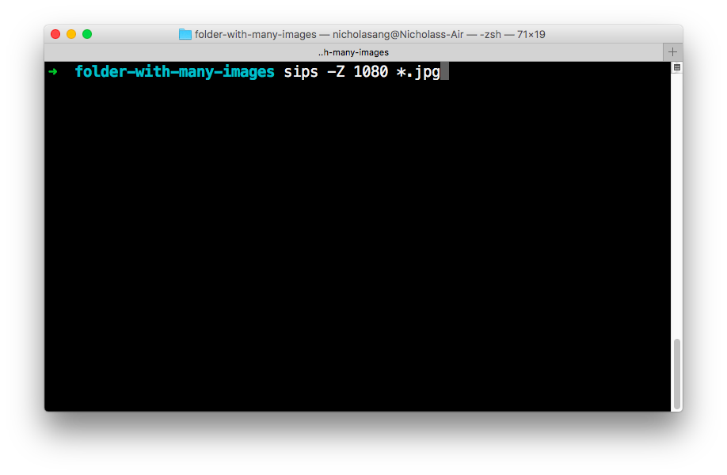

I've been teaching people how to code for several iterations now, and one of the things I used to struggle with was to convey why it is useful to learn to use the command line interface, i.e. Terminal.

At the beginning, learning to use the Terminal means learning to do things more laboriously. You can imagine how that can be a hard sell. It's like saying "trust me" and then telling a long ass, not so interesting tale that eventually delivers a great surprising ending.

But _trust me_, it's useful to learn to use Terminal.

Okay, jokes aside, it really is useful. I mentioned that I initially had a hard time trying to explain to students why we should learn to use the Terminal - as in, I no longer find it so hard to explain why we should invest time to learn it.

The key seems to be demonstrating the possibilities up-front.

## Basic Terminal commands are building blocks for something greater

These commands are boring but super useful _as part of_ understanding how the command line works, and _as part of_ scripts that could automate bulk actions:

- `cd directory_name` -> change into directory\_name
- `ls` -> list files and folders in current directory
- `pwd` -> print the path to the working directory
- `mkdir directory_name` -> create new directory directory\_name
- `touch filename` -> create file
- `mv directory_name_1 directory_name_2` -> move folder
- `mv filename_1 filename_2` -> rename file
- `rm file_name` -> delete file
- `rm -rf directory_name` -> delete all children files and directories in directory\_name

Sure, navigating around directories and creating and deleting and renaming files is not in itself interesting or even particularly useful. But when you understand the basics, you develop an intuition for what the command line is capable of, how to work it, and what to expect in terms of its behaviour.

For example, you need to use the command line with basic commands like `cd directory_name` to know that Terminal will not report little successful operations but instead, only complain when there is problem. So changing directory with `cd` just quietly succeeds. Also, learning to use the humble `cd` command teaches you that in Terminal, you are always working from a specific directory. None of these things are intuitive at the start until you try doing some things with commands.

Once you know the basics, at some point you put two and two together and realise that there probably are a lot more sophisticated commands you can use to do cool things with. And, you’d be able to guess that if an operation is successful, it could be quiet and the way to check is to do an `ls` or `cat filename` to see the contents on folders and files.

Finally, you start to apply your knowledge in real-life scenarios. That's when your knowledge of Terminal really pays off.

## Practical application example: Batch resizing image files

One of my students, who is also my colleague at [Smartly.io](http://smartly.io/), came to share with me recently, a few days after our 3-hour "learn the command line" class, that he had successfully ran his first useful Terminal command. Let's call him M.

M had a repetitive part of his work at [Smartly.io](http://smartly.io) where he has to send several photos of invoices in an email to our finance team on a weekly basis. The challenging part was staying below the attachment size limits imposed by Gmail in a single email. He always had to manually the photos taken with his too-many-megapixel iPhone camera from 6 MB to 300 KB, and he did this one by one with Preview > Adjust size > save.

After he learned the basic commands of Terminal from our class, M saw an opportunity immediately to make his life better by "automating" this task. We work in an advertising technology company so automation has always been at the top our minds, but this was perhaps the first time he could actually **write the code to execute that automation**. It was a proud moment for him as it was for me.

Here's the one-liner that helped him to resize all the images in a folder. I did _not_ teach the `sips` command in class:

```sh
sips -Z 1080 *.jpg
```

- `-Z` is the flag that ensures the aspect ratio is kept
- `1080` is to specify the maximum pixel height or width
- `*.jpg` is to specify to apply resizing only to files with the .jpg extension

## Familiarity leads to use

The key message I'm trying to get across here is this:

> Anyone can google for a command to run in Terminal to execute some bulk task, but 80% of people will never do that until they feel familiar with what the Terminal is and can do in the first place.

And the same applies to many things in programming. We should strive to learn the boring basics first so that we can do interesting, creative things later.
