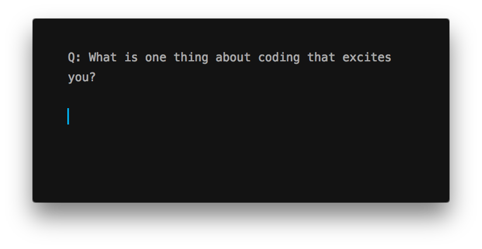

I was asked this question recently by a student from a coding bootcamp and I thought it might be useful to document my answer down for my own reference and also for those who are curious to know.

One thing that excites me about coding is the **empowerment** it gives me to build things that can **automate away the repetitive tasks** so that I can move on to **do more proactive and creative work**.

A good example of this is how one of my colleagues recently used the `sips` command in Terminal to bulk resize images in a particular folder so that he can attach them in an email without bumping against the attachments file size limit in Gmail. He was able to do this after learning about Terminal with me for a couple of hours. See [Why it’s useful to learn Terminal (with example application)](/2020-03-08-why-useful-to-learn-terminal-with-example-application/).

I am a "Service Operations Engineer" at the time of writing this post, which is a special role that sits at the intersection of 3 different tech roles: Solutions Engineer, Internal Tools Engineer, and Technical Support Engineer. It's not a common role, and that's what I love about it.

Anyway, I brought up my role because my answer to this person's question was coming from the vantage point that I have being in a role like mine. That is, if I were still a software developer that contributes to the maintaining and development of the core product code base, my answer would probably differ slightly.

Since it's my full-time job to build internal tools and write ad-hoc scripts to get our prospects and clients unstuck so we can close new deals or unlock more spending through our platform, I think in terms of the hacky capabilities of coding.

What's your answer?
