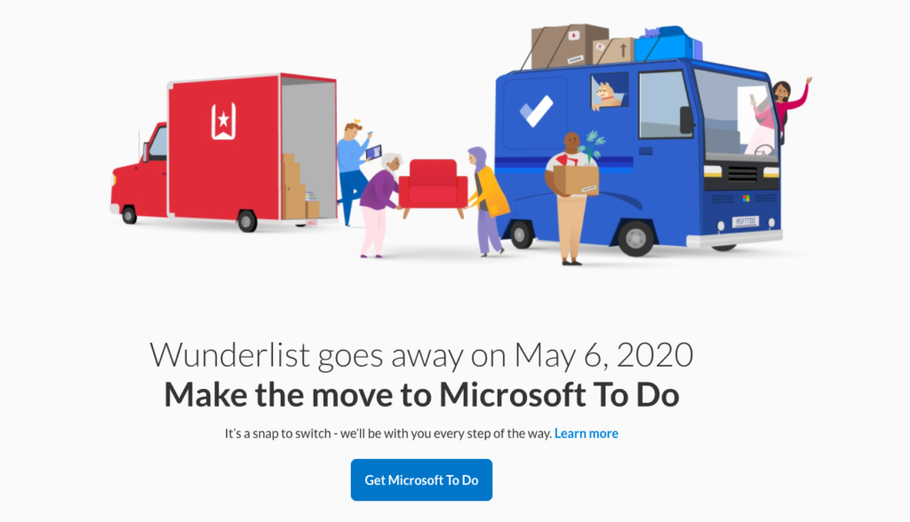
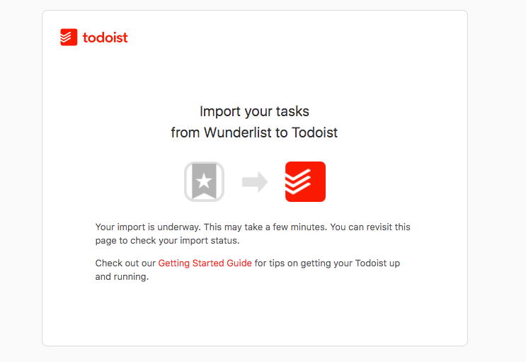
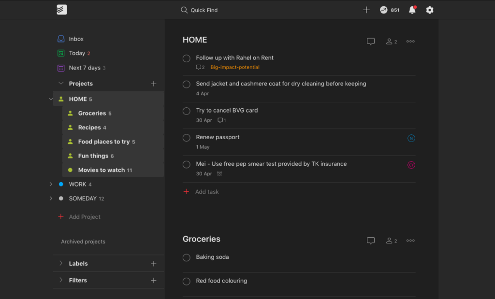

Source: wunderlist.com

This week I realised that [Wunderlist is shutting down and folding into Microsoft To do](https://www.wunderlist.com/blog/join-us-on-our-new-journey/). It came as a surprise to me but it probably shouldn't have, since Wunderlist is (was?) completely self-sufficient in the Free pricing tier. Anyway, I was forced abruptly to consider a new todo list app. My decision is to go with [Todoist](https://todoist.com/).

I had been using Wunderlist for 3 to 4 years now, but within a day, I had my new setup with Todoist up and running. The switch wasn't too difficult, and it actually offered me a chance to reconsider how I _ought_ to use my todo list app. Looking back now, 2 days into using Todoist, I realise I had been under-utilising this kind of app.

## My research before moving

I first listed down my "must have" features in a todo list app. This list comes from years of weekly use of a todo list app, and everyone's list is probably different. For me, the list of required features are:

- The app must load within 2 seconds of launch → so lag doesn't cause lost opportunities
- Lists must be shareable → so I can share lists with my wife
- An entry can be created within 2 taps and live in a central inbox without consideration for "where should this go"
- Each entry must be able to hold images and extra notes → because I also keep recipes in my todo list app
- Each entry must be schedule-able → so I can set reminders and trust it will prompt me to do it when it's timely

Equipped with this list, I started to do some research. Todoist was honestly at the top of my mind already at this point because I remember at least 2 or 3 friends recommending it.

A few todo list apps I tried before deciding on Todoist:

1. [**TickTick**](https://ticktick.com/). This is the app that everyone in the Wunderlist "Join us on our new journey" blog post commented as their favourite alternative. I decided against it because the app didn't feel well-designed in terms of aesthetics and user flow.
2. [**Microsoft To do**](https://todo.microsoft.com/tasks/). This is the app that Wunderlist wanted all their users to move to. They even built an export-import tool. But when I saw Microsoft, I decided against it because I have not liked a single Microsoft product's design for a while. Why would this time be different? I was certain they would try to lure me into their ecosystem of other apps and I don't have an appetite for it.

Source: todoist.com

Once I looked into a few apps, I decided to do my research on Todoist. These video tutorials helped me get a very quick lowdown on the workflow with Todoist:

- [Carl Pullein's Beginners Guide To Todoist (YouTube)](https://www.youtube.com/watch?v=XkNrk77I9lI)
- [Keep Productive's Todoist Foundations Explained! (YouTube)](https://www.youtube.com/watch?v=qc8oocQQH8I) - _(thanks [Jose](https://twitter.com/perspectivalean/status/1241699755207667713) for the recommendation)_

I liked what I saw because it fit my mental model of what todo lists are for. Plus, they slapped on a few nice features like Labels and Filters that I instinctively knew would come in handy when I eventually move more of my life into the app.

A few things that drew me to Todoist:

- Friends recommended it
- Clean aesthetics and thoughtful user design
- Longevity as an independent app due to the company's declaration to [not seeking an exit](https://doist.com/blog/no-exit-strategy) via acquisition
- Heard about IFTTT integrations
- Has Siri support for creating items
- Labels and Filters seem powerful
- Free 30-day trial for Premium

Okay, so what about the actual switch? How painful was it?

## Moving from Wunderlist to Todoist

For me, the move was almost painless because my lists were quite small. (Hopefully yours aren't too large either!) I was done within 2 hours from setup to import and deleting Wunderlist.

Todoist has a [Wunderlist importer tool](https://todoist.com/import/wunderlist) but when I tried it, the importer tool just kept showing a screen saying "Your import is underway. This may take a few minutes. You can revisit this page to check your import status."

Source: todoist.com

Many minutes later, I gave up on it ever working and manually transferred my entries. It wasn't that laborious. In retrospect, I don't think I would have saved much time had the importer tool worked.

What sped things up for me was opening Wunderlist and Todoist side by side on my laptop and creating new items in Todoist one by one without switching windows.

In the end, I found that roughly 60 percent of my todos in Wunderlist were actually outdated, so I mostly went on a "mark as done" spree. It felt good.

## Things I'm already liking about Todoist

Loosely associated nested lists! Notice how Movies to watch has a dot icon and others under HOME have a person (shared) icon.

I could probably write a separate post describing my favourite features about Todoist after I've used it for a couple of months, but so far a few things have stood out for me:

- **Smart date/time recognition.** I can write a task like "office hours twitter - helpmecode sunday 4pm" and it would create a task called "office hours twitter - helpmecode" with a due date of this coming Sunday 16:00. And this happens smoothly on the user interface, which is hard to pull off.
- **Themes.** I'm using the dark theme, which makes me feel more comfortable using the app more regularly and therefore more heavily for managing my tasks.
- **Nested lists.** Lists are called Projects in Todoist. They can be nested, which is helpful because I can have _HOME_ as a top-level list, and _Groceries_ and _Movies to watch_ as lists nested under HOME. That way, HOME becomes an inbox for all things home-related, including things that don't fit other existing lists. Best part about nesting in Todoist is that it lists are **loosely associated** when they are nested, meaning it just affects the user interface but not the independence of the lists: I can share _HOME_ with my wife but choose not to share the nested _Movies to watch_ with her.
