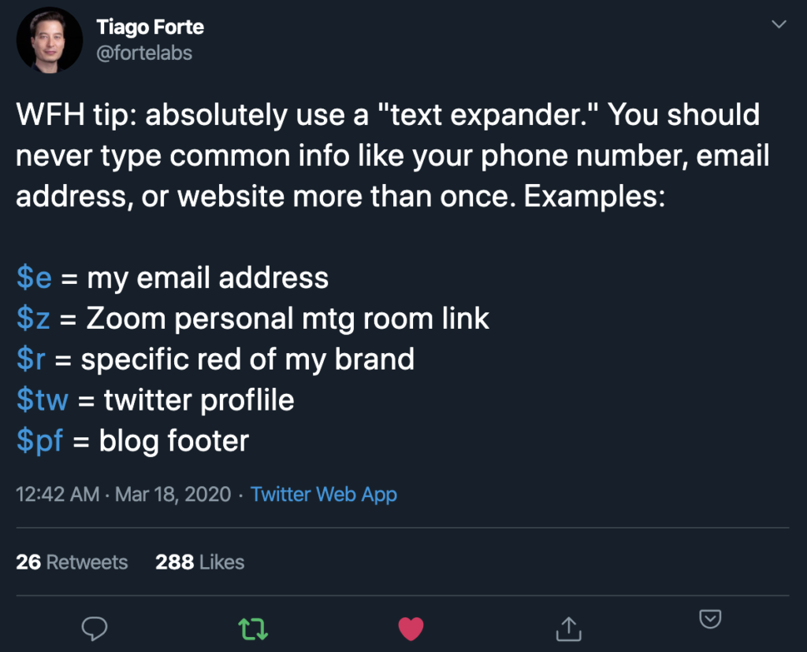
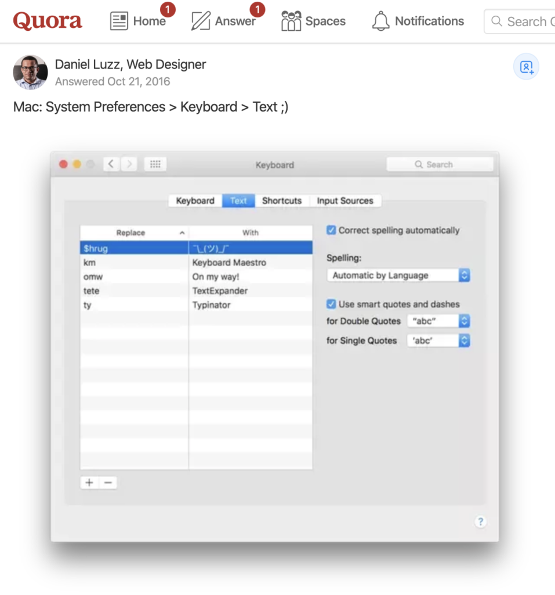
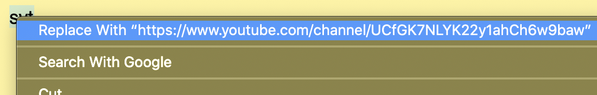
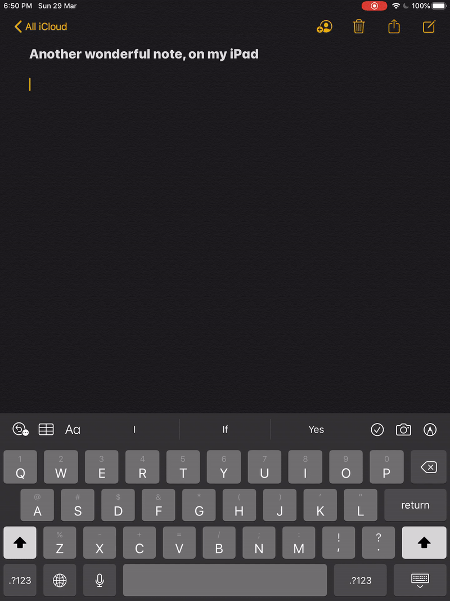

I recently went on a hunt for a suitable text expander software and in this post I share how I arrived at a perfect free tool.

As a primer, a text expander is a software that inserts some longer text when a keyword is typed.

Here's an example use case: I would like to be able to insert my YouTube channel URL quickly without having to refer, so I type "syt" and expect it to be replaced with the URL, like this:

The usefulness of this workflow automation should be quite self evident. Time saved on small actions that are frequently carried out will accumulate very quickly. Plus, in the case of getting one's YouTube channel URL, you save yourself from going down another potential rabbit hole of binge watching. Applicable to all social media links. It just makes sense to automate this.

I was first inspired to look for a text expander when I saw one of [@fortelabs](https://twitter.com/fortelabs/status/1240060861755998210)' tweets a few days ago:

In a second tweet in the same thread, he mentioned that he's using the "snippets" feature on the [Alfred app](https://www.alfredapp.com/) for this functionality. At this point I got very excited because I also use Alfred, mostly for searching for files more quickly than the built-in Spotlight.

But I quickly realised that snippets is a premium-only feature in Alfred. After some research, I decided I couldn't justify the investment of 50 GBP (one-off fee) to upgrade to premium, at least not until I've exhausted other options.

Is there a **free text expander software** somewhere?

Turns out, yes there is.

For Windows, I found a number of free text expander software quickly with a single google search. But I'm using a MacBook at work and personally so I had to fine one for macOS.

I was delighted to see this [Quora answer](https://www.quora.com/What-are-some-free-alternatives-to-TextExpander-on-the-Mac) after some light googling:

Source: https://www.quora.com/What-are-some-free-alternatives-to-TextExpander-on-the-Mac

> System Preferences > Keyboard > Text -- Daniel Luzz on Quora

Voila! The next logical thing to do was of course to take it for a spin!

## Apple's built-in text expander for macOS, iPadOS, iOS

I'll skip to the chase: this feature is built into not just macOS laptops but iPads and iPhones and it is quite complete. Once setup, the shortcuts that you saved will sync and work seamlessly across all your devices.

The setup is straightforward enough:

1. Go to **System Preferences > Keyboard > Text**
2. Click on "+" to add a new shortcut (i.e. keyword to trigger a specific text expansion)
3. Type the keyword + Type the expanded text
4. Test it out

When I tested my first keyword, it didn't work right away. But a quick right-click > click on Replace With "..." solved the problem permanently.

It's likely that this was by design, meaning that for the first time you initialise the built-in text expander, you would have to manually right click the selected keyword text and click on the "Replace With..." option. From there on, it's free text expander bliss.

Here is an example of text expander helping me to express myself with the flip table text expander:

ASCII art > emojis

So from here on out, I only have to type `tflip` and hit the spacebar on my laptop to have the flip table ASCII art inserted (I refer to this [cheatsheet on GitHub](https://github.com/dysfunc/ascii-emoji)). Communication perfection. And not forgetting, time saved.

I have tried it on my iPad as well as iPhone and it works perfectly. To be honest, I did not at all expect that I could set these shortcuts on my laptop and they would **magically work across my devices**. But it did, and it definitely was a moment of delightful user experience.

Here are recordings of it working beautifully on my iPad and iPhone, both of which are logged in with my Apple ID:

Now that I'm using text expanders as part of my daily workflow, I communicate with much more ease. I am certain this will remain a permanent fixture in my workflow.

### Known areas where it won't work

Text expansion doesn't work on the Chrome address bar. My guess is that Chrome actively suppresses text expansion on it, but I didn't test this hypothesis with an alternative text expander software. In any case, this is not a deal breaker for me since Chrome has bookmarks and autocomplete.

## My shortcuts

If you haven't started using text expander software yet, I highly recommend giving it a test drive. Here are some shortcuts that I have setup across my devices that could serve as a starting point for yours:

|Keyword|Full text|
|--- |--- |
|tflip|(╯°□°）╯︵ ┻━┻|
|$yt|my youtube channel link|
|$tw|my twitter profile link|
|$gm|my google meet video conference link|
|->|→ (because I like how it looks)|
|AA|Automated Ads (name of a product feature)|

Happy communicating!
