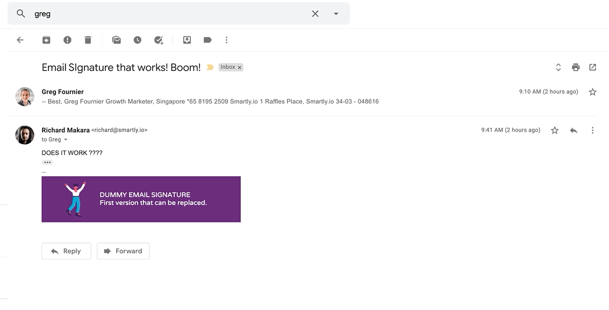

One of the biggest reasons I enjoy teaching is because I get to see others do things I would never have thought of doing. While I’m good at explaining things clearly for others to understand, I don’t think I am good at coming up with creative solutions to problems. It’s clear to me that there are many people who are much better at doing that than I am. Teaching is fun for me because I get to watch someone grasp a concept and then apply it to build something cool afterwards, again and again.

_Greg is the right-most. Look at that focus :D_

Greg is one of those people who regularly surprises people with his ability to turn ideas into solutions to people’s problems. He is one of my favourite people whom I’ve become friends with while working at Smartly.io, and he was also one of my students in an instalment of the in-house coding bootcamp I was running between February to May 2019.

In February, Greg had patchy understanding how programming and little knowledge of how browsers worked with servers to make web applications work, and by the end of the bootcamp in May, I could tell that he had a solid understanding of what was going on. His final project was the most impressive among the lot - a “creative review generator” created with [Google Apps Script](https://developers.google.com/apps-script) and Google Sheets that generated a beautiful Google Slides deck based on a short questionnaire for Smartly.io salespeople to use to pitch prospects.

Today I found out on LinkedIn that Greg had made another solution, this time for marketers that would allow them to update everyone’s email signatures with the latest on-brand promos without needing individual employees to make those changes.

_Demo of the result. Source: [Richard/Greg](https://hyper-typed-marketing.mailchimpsites.com/)_

When I read the post, I was intrigued. But when I read the linked [blog post](https://hyper-typed-marketing.mailchimpsites.com/growth-1-how-automate-dynamic-email-signature), I felt a strong sense of pride. I might even have said to myself “Damn, *this* is why love teaching!”

You see, Greg’s implementation was extremely simple from a technical point of view. Any software developer could have thought of this as a solution if they were ever presented with the problem, although I highly doubt that this particular “problem” of non-dynamic images in people’s email signatures would ever come across as a problem to a developer in the first place.

Greg, as a growth marketer on the other hand probably saw this as an area of improvement when he was asleep. Expertise in a domain puts one closer to the edge of the unknown and gives one the ability to see where there are opportunities to build new bridges.

But what made me extra happy was the fact that Greg managed to conjure the solution. It was almost magically created from just *understanding* how the web works. 

He goes into more detail in his blog post about the implementation, but effectively, Greg did not actually write a single line of code to unlock the achieve the outcome he wanted. What he did was to realise that a Universal Resource Locator (URL) link can be preserved while the underlying image in the server is changed, and he applied that understanding creatively to improve his team’s workflow.

To me, this is the true power and utility of knowing how to code. It’s not always about building something new. Sometimes amazing things can come out of pure, simple comprehension.

---

_Thanks, Greg, for being an inspiration to me and to everyone who has ever thought of crossing the technical chasm to improve their own careers and lives!_
