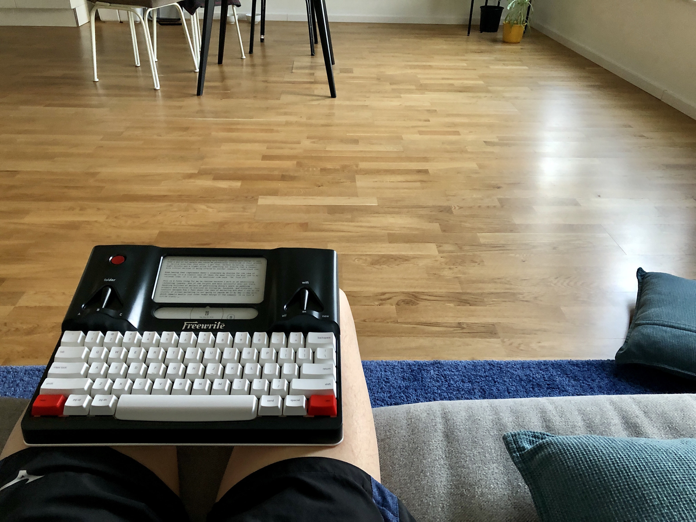

Marketing feels dirty. When a model poses with a perfect smile, just so happening to be holding a product in her hand... that thought makes me uneasy.

I feel cheated when I think about how a photo was taken precisely for the reason of trying to get my attention.

I understand the value of marketing very clearly. People with things to sell need a way to let people who could be potentially interested in their product or service know that they exist. Without marketing, consumers might blindly pay a higher price for something not knowing that a cheaper, more ethical version is being offered by another company. I understand that [and more](/2018-12-01-is-there-fundamental-goodness-in-marketing).

Even having that cognisance doesn't eliminate my dislike for the idea of marketing though. It's a classic case of "does the mean justify the end" and to my rational side, it is a yes. My emotional side says, "Oh, fuck off."

This is a funny thing for me to say out loud because I work at an [advertising technology company](https://smartly.io). One of the largest and most successful ones out there, handling billions of dollars of advertising dollars spent on peddling products and services to everyone on Instagram, Facebook, and Pinterest.

This conflict between how I feel about the idea of marketing and what I see as the utility of actual marketing is not going to impede me in my day-to-day work, which impacts mostly just other human beings in the company. It is just an irony.

---

_Thursday 8:40pm. On my couch after a day of doing marketing-related things at work-work, followed by helping my wife take photos for her upcoming blog post._

