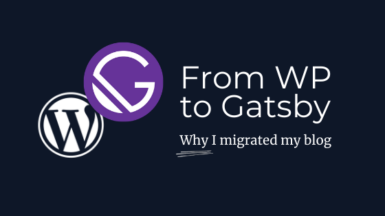
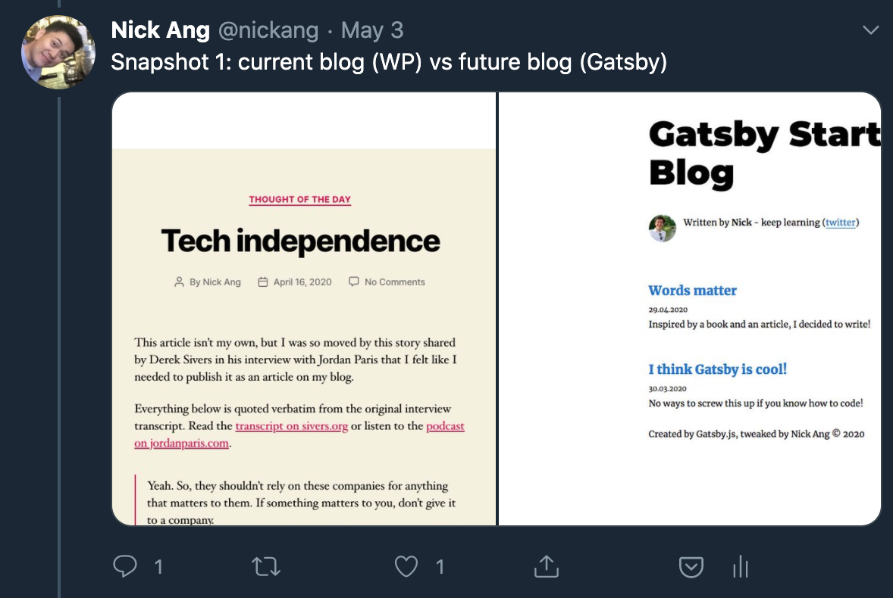
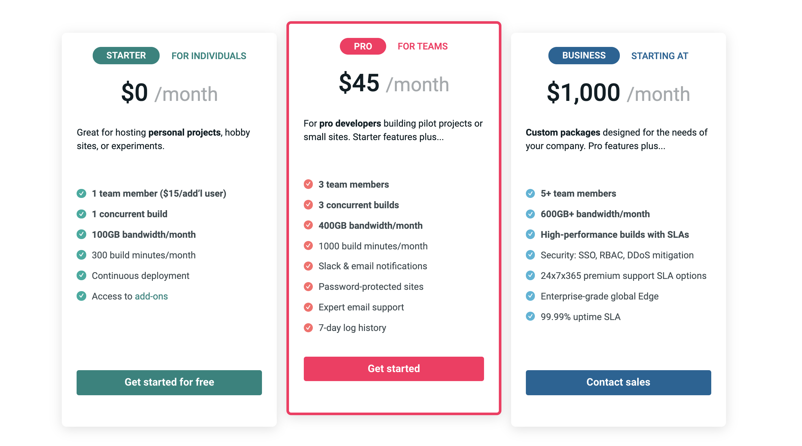

[Gatsby](https://www.gatsbyjs.org/) is an open-source static site generator library written in JavaScript. Anyone who knows JS and a bit of Node.js and React.js will be able to setup a Gatsby blog. At the moment I don't think it is more accessible than that yet, although wider usability improvements could come quite soon with [Gatsby Cloud](https://www.gatsbyjs.com/).

[WordPress](https://wordpress.org/) on the other hand is a fully fledged content management software (CMS) with a long heritage from the early days of the world wide web. That heritage makes WP necessarily a little rough around the edges when seen with modern eyes.

## Gatsby loads much faster for visitors

The main reason I moved my blog from WP to Gatsby is the __gains in loading speed__ for the website visitor.

To illustrate how much faster this website loads using Gatsby versus WP, I'll try and briefly explain how content is loaded for the reader on their browser. Let's assume you have no prior knowledge of how the web works, so I can explain the process more completely.

When you enter a URL and hit enter, the browser makes a HTTP request to another computer connected to the internet. That computer is known as the server in this relationship, and upon receiving the request, it will retrieve the relevant bits of info and generate a HTML file, and then send that file back to your browser in a HTTP response.

Now, that part is common to both WP and Gatsby websites. What is different is __how much work the server computer needs to do__ to respond with an assembled HTML file to be sent back in its response to the browser.

For a WP website, the following needs to happen for the server to assemble that HTML file:

- Make a database query for the page's content
- Make a second database query for the comments associated with the page
- Load a HTML file that contains the layout of your page (header, footer, sidebar, etc.)
- Inject page content and comments into the layout file, creating an assembled file
- Send the assembled HTML file back to the requesting browser

All of this takes time. Not too much time in the grand scheme of things, considering how fast computers are able to process these steps, but they add up. Also, the server's connection to the database can be unstable, occasionally causing extra miliseconds of lag.

Now by contrast, for a Gatsby website, only two things need to happen on the server side:

- Find the file corresponding to the page being requested for
- Send the already-assembled HTML file back to the requesting browser

Doesn't that simplicity just feel _lovely_?

In practice, a Gatsby site is really just a series of pre-generated _static_ HTML files ready to be pulled by the server like a robot librarian looking for a single book in an indexed library. This is a fundamentally different way of serving a website, because all the rendering is done upfront before a single request is received. I believe that websites used to all be served this way before they turned into web _applications_. That shift was enabled and became the result of powerful all-in-one CMSes like WP.

I have to give credit to WP for enabling me to have a blog in the first place, though. Five years ago when I setup this site on WP, I hadn't learned to code yet so I appreciated the simplicity of the famous WP 1-click install.

## Gatsby uses a tech stack I already know

Over the course of 5 years of blogging with WP, I've only ever slightly tweaked the WP themes to modify the structure and styling of my website. Adjusting a WP theme has always been out of reach to me, even after I became a professional web developer, because it always involved a heavy upfront investment to learn PHP, a programming language that I did not use at all at work.

This brings me to the second reason I chose to migrate my site to Gatsby.js: it uses modern technology under the hood that I am familiar with and use daily at work as a sort-of software developer. What this means is that the tooling to make tweaks to the site feels very familiar to me right off the bat because of what I already know about GraphQL and React.js. With those fundamentals, I learned how to setup a Gatsby site in a few hours. I relied heavily on Andrew Mead's comprehensive [The Great Gatsby video tutorial](https://www.youtube.com/watch?v=8t0vNu2fCCM) and by reading the Gatsby.js [documentation](https://www.gatsbyjs.org/docs/) whenever I needed to dive deeper into something.

In the end it took me around 4 weekends of 2-3 hours of work to migrate around 360 posts and pages to Gatsby, and I am quite happy so far with the result. I tweeted most of the significant parts of the project in a single thread [here](https://twitter.com/nickang/status/1254864484826374144).

## Unexpected perks of using Gatsby

Being able to write in markdown in my preferred code editor is a nice. While I normally write first drafts outside of the code editor, I prefer editing them in one. This is mostly because I can easily do a global search and look for keywords among my existing posts and remember what I wrote before on a topic and to add a cross-link.

The next nice perk is cost savings. What I'm about to say may not hold true for you, and may not even hold true for me after a few months, but it is true for now: I am hosting my site for free at the moment, which makes it infinitely cheaper than hosting my previous site. 

Previously I paid Bluehost for a shared hosting plan that cost around USD 120 annually. Now, I pay nothing to Netlify to distribute my static HTML files in their CDN (content delivery network) because they have a free [Starter plan](https://www.netlify.com/pricing/) that allows anyone to have 300 free build minutes per month for hobby projects. Netlify's target audience includes developers, and developers like building new things, which is why they offer such a plan. Bluehost on the other hand seems designed to scoop in people who are like me 5 years ago - without technical knowledge and happy to pay as long as it works. Anyway, I might have to start paying USD7/500 minutes of build time exceeding the initial 300 minutes, which I don't mind at all considering how easy and reliable Netlify is.

The last unexpected perk is to do with backups. With Gatsby, because of the git workflow, everything is backed up by default. Git is a version control software that is used by most tech companies to manage their code bases. With my Gatsby site, I deploy changes by pushing git commits to GitHub, which then triggers Netlify to re-build the entire site. The cool thing about this setup is that at any point in time, I will have a copy of my entire website on my laptop as well as in the cloud in GitHub. So if GitHub ever corrupts my repository of files, I have my local copy. And if my local copy is corrupted, I can clone the entire repository from GitHub.

Even though if both copies are corrupted at the same time I'd still be screwed, this setup is much better than my Bluehost and WP setup, which maintains the files and database of my content. While it's tehcnically possible for me to maintain an up-to-date copy of the files, folders, and database stored in my WP installation in Bluehost, I never put in time to figuring out how to do it because it presented no additional value to me. Yes, I know, living dangerously! I just dislike adminstrative work and that's why for the past 5 years I have only made 2 backups and stored them somewhere obscure in Dropbox. This is no longer a problem with Gatsby. Back to safety.

## Some downsides of Gatsby compared to WP

The way comments work on most websites is that a visitor fills out and submits a web form, which will send the form data to a server. That server will then have to be configured to receive comment "HTTP POST" requests and then do something about that information, like store it in a new row in a database table. Because Gatsby is a static site generator and does not require you to write any server-side code, it comes without comments functionality. So yeah, this blog that now runs on Gatsby doesn't have a comments section under each post. Jeff Atwood's [agreeable opinion](https://blog.codinghorror.com/a-blog-without-comments-is-not-a-blog/) that a blog without comments is not a blog did not help me feel better about it. But I know that Gatsby has a rich [plugin library](https://www.gatsbyjs.org/plugins/), each one a standalone Node module, and there is at least a plugin for Disqus among the list. For now though, after a month of migrating, I prefer to focus on writing than improving the site and so will leave this to be a problem at a later time.

So, that's it! This is why I moved my website from WP hosted on Bluehost to Gatsby hosted on Netlify.

In a coming post, I will share the details of how I did the migration.