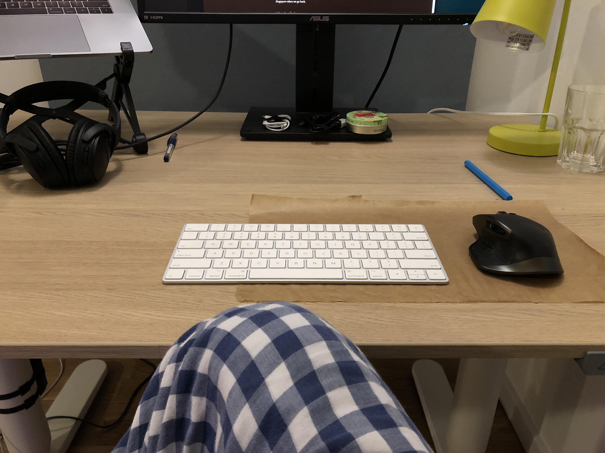

I regularly get asked why I moved to Berlin. While I’d be glad to answer this question every time I get asked because because *wow*, I *get* to live in Berlin, I wanted to write my answer properly so I can share this article with whoever seems to really want to know my reasons.

## I wanted to live away from Singapore
From when I was very young, I knew I wanted to live abroad at least for a little while.

Like most people who has gone to university, an exchange program would have been the best opportunity to experience life away from their home city. But I managed to screw up my exchange program application and lost that opportunity. Eventually I managed to salvage a consolation prize and won a slot to spend an amazing month in London for summer school, but I wouldn’t describe that as really living abroad. It was just too short for a stay.

I wanted to live away from Singapore because movies and TV shows and... well, Google Maps told me that Singapore is a laughably small country. There was no way I going to knowingly limit my life experiences to that of a tiny dot on the map. Tragic fun fact: you can't even see the island that is Singapore on the world map. The letter “S” covers it.

But it’s not so much the size of my country that compelled me to move - it was the diversification of thought that I truly yearned. I felt the need to see how other people lived, what kind of things they have access to that we don't in Singapore, why, and what sort of rules, traditions, and ways of thinking govern their lives.

Of course, I have to admit that at close to 30, I was starting to see the flaws of Singaporean society (stable and wealthy but lacking a soul). Every society has its strengths and weaknesses. I wanted to see if there were things I could learn from living abroad that I might eventually be able to apply to how I lived in Singapore when we go back.

## Why Berlin?
*Inhales sharply.* I did not decide to come to Berlin.

Exactly like my experience with the secondary school that I ended up studying at, I had chosen several places and ended up in none of them. My top choices were San Francisco and London. If those were out of bounds, I thought to myself, maybe we could try some city in New Zealand. Berlin was actually never on my radar… I tell this story to my colleagues in the Berlin office and they always boo at me. In jest, I hope!

But just like my secondary school experience, my unintended landing in Berlin may yet turn into a beautiful thing. I met my wife at the secondary school I did not choose.

So far, I love it here. Charlane does as well. There is *a lot* to like about a big, historically-important and relevant city like Berlin. Would I still make the same choice and pick Berlin if I could get another chance to choose? I'm quite sure my answer would be "yes".

Anyway, this is the answer I give to people who ask me why I moved to Berlin with my wife and dog. I really just wanted to know how other people different from us lived so I can inform my own decisions on how to live mine. Even if I go home to Singapore not having found a better way of life, I would have gone home more appreciative of what we have going on in that young city-island-state.

---

_Monday, 11:11pm. Thinking about how the long weekend ("Whit Monday") is over now and what I'll be doing tomorrow at work._

