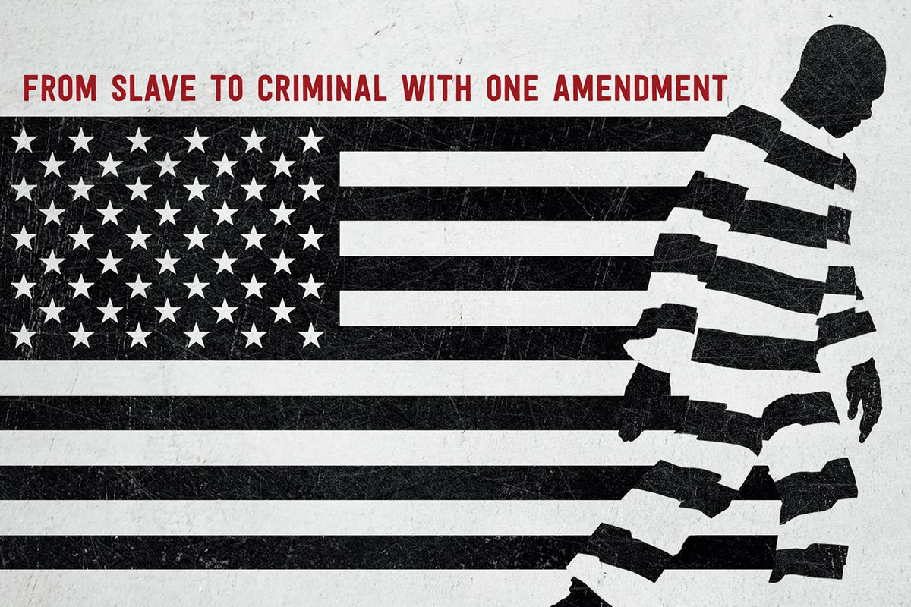

The documentary is very well made and provides someone like me with the important specifics of the history of black people's struggles in the US.

Quote blocks below are my notes taken while watching the documentary. Words below the quotes are my thoughts on them in post-processing.

> After the 13th Amendment to the US Constitution abolished slavery in the US, southern states (where most last remaining pro-slave people were) needed to do something to regain their production again to rebuild the economy. 4 million negroes who were previously property had suddenly become citizens and it was an economic problem.

Just because the civil war ended and slavery was abolished by law does not mean that hatred gets erased. It's not hard to imagine that people at the time pinned the economic problem post-war on the now-freed slaves who were all black people.

> Public lynching and other acts of terrorism on negroes happened regularly. At some point, American society no longer wanted these public acts of terror on negroes and a new legal angle of attack on black people commenced.

> Nixon in 1970s declared war on drugs internally as the most important problem for the US. Most historians believe this was a proxy war against black and latino communities.

> _Cops_ and other TV shows like it tend to over-represent black people as criminals.

> "Super predators" was at one point used regularly by the media and politicians (including Hillary Clinton) to refer to the young black population.

> Four young black men were accused of rape of a woman in the Central Park jogger case of 1989. DNA evidence apparently showed they were innocent, but that was after years of prison time had already been served on the erroneous accusations. Donald Trump took out an ad in some printed medium to lobby for the death penalty for these men.

Just sad to hear of the wrongful incarceration of these four young black men who were found innocent too late. As a person who hates (I use that word carefully here) being accused of something I did not do, I feel the pain of these men.

> The Black Panthers was a black organisation led by someone that was labelled as "the greatest threat to America" by J. Edgar Hoover.

I've heard the name "J Edgar Hoover" but never knew who he was. [Wikipedia](https://en.wikipedia.org/wiki/J._Edgar_Hoover) tells me that he was the first director of the FBI and who was, to my surprise, in that position for 37 years. 37 years! 

Also, I'd never heard of the Black Panthers. In the documentary they explained that the US government killed the leaders of the Black Panthers in fear of their potential uprising, compelled in no small part by Hoover's proclamation of them as the biggest threat. I need to read more to inform myself, but a brief read of the [Black Panther Party](https://en.wikipedia.org/wiki/Black_Panther_Party) Wikipedia page says that it is a group that made use of the "open carry" of guns to carry out "cop watching" to actively challenge police brutality between 1966 to 1982.

> Trayvon Martin, a 17 year-old black kid was shot and killed by a white man, George Zimmerman, just for walking in a neighbourhood to visit his relatives. Zimmerman was charged with murder but was acquitted after claiming self-defense aided by the "stand your ground" law.
> 
> 'A stand-your-ground law (sometimes called "line in the sand" or "no duty to retreat" law) establishes a right by which a person may defend one's self or others (right of self-defense) against threats or perceived threats, even to the point of applying lethal force, regardless of whether safely retreating from the situation might have been possible.'
> <cite>[Wikipedia](https://en.wikipedia.org/wiki/Stand-your-ground_law)</cite>

> That law was passed through corporations that stood to gain financially from more sale of guns, bullets, and prison inmates, who were in bed with US law-makers through the organisation called ALEC (American Legislative Exchange Council). So blatant is ALEC's involvement in the government's passing of laws that the ALEC logo had been forgotten in some proposal bill before.

This has to be the epitome of corporations being in bed with the government in the US. I used to think it was the fact that Presidential campaigns were run with multi-million dollar budgets donated by corporations to run ads that epitomised how corporations had a way to influence the government. ALEC seems worse because it is more blatant and directly influences the lawmaking process.

> Contracts from government to private prison operators. Government had to guarantee a minimum number of inmates as part of contractual agreements. Step one in creating perverse incentives for getting more bodies into prisons. Start of prison-industrial complex.

> Corporations make use of prison labour (known as [penal labour](https://en.wikipedia.org/wiki/Penal_labor_in_the_United_States)) as the 13th Amendment of the US Constitution allows for it: "neither slavery nor involuntary servitude, except as a punishment for a crime whereof the party shall have been duly convicted, shall exist within the United States, or any place subject to their jurisdiction".

> Plea bargains vs going to trial. The legal system favours plea bargains by making sure that if you go to trial (if you can afford it) and lose the trial, your sentence will become much higher. Kalief Browder chose not to take plea bargain for his case of petty crime. He served jail time for something trivial. When he was let out, he gave some interviews. His mental health deteriorated significantly because of the ordeal and he hanged himself at age 22.

> Convicted felons cannot vote. This is apparently called [felony disenfranchisement](https://en.wikipedia.org/wiki/Felony_disenfranchisement_in_the_United_States) in the US. (Why? Isn't that too strong a blow?) Something like 30 percent of the black population in Alabama have actually lost their rights to vote because they have had some kind of criminal record. Selma, Alabama was where Martin Luther King Jr led black marches in the 1960s.

> Who is Jim Crow? He seems so important in all of this.

Turns out, he is a fictional character in a theatre production that has been used as a racist depiction of black people.