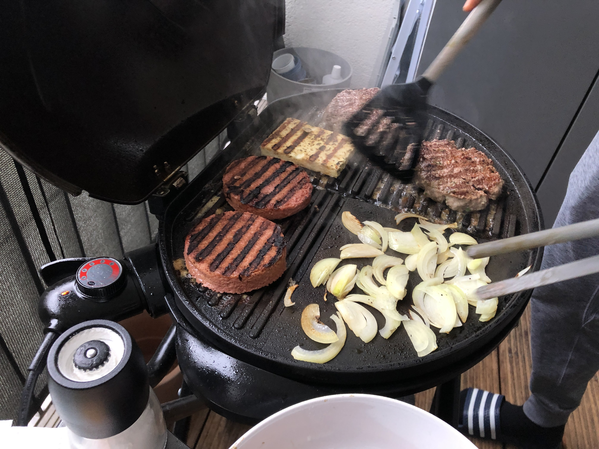

The perfectly round and red patties are vegan "meat" patties, sitting next to two real meat patties on our friends' grill in Berlin.

Hi, I am Nick and I am a "flexitarian". In short, that means I am mostly a vegetarian but occasionally I bend the rules that I impose on myself and eat meat. In this article I'll share why I am an unapologetic flexitarian.

The main reason is simple: I am human and fallible. Sometimes, like a few days ago, I would get an opportunity to have a dish that contains meat that would catch my attention and palate. We went to an Indonesian restaurant in Berlin and saw that they served _beef rendang_. My head started to swirl at the thought of tasting that dish and I simply stopped resisting. Could I have had their vegetarian _gado gado_? Yes. Would I have felt like I was missing out on an opportunity to be immensely, although temporarily, happy? Definitely. So I went for it!

It's not just my fallibility that makes me transgress my self-imposed rule to be a vegetarian sometimes. It is also a matter of priority. In my opinion, life is too short for moments of potential happiness to be squandered in the name of some unclarified principle. I [chose to be vegetarian](/2018-06-22-why-im-going-vegetarian) to reduce the number of animals that would have to die for human consumption, to bring down global greenhouse gas emissions, and to have better health. I did not do it out of a promise to society that I will be a model non-meat-eating citizen. In the thick of it, it is easy to forget that flexitarians like me do a lot of good by cutting their meat consumption by 95 percent compared to regular omnivores. I refuse to let that 5 percent negate my personal contributions to animal ethics and environmental sustainability.

Apart from the [rare scenario](/2018-06-23-vegetarian-obstacles-flight-food/) where I really have no other choice, the only other reason I have to sometimes choose to eat meat is a cultural one. Cuisines! As I grow older I appreciate well-made, tasty, and culturally-rich foods more and more. I would be really upset with myself if I, out of principle, chose not to have the delicious tapas with slices of jamon in Barcelona. Or the duck confit in Paris. Or the beef rendang in Bali.

Perhaps you think this reason is flimsy and could be construed as me making an excuse to lapse as a omnivore turned herbivore. I can see why and to that charge, I have no counter-argument. We perhaps don't agree on the level of importance that food has in bonding people. Whenever I eat the focaccia bread made by our Italian friends, I feel kinship with them because they have made something using a recipe that their parents and their friends and the Italians altogether have honed over centuries. It is like them saying "Here, this is the best we and our people can offer you. We really hope *you* like it." Few things are as consistently accessible and profound as food.

This is why I'm a flexitarian, and probably will be for the rest of my life.

---

_Sunday, 21 June 2020, in the courtyard finishing a bottle of Augustinerbräu Lagerbier._

By the way, in 2018, I [declared](/2018-06-22-why-im-going-vegetarian/) that I was going vegetarian.