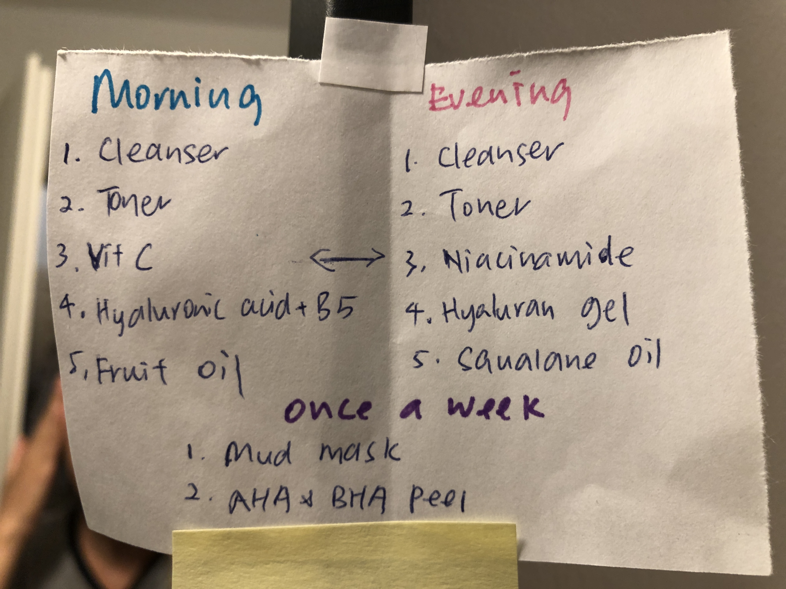

My wife recently gave me an elaborate facial procedure to follow daily. She devised a note that consisted of one list for the morning and another for the evening, instructing the order of products to use. It looks like this:

I'm actually benefitting a lot from this simple note as it's helping me use the right products in the right sequence and I have not had better skin in the last 10 years.

But did you notice the two-way arrow in the middle, indicating a swap between "Vit C" and "Niacinamide"? Two weeks into this daily routine, we both noticed that there would always be a "balling" effect in the morning when we applied the "Hyaluronic acid + B5" right after the "Vit C". This happened consistently, so my wife thought it would be a good idea to swap that product with something from the evening list.

That _was_ a good idea, but the execution soon created a new problem. I now take an extra five seconds to figure out what product I _actually_ need to use when I referred to the list! 

_It's the morning and I've applied the toner. Okay. What's next? Vit C! Oh wait, no, Niacinamide. Is it really? That's on the evening list. Oh no really, we wrote that arrow to swap, see? Right. Okay done. Next? Hyaluron gel. Oh no that's the evening list, go back and look at the morning list, silly._

When I first noticed the mental gymnastics that I was doing each day ever since the arrow was scribbled on, I immediately drew a parallel to the idea of "spaghetti code" in software development. Spaghetti code works, but it could have been done better. Same case here.

The extra five seconds each time I referred to the list is not one-off - it is something I have to pay every time I use the list, like getting taxed each time I used an amenity like an expressway. Over time, the mental energy and time wasted accumulates to something significant, which is a pity considering how it would have taken just five minutes to rewrite the list.

I rewrote the list.