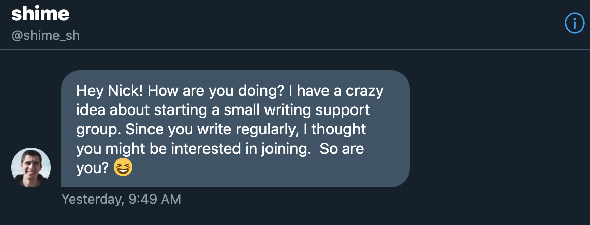
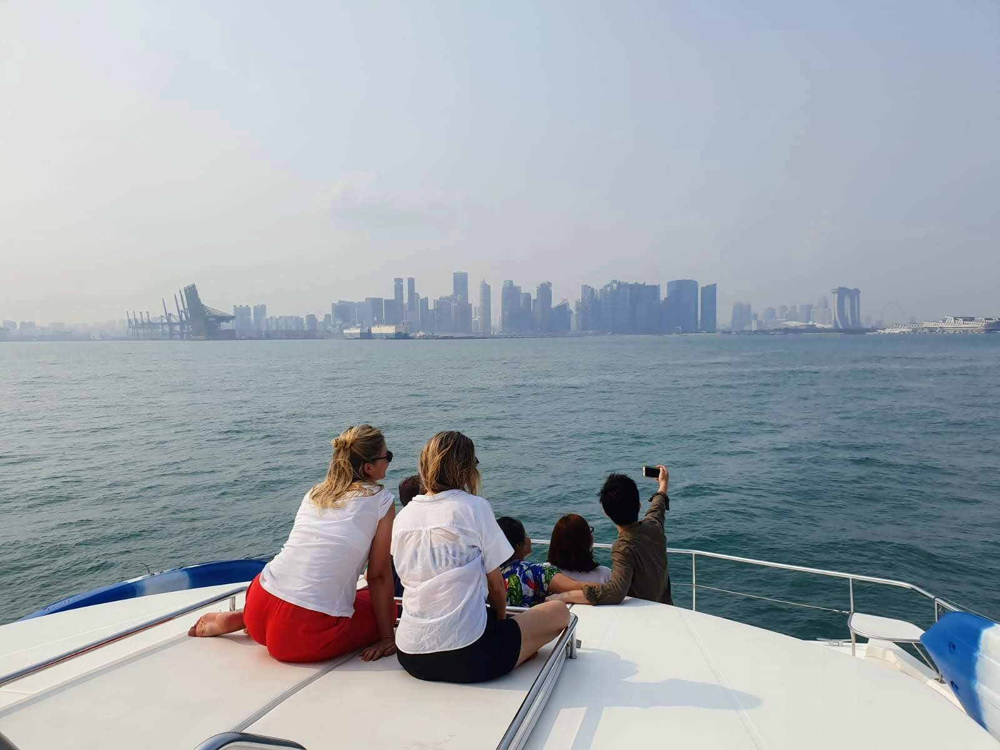

Once in a while an idea comes along that feels right. I've learned to be biased towards acting on such ideas when they appear, and today I'm taking action on an idea by someone I honestly barely know from twitter. The idea is to join a word raft.

Shime (shim-eh, "like Beyoncé" as he describes it) sent me a DM [on twitter](https://twitter.com/shime_sh) yesterday to tell me about the idea. It helped that he had already [published an article on his blog to explain the concept](https://shime.sh/raft). Perhaps it is his way of driving home the message that writing is useful and worthwhile?

Okay, so here's the idea: a **word raft** consists of a small group of people who are committed to writing and publishing an article every week for the foreseeable future. Each person's true motivation for joining a word raft can and probably will vary, but the main goal is to write more and write regularly.

A word raft is designed to be small - no more than 5 rafters at a time. This is of course an arbitrary number at this point but I think the small size is important in keeping us feeling personally accountable to the other 1-4 rafters on board our raft. *Keep paddling you son of a bitch or we'll all die in the middle of the god damn ocean!* Maybe Shime didn't know this about me before he let me on his raft.

Anyway, there is a real consequence to not keeping up. The moment a person becomes dead weight (by stopping to write and publish once a week), we haul that person overboard and take in someone who has been paddling in the water and may be more enthusiastic about being aboard a raft that is headed for our shared destination. Oh and the rule Shime has set is that once you have been kicked off a raft, you'll never be allowed back on. Only practical people need apply, I suppose.

## Why I joined a word raft

_That's me posing with my colleagues for a photo in the wrong direction on a yacht in Singapore waters. It's a raft, no?_

I'm intending for this article to be the opening entry in what will hopefully be my forever weekly cadence, so I thought it adequate to explain why I didn't hesitate when Shime told me about this idea and asked if I wanted to join him as official rafter #2. (I gave myself that number badge.)

My number one reason for joining a word raft is to document my learnings on a regular basis. It's likely that I have already achieved that goal on some level with this blog over the last 5 years, having written and published a weird smattering of 370 or so articles. (When trying to trace my first post, I also rediscovered [my old WordPress blog](https://nickang.wordpress.com/) that has 13 pages of posts that adds up to 52 more posts.)

But I'm not satisfied with that cadence. I often think about how many [learning experiences](/2018-03-28-on-learning/) I have had in between those articles that I can no longer remember, and how, because of that, I have to re-learn things the hard way again. So my number one reason is a selfish one: **I want to [internalise](/2016-05-14-seneca-1thought-every-day/) the [things I learn](/2016-08-19-writing-daily-helping-learn/) throughout my life and have them on record so that I can refer back whenever I need to, be it to re-learn a lesson or to build on top of one**.

The second reason is about sharing my learnings with other people. I'm turning 30 soon, and that puts me in a position to guide younger people who are just beginning their careers. I remarked to my wife the other day that since I [learned to code](/2016-08-15-entering-digital-jungle/) and became a software developer, I have probably had around 15 to 20 people reach out to ask me for my advice on their tech careers. Most of them are fresh university graduates and some are mid-lifers itching to switch to a career in tech. Whoever they were, I've always found it helpful to be able to hand them links to my blog posts that I think may be relevant to them in their situation. This has the effect of saving me time, but more importantly, it also ensures that I give every person my most well thought out answer to a given topic.

So my second reason is **to be able to share my clarified thoughts on any topic I have learned and spent time reflecting on with other people**.

Okay, so those are my main reasons to join a word raft. I have a few other smaller reasons that I will just list as bullet points:

- Improve at the craft of communicating through words
- Experience first-hand being part of a writing support group
- Get closer to the truth to why I am drawn to writing in the first place through practice

So that's it. I'm ready for this. 

Thank you, Shime, for conceptualising the idea of the writing raft, writing about it, and sending it my way and helping me aboard this raft. I'm looking forward to the journey.